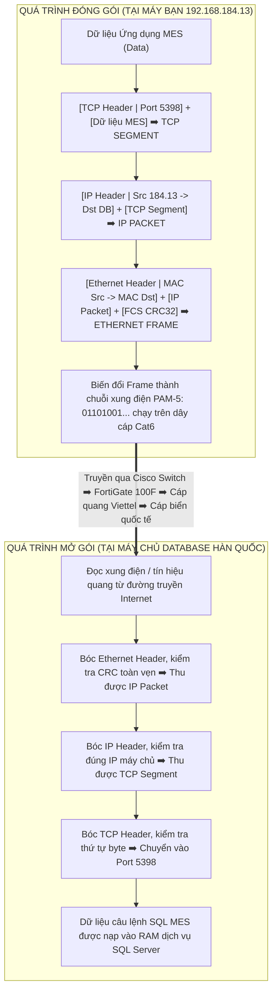
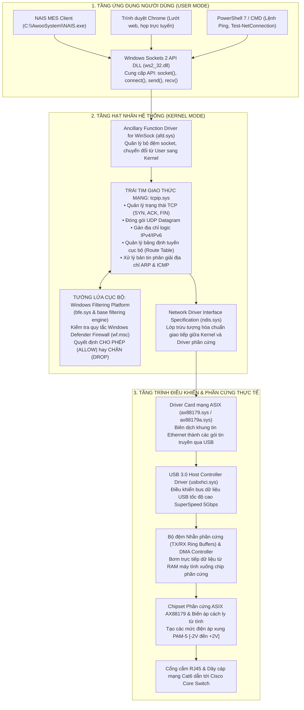
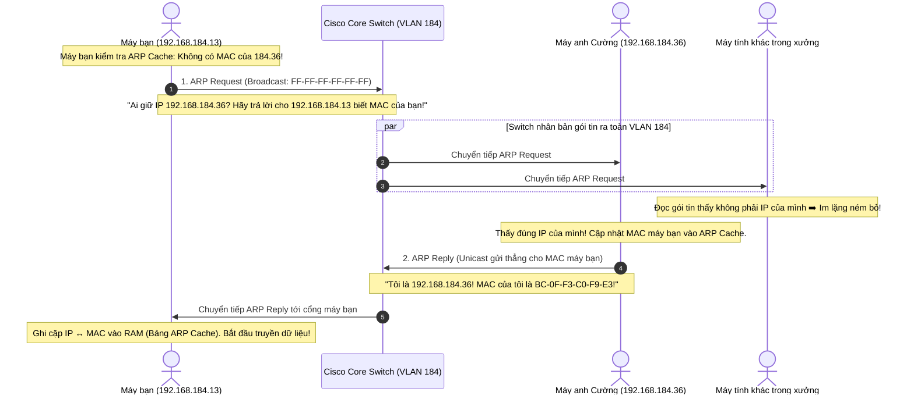
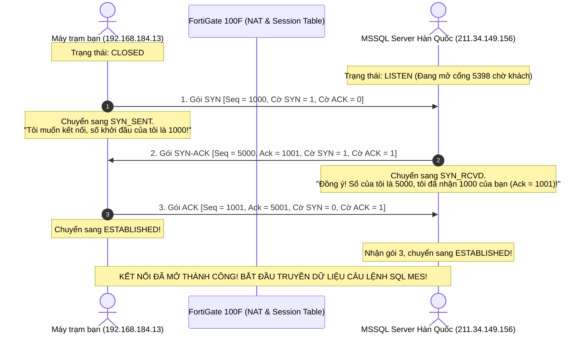
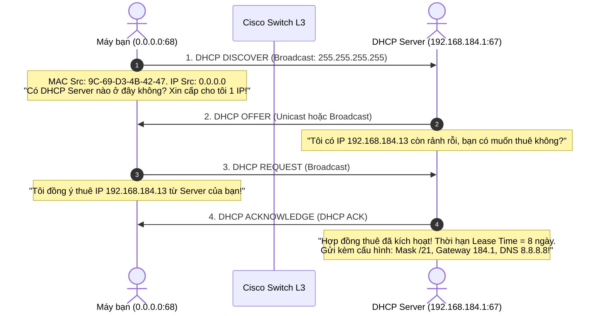
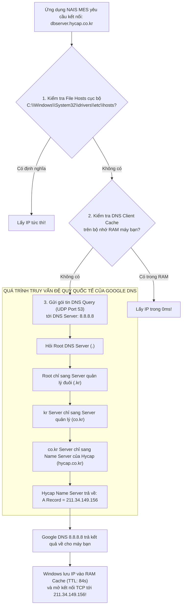
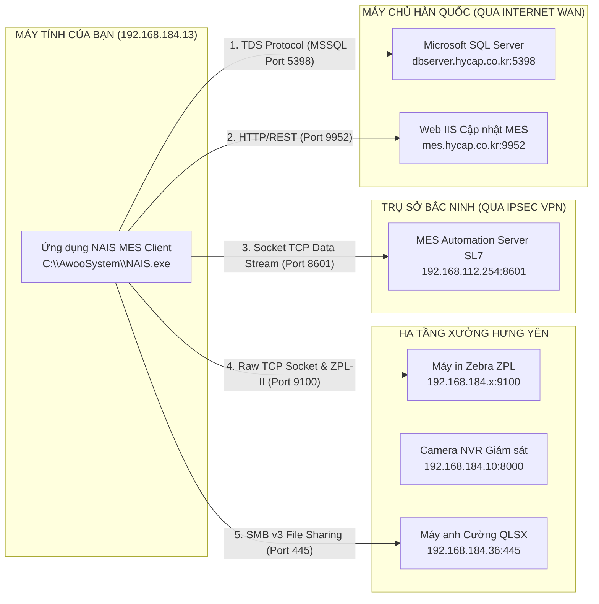
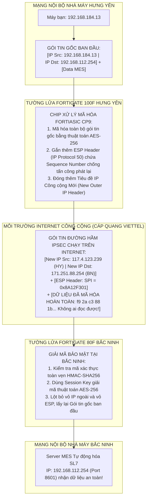

# 📘 TẬP 1: ĐẠI GIÁO TRÌNH NỀN TẢNG MẠNG MÁY TÍNH & KIẾN TRÚC HỆ THỐNG DOANH NGHIỆP
> **Chương trình đào tạo chuyên sâu từ mức độ hạ nguyên tử (Bit, Xung điện, Trường sóng) đến Kiến trúc Mạng Đa Nhà máy Toàn cầu**  
> **Dành riêng cho Kỹ sư & Cán bộ Kỹ thuật Vận hành Hệ thống Vinatech**  
> **Phiên bản Đại tu Chi tiết Toàn diện — 100% Thực chiến & Minh họa Trực quan**  
> **Đối tượng tham chiếu sống:** Máy tính trạm bạn đang ngồi (`192.168.184.13`), Card mạng USB Gigabit ASIX AX88179 (`9C-69-D3-4B-42-47`), Cisco Catalyst Core Switch L3 (`192.168.184.1`), Tường lửa Doanh nghiệp FortiGate 100F Hưng Yên (`10.0.0.1`), Máy chủ Database Hàn Quốc (`dbserver.hycap.co.kr:5398`), Hub Trụ sở Bắc Ninh (`192.168.0.254`), Máy chủ MES Dây chuyền Tự động SL7 (`192.168.112.254:8601`) và Máy in Mã vạch Công nghiệp Zebra Chuyền Sản xuất.

---

## 📑 MỤC LỤC CHI TIẾT ĐẠI GIÁO TRÌNH

1. [Chương 1: Triết lý Mô hình Tham chiếu Mạng — So sánh Toàn diện OSI 7 Tầng & TCP/IP 4/5 Tầng](#chương-1-triết-lý-mô-hình-tham-chiếu-mạng--so-sánh-toàn-diện-osi-7-tầng--tcpip-45-tầng)
2. [Chương 2: Khái niệm Hạ nguyên tử — Bit, Byte, Xung điện, Điều chế Tín hiệu & Hạ tầng Cáp vật lý](#chương-2-khái-niệm-hạ-nguyên-tử--bit-byte-xung-điện-điều-chế-tín-hiệu--hạ-tầng-cáp-vật-lý)
3. [Chương 3: Giải phẫu Ngăn xếp Mạng Hệ điều hành Windows 11 từ User Mode đến Trình điều khiển Phần cứng](#chương-3-giải-phẫu-ngăn-xếp-mạng-hệ-điều-hành-windows-11-từ-user-mode-đến-trình-điều-khiển-phần-cứng)
4. [Chương 4: Tầng 2 (Data Link) — Khung tin Ethernet II, Địa chỉ MAC, Giao thức ARP Toàn diện & Phân vùng VLAN 802.1Q](#chương-4-tầng-2-data-link--khung-tin-ethernet-ii-địa-chỉ-mac-giao-thức-arp-toàn-diện--phân-vùng-vlan-8021q)
5. [Chương 5: Tầng 3 (Network) — Tiêu đề Gói tin IPv4, Phân mảnh MTU, Đại số Nhị phân Subnetting `/21` & Nguyên lý Định tuyến](#chương-5-tầng-3-network--tiêu-đề-gói-tin-ipv4-phân-mảnh-mtu-đại-số-nhị-phân-subnetting-21--nguyên-lý-định-tuyến)
6. [Chương 6: Tầng 4 (Transport) — Phân tích Chuyên sâu TCP vs UDP, Bắt tay 3 bước, Giải phóng 4 bước, Kiểm soát Luồng & Quản lý Cổng Dịch vụ](#chương-6-tầng-4-transport--phân-tích-chuyên-sâu-tcp-vs-udp-bắt-tay-3-bước-giải-phóng-4-bước-kiểm-soát-luồng--quản-lý-cổng-dịch-vụ)
7. [Chương 7: Bộ ba Dịch vụ Mạng Trụ cột — DHCP (DORA & Relay), Phân giải DNS Đệ quy & Giao thức Điều khiển ICMP / NTP](#chương-7-bộ-ba-dịch-vụ-mạng-trụ-cột--dhcp-dora--relay-phân-giải-dns-đệ-quy--giao-thức-điều-khiển-icmp--ntp)
8. [Chương 8: Tầng 7 (Application) — Các Giao thức Ứng dụng & Chuẩn Truyền thông Nghiệp vụ Sản xuất MES Vinatech](#chương-8-tầng-7-application--các-giao-thức-ứng-dụng--chuẩn-truyền-thông-nghiệp-vụ-sản-xuất-mes-vinatech)
9. [Chương 9: Tường lửa Thế hệ mới (NGFW), Bảng Giám sát Trạng thái Phiên (Session State Table) & Cơ chế Biên dịch Địa chỉ NAT](#chương-9-tường-lửa-thế-hệ-mới-ngfw-bảng-giám-sát-trạng-thái-phiên-session-state-table--cơ-chế-biên-dịch-địa-chỉ-nat)
10. [Chương 10: Bảo mật Liên Nhà máy Toàn cầu — Bản chất Đóng gói Đường hầm IPsec VPN (ESP Protocol 50, IKE Phase 1 & 2)](#chương-10-bảo-mật-liên-nhà-máy-toàn-cầu--bản-chất-đóng-gói-đường-hầm-ipsec-vpn-esp-protocol-50-ike-phase-1--2)
11. [Chương 11: 15 Bài Thực hành Lệnh Vi mô (Micro-Labs) Đo lường & Giải phẫu Trực tiếp trên Máy tính của Bạn](#chương-11-15-bài-thực-hành-lệnh-vi-mô-micro-labs-đo-lường--giải-phẫu-trực-tiếp-trên-máy-tính-của-bạn)

---

## CHƯƠNG 1: TRIẾT LÝ MÔ HÌNH THAM CHIẾU MẠNG — SO SÁNH TOÀN DIỆN OSI 7 TẦNG & TCP/IP 4/5 TẦNG

Trong thế giới mạng máy tính, việc gửi một dòng chữ, một con số kiểm tra chất lượng tụ điện từ Hưng Yên sang máy chủ Hàn Quốc trông có vẻ tức thời, nhưng bản chất là một chuỗi biến đổi dữ liệu vô cùng phức tạp qua nhiều tầng công nghệ độc lập.

### 1.1. Tại sao nhân loại phải sinh ra các mô hình phân tầng?
Vào thập niên 1970 - 1980, các hãng công nghệ lớn như IBM, DEC, Xerox đều tự tạo ra giao thức mạng đóng kín (Proprietary). Máy tính của IBM không thể nào gửi dữ liệu sang máy tính của DEC. Nếu một hãng thay đổi cấu trúc phần cứng card mạng, toàn bộ phần mềm ứng dụng kế toán hay quản lý kho phải viết lại từ đầu.
Để giải quyết bài toán hỗn loạn này, các nhà khoa học đã đưa ra **Nguyên lý Đóng gói Trừu tượng hóa (Modularity & Encapsulation)**:
1. **Chia nhỏ bài toán:** Chia quá trình giao tiếp khổng lồ thành các tầng chức năng riêng biệt.
2. **Độc lập công nghệ:** Tầng trên chỉ cần biết dịch vụ do tầng dưới cung cấp, không cần quan tâm tầng dưới được chế tạo bằng công nghệ gì. Ví dụ: Phần mềm MES NAIS ở Tầng Ứng dụng chỉ cần gửi câu lệnh SQL, nó không cần quan tâm bên dưới máy tính bạn đang cắm dây cáp đồng Cat6, cáp quang hay dùng sóng Wi-Fi.
3. **Chuẩn hóa giao tiếp mở:** Bất kỳ thiết bị của hãng nào (Cisco, Fortinet, Dell, HP) chỉ cần tuân thủ đúng chuẩn của tầng đó là có thể nói chuyện trơn tru với nhau.

---

### 1.2. Bảng So sánh Đối chiếu Toàn diện: OSI 7 Tầng vs TCP/IP 4/5 Tầng

| Tầng OSI (ISO/IEC 7498-1) | Tên Tầng & Chức năng Cốt lõi | Tầng TCP/IP Tương đương | Đơn vị Dữ liệu (PDU) | Giao thức Tiêu biểu | Thiết bị Phần cứng Hoạt động | Ví dụ Sống động tại Vinatech |
| :---: | :--- | :---: | :---: | :--- | :--- | :--- |
| **Tầng 7** | **Application (Ứng dụng):** Giao diện trực tiếp giữa phần mềm người dùng và dịch vụ mạng. | **Application** | Data / Message | HTTP, HTTPS, TDS (MSSQL), ZPL, DNS, DHCP | Máy tính trạm, Máy chủ Server | Phần mềm `NAIS.exe`, Trình duyệt Chrome, Lệnh in Zebra |
| **Tầng 6** | **Presentation (Trình diễn):** Định dạng, mã hóa ký tự (UTF-8, ASCII), nén dữ liệu và mã hóa bảo mật (SSL/TLS). | *(Gộp vào Application)* | Data | TLS 1.3, SSL, JPEG, ASCII, GZIP | Máy trạm, Web Server | Quá trình mã hóa HTTPS bảo vệ mật khẩu đăng nhập MES |
| **Tầng 5** | **Session (Phiên):** Thiết lập, duy trì, đồng bộ và ngắt các phiên hội thoại logic giữa 2 ứng dụng. | *(Gộp vào Application)* | Data | NetBIOS, RPC, Sockets API | Hệ điều hành Windows | Quản lý phiên đăng nhập liên tục của user trên MES |
| **Tầng 4** | **Transport (Giao vận):** Truyền dữ liệu đầu-cuối (End-to-End), đánh số thứ tự, kiểm soát lỗi và điều tiết tốc độ. | **Transport** | **Segment** (TCP) / **Datagram** (UDP) | TCP, UDP | Tường lửa L4, Hệ điều hành (Kernel) | Cổng `5398` (SQL), Cổng `8601` (MES BN), Bắt tay 3 bước |
| **Tầng 3** | **Network (Mạng):** Định địa chỉ logic toàn cầu (IP) và tìm đường đi tối ưu (Routing) qua các mạng khác nhau. | **Network (Internet)** | **Packet (Gói tin)** | IPv4, IPv6, ICMP, IPsec (ESP), OSPF, BGP | Router, Layer 3 Switch, Tường lửa (Firewall) | Cisco Catalyst L3 (`192.168.184.1`), FortiGate 100F (`10.0.0.1`) |
| **Tầng 2** | **Data Link (Liên kết dữ liệu):** Truyền dữ liệu tin cậy giữa 2 nút kề nhau trên cùng 1 môi trường vật lý qua địa chỉ phần cứng (MAC). | **Data Link (Network Access)** | **Frame (Khung tin)** | Ethernet II (802.3), 802.1Q (VLAN), ARP, STP | Layer 2 Switch, Card mạng (NIC), Wi-Fi AP | Card mạng ASIX (`9C-69-D3-4B-42-47`), Switch chia mạng xưởng |
| **Tầng 1** | **Physical (Vật lý):** Biến đổi dữ liệu nhị phân thành các tín hiệu vật lý (điện, ánh sáng, sóng radio) chạy trên dây cáp. | **Physical (Network Access)** | **Bits (0 và 1)** | 1000BASE-T, Cáp Cat6, SFP 1000BASE-LX, PAM-5 | Dây cáp mạng, Đầu bấm RJ45, Module quang SFP, Hub | Dây cáp mạng cắm từ máy bạn vào cổng âm tường dẫn ra tủ Rack |

---

### 1.3. Bản chất Đóng gói (Encapsulation) & Mở gói (Decapsulation)
Hãy hình dung quá trình này giống như bạn viết một bức thư mật gửi cho Giám đốc Nhà máy Bắc Ninh:
1. **Tại máy gửi (Quá trình Đóng gói - Đi từ Trên xuống Dưới):**
   * **Tầng 7, 6, 5:** Phần mềm NAIS tạo ra một khối dữ liệu thuần túy (Data): *"Cập nhật Lot VJ240927001 đạt chuẩn điện áp 3.0V"*.
   * **Tầng 4 (Transport):** Hệ điều hành dán thêm **TCP Header** (chứa Cổng nguồn `54120` và Cổng đích `5398`, số thứ tự Sequence Number) $\rightarrow$ Tạo thành **TCP Segment**.
   * **Tầng 3 (Network):** Tầng mạng dán thêm **IP Header** (chứa IP nguồn `192.168.184.13` và IP đích `211.34.149.156`) $\rightarrow$ Tạo thành **IP Packet**.
   * **Tầng 2 (Data Link):** Card mạng bọc tiếp **Ethernet Header** (chứa MAC nguồn máy bạn và MAC đích của Cisco Switch) ở đầu, và gắn thêm mã kiểm tra lỗi **FCS (CRC32)** ở đuôi $\rightarrow$ Tạo thành **Ethernet Frame**.
   * **Tầng 1 (Physical):** Chip card mạng chuyển toàn bộ khung tin số thành **chuỗi xung điện nhị phân** bắn qua 8 lõi cáp đồng Cat6.

2. **Tại thiết bị nhận (Quá trình Mở gói - Đi từ Dưới lên Trên):**
   * Thiết bị nhận đọc tín hiệu điện $\rightarrow$ tái tạo thành Khung tin Frame $\rightarrow$ kiểm tra mã CRC nếu đúng thì bóc bỏ vỏ Ethernet Header $\rightarrow$ đọc gói tin IP Packet $\rightarrow$ bóc bỏ IP Header $\rightarrow$ đọc TCP Segment $\rightarrow$ bóc bỏ TCP Header $\rightarrow$ chuyển Dữ liệu thuần túy nguyên bản lên phần mềm Database xử lý!



---

## CHƯƠNG 2: KHÁI NIỆM HẠ NGUYÊN TỬ — BIT, BYTE, XUNG ĐIỆN, ĐIỀU CHẾ TÍN HIỆU & HẠ TẦNG CÁP VẬT LÝ

Mọi kiến trúc mạng phức tạp nhất đều bắt nguồn từ một câu hỏi vật lý: **Làm sao gửi được một ý niệm số học qua một sợi kim loại hoặc một sợi thủy tinh mỏng hơn sợi tóc?**

### 2.1. Thang đo Kích thước Dữ liệu trong Điện toán & Viễn thông

```
┌────────────────────────────────────────────────────────────────────────┐
│ 1 Bit (b)         = 0 hoặc 1 (Một trạng thái bật/tắt vật lý)           │
│ 1 Nibble          = 4 bits (Đúng bằng 1 ký tự Hex: từ 0 đến F)         │
│ 1 Byte (B)/Octet  = 8 bits (Đủ biểu diễn 256 ký tự mã ASCII)           │
│ 1 Kilobyte (KB)   = 1.024 Bytes = 8.192 bits                           │
│ 1 Megabyte (MB)   = 1.024 KB    = 1.048.576 Bytes                      │
│ 1 Gigabyte (GB)   = 1.024 MB    = 1.073.741.824 Bytes                  │
└────────────────────────────────────────────────────────────────────────┘
```
> **CẢNH BÁO QUAN TRỌNG:** Phân biệt chữ **`B` hoa** (Byte) và chữ **`b` thường** (bit):
> * Băng thông đường truyền mạng tính bằng **bit/giây** (bps - bits per second). Đường truyền mạng Viettel của xưởng Hưng Yên là `300 Mbps` (Megabits/giây).
> * Tốc độ tải file thực tế tính bằng **Byte/giây** (Bps - Bytes per second).
> * Muốn biết tải file nhanh nhất được bao nhiêu MB/s, bạn phải **chia cho 8**:
>   $$\text{Tốc độ tải tối đa} = \frac{300 \text{ Mbps}}{8} = 37,5 \text{ MB/giây}$$

---

### 2.2. Bản chất Vật lý của Xung điện trên Dây Cáp mạng Cat6 máy bạn
Chiếc máy tính của bạn sử dụng card mạng USB Gigabit **ASIX AX88179** cắm vào dây mạng Cat6 UTP dẫn ra ổ cắm âm tường.
1. **Cấu tạo 8 lõi dây:** Bên trong sợi cáp mạng chuẩn UTP (Unshielded Twisted Pair) có **8 lõi đồng nguyên chất**, được xoắn chặt thành **4 cặp** với các bước xoắn khác nhau:
   * Cặp 1: Trắng Cam - Cam
   * Cặp 2: Trắng Xanh Lá - Xanh Lá
   * Cặp 3: Trắng Xanh Dương - Xanh Dương
   * Cặp 4: Trắng Nâu - Nâu
   * *Tại sao phải xoắn các cặp dây?* Hiện tượng xoắn đôi triệt tiêu **Nhiễu điện từ xuyên âm (Cross-talk)** giữa các cặp dây liền kề và chống lại cảm ứng từ trường từ máy móc công nghiệp trong xưởng.
2. **Chuẩn bấm dây T568B (Chuẩn tiêu chuẩn tại Nhà máy Vinatech):**
   * Thứ tự chân từ 1 đến 8 (nhìn mặt chân đồng hướng lên trên, ngàm bấm quay xuống dưới):
     $$\text{1: Trắng Cam} - \text{2: Cam} - \text{3: Trắng Xanh Lá} - \text{4: Xanh Dương} - \text{5: Trắng Xanh Dương} - \text{6: Xanh Lá} - \text{7: Trắng Nâu} - \text{8: Nâu}$$
   * Cáp thẳng (Straight-through): Hai đầu bấm cùng chuẩn T568B (nối máy tính vào Switch).
   * Cáp chéo (Crossover): Một đầu T568A, một đầu T568B (nối 2 switch hoặc 2 máy tính với nhau thời xưa).
   * Ngày nay, tất cả card mạng và Cisco Switch đều hỗ trợ **Auto-MDI/MDIX** (Tự động đảo chân phát/nhận), do đó bạn bấm cáp thẳng hay chéo thiết bị đều tự nhận diện được.
3. **Công nghệ Điều chế Xung PAM-5 ở tốc độ Gigabit (1000BASE-T):**
   * Ở mạng 10 Mbps ngày xưa, người ta chỉ dùng 2 mức điện áp: $0\text{V} = 0$ và $+5\text{V} = 1$ (Điều chế Manchester). Tốc độ truyền rất chậm.
   * Ở tốc độ 1.000 Mbps (1 Gbps) trên máy bạn:
     * Cả **4 cặp dây đồng đều truyền và nhận đồng thời (Full Duplex)**.
     * Chip ASIX AX88179 sử dụng thuật toán **PAM-5 (Pulse Amplitude Modulation 5 cấp độ)** với 5 mức điện áp: $-2\text{V}, -1\text{V}, 0\text{V}, +1\text{V}, +2\text{V}$.
     * 4 mức điện áp đại diện cho 2 bit nhị phân (`00`, `01`, `10`, `11`), mức điện áp thứ 5 dùng để sửa sai (FEC).
     * Tần số đồng hồ dao động chuẩn là $125 \text{ MHz}$ (125 triệu chu kỳ mỗi giây).
     * Công thức tạo ra lưu lượng 1 Gbps trên máy bạn:
       $$\text{Băng thông} = 125.000.000 \text{ Hz} \times 2 \text{ bits/chu kỳ} \times 4 \text{ cặp dây} = 1.000.000.000 \text{ bps} = 1 \text{ Gbps!}$$

---

### 2.3. Hạ tầng Cáp Quang (Fiber Optic) & Module SFP tại Tủ Rack Nhà máy
Từ switch tầng xưởng về Core Switch Cisco Catalyst và từ Core Switch lên Tường lửa FortiGate 100F, tín hiệu điện không thể đi xa hơn 100 mét (giới hạn suy hao của cáp đồng Cat6). Hệ thống bắt buộc dùng **Cáp quang**:
* **Nguyên lý:** Dữ liệu số (0 và 1) được chuyển thành **chùm photon ánh sáng (Laser hoặc LED)** bắn vào lõi thủy tinh tinh khiết, truyền đi theo nguyên lý **Phản xạ toàn phần (Total Internal Reflection)**.
* **Cáp quang Đa mốt (Multimode - MMF, vỏ màu cam hoặc xanh ngọc OM3/OM4):**
  * Lõi lớn ($50\mu m$ hoặc $62.5\mu m$). Ánh sáng đi theo nhiều góc phản xạ zic-zac.
  * Khoảng cách truyền tối đa: $300\text{m} - 550\text{m}$. Sử dụng bước sóng $850\text{nm}$. Phù hợp kết nối nội bộ giữa các tủ rack trong cùng nhà máy Hưng Yên.
* **Cáp quang Đơn mốt (Singlemode - SMF, vỏ màu vàng):**
  * Lõi cực nhỏ ($9\mu m$). Chùm laser đi thẳng tắp một tia duy nhất, không bị tán sắc.
  * Khoảng cách truyền: từ $10\text{km}$ đến $80\text{km}$. Sử dụng bước sóng $1310\text{nm}$ hoặc $1550\text{nm}$. Đây là loại cáp quang Viettel kéo từ ngoài đường vào phòng máy chủ FortiGate để cấp Internet cho nhà máy.
* **Module quang SFP / SFP+:** Bộ thu phát nhỏ gọn cắm vào khe cắm quang trên Cisco Core Switch và FortiGate 100F, có nhiệm vụ chuyển đổi qua lại giữa xung điện và xung ánh sáng.

---

### 2.4. Miền Xung đột (Collision Domain) vs Miền Quảng bá (Broadcast Domain)
Hai khái niệm nền tảng mà mọi kỹ sư mạng bắt buộc phải khắc cốt ghi tâm:

```
┌─────────────────────────┬───────────────────────────────────┬──────────────────────────────────┐
│ Thiết bị phần cứng      │ Miền Xung đột (Collision Domain)  │ Miền Quảng bá (Broadcast Domain) │
├─────────────────────────┼───────────────────────────────────┼──────────────────────────────────┤
│ Hub (Thời kỳ đồ đá)    │ 1 Miền duy nhất cho tất cả cổng   │ 1 Miền duy nhất                  │
│ Switch Layer 2 thông dụng│ MỖI CỔNG LÀ 1 MIỀN XUNG ĐỘT RIÊNG │ 1 Miền duy nhất (chung toàn LAN) │
│ Router / L3 Switch / FW │ Mỗi cổng là 1 miền riêng biệt     │ MỖI CỔNG LÀ 1 MIỀN RIÊNG BIỆT    │
└─────────────────────────┴───────────────────────────────────┴──────────────────────────────────┘
```

1. **Miền Xung đột (Collision Domain):** Vùng mạng mà nếu 2 thiết bị cùng phát tín hiệu tại một thời điểm, hai dòng điện sẽ đâm sầm vào nhau gây biến dạng sóng (va chạm).
   * Thời cổ đại dùng Hub: Cả xưởng dùng chung một môi trường chia sẻ. Thiết bị phải dùng thuật toán **CSMA/CD** (lắng nghe đường truyền, nếu có xung đột thì dừng lại, đợi một khoảng thời gian ngẫu nhiên rồi phát lại). Mạng cực kỳ chậm!
   * Thời hiện đại với Switch: Nhờ bộ nhớ đệm (Buffer) trên từng cổng và chế độ Full Duplex, **mỗi cổng switch là một miền xung đột độc lập**. Hiện tượng va chạm điện áp hoàn toàn bị triệt tiêu 100%!
2. **Miền Quảng bá (Broadcast Domain):** Vùng mạng mà khi một máy tính gửi một gói tin cho tất cả mọi người (`FF-FF-FF-FF-FF-FF`), toàn bộ các máy khác trong vùng đó đều phải giật mình nhận và đọc gói tin đó.
   * Switch Layer 2 chuyển tiếp broadcast ra tất cả các cổng. Nếu một xưởng có 2.000 máy tính liên tục phát broadcast, mạng sẽ bị tê liệt do **Bão Broadcast (Broadcast Storm)**.
   * Thiết bị duy nhất chặn được Broadcast Domain chính là **Router, Switch Layer 3 hoặc Tường lửa** (hoặc dùng kỹ thuật chia **VLAN**).

---

## CHƯƠNG 3: GIẢI PHẪU NGĂN XẾP MẠNG HỆ ĐIỀU HÀNH WINDOWS 11 TỪ USER MODE ĐẾN TRÌNH ĐIỀU KHIỂN PHẦN CỨNG

Nhiều người nghĩ mạng chỉ nằm ở sợi dây và cái switch. Sai lầm! Trên chính chiếc máy tính bạn đang ngồi (`Windows 11 Build 26100`), một nửa hành trình của dữ liệu diễn ra bên trong các tầng xử lý của hệ điều hành.



### 3.1. Hành trình Chi tiết của một Dòng lệnh SQL từ NAIS MES:
1. **User Mode:** Khi bạn ấn nút Lưu Lot trên NAIS, phần mềm gọi hàm `send()` trong thư viện `ws2_32.dll`. Lúc này CPU chuyển từ chế độ đặc quyền người dùng (Ring 3) sang chế độ đặc quyền hạt nhân (Ring 0) thông qua lời gọi hệ thống (System Call).
2. **`afd.sys` (Ancillary Function Driver):** Tiếp nhận dữ liệu, cấp phát bộ nhớ đệm (Socket Buffers) trong vùng nhớ Non-Paged Pool của RAM để chống tràn bộ nhớ ứng dụng.
3. **`tcpip.sys`:** Đây là module đồ sộ và phức tạp nhất của Windows. Nó chia nhỏ chuỗi dữ liệu thành từng mảnh phù hợp với MSS (Maximum Segment Size, thường là 1.460 bytes), gắn cờ TCP PSH+ACK, đánh số thứ tự byte dữ liệu, tra cứu bảng định tuyến Windows để gắn IP nguồn `192.168.184.13` và IP đích `211.34.149.156`.
4. **WFP (Windows Filtering Platform):** Tường lửa Windows chặn lại ở cổng ra. Nó soi xem ứng dụng `NAIS.exe` có bị cấm không? Cổng `5398` có bị chặn Outbound không? Nếu cấu hình card mạng là **Public**, tường lửa sẽ khóa chặt rất nhiều cổng chia sẻ file và dịch vụ nội bộ!
5. **`ndis.sys` & Miniport Driver `ax88179.sys`:** Đóng khung Ethernet, dán MAC nguồn và MAC đích.
6. **DMA (Direct Memory Access) & Bộ đệm Nhẫn (Ring Buffers):** Thay vì bắt CPU phải copy từng byte, bộ điều khiển DMA trực tiếp lấy dữ liệu từ RAM đổ thẳng vào bộ nhớ đệm truyền (TX Ring Buffer) của chip ASIX AX88179 qua giao tiếp USB 3.0.
7. **Biến áp cách ly từ tính & Cổng RJ45:** Chip PHY phát xung điện qua một cuộn biến áp siêu nhỏ (nhằm chống sét lan truyền và cách ly tĩnh điện) rồi phóng dòng điện ra 8 lõi đồng!

---

## CHƯƠNG 4: TẦNG 2 (DATA LINK) — KHUNG TIN ETHERNET II, ĐỊA CHỈ MAC, GIAO THỨC ARP TOÀN DIỆN & PHÂN VÙNG VLAN 802.1Q

Ở Tầng 2, các thiết bị không hề biết địa chỉ IP là cái gì. Chúng chỉ hiểu duy nhất: **Ai có địa chỉ MAC này, tôi sẽ chuyển khung tin cho người đó!**

### 4.1. Cấu trúc Vi mô Giải phẫu Khung tin Ethernet II Chuẩn (IEEE 802.3):

```
 0                   1                   2                   3
 0 1 2 3 4 5 6 7 8 9 0 1 2 3 4 5 6 7 8 9 0 1 2 3 4 5 6 7 8 9 0 1
+-+-+-+-+-+-+-+-+-+-+-+-+-+-+-+-+-+-+-+-+-+-+-+-+-+-+-+-+-+-+-+-+
|                            Preamble                           |
|                      (7 Bytes: 10101010...)                   |
+-+-+-+-+-+-+-+-+-+-+-+-+-+-+-+-+-+-+-+-+-+-+-+-+-+-+-+-+-+-+-+-+
|    Preamble   |      SFD      |   Destination MAC Address     |
|   (1 Byte)    | (10101011)    |          (2 Bytes)            |
+-+-+-+-+-+-+-+-+-+-+-+-+-+-+-+-+-+-+-+-+-+-+-+-+-+-+-+-+-+-+-+-+
|                  Destination MAC Address (4 Bytes)            |
+-+-+-+-+-+-+-+-+-+-+-+-+-+-+-+-+-+-+-+-+-+-+-+-+-+-+-+-+-+-+-+-+
|                    Source MAC Address (4 Bytes)               |
+-+-+-+-+-+-+-+-+-+-+-+-+-+-+-+-+-+-+-+-+-+-+-+-+-+-+-+-+-+-+-+-+
|   Source MAC Address (2 Bytes)|           EtherType           |
+-+-+-+-+-+-+-+-+-+-+-+-+-+-+-+-+-+-+-+-+-+-+-+-+-+-+-+-+-+-+-+-+
|                                                               |
|                 PAYLOAD (Gói tin IPv4 / ARP)                  |
|                 (Kích thước từ 46 đến 1.500 Bytes)            |
|                                                               |
+-+-+-+-+-+-+-+-+-+-+-+-+-+-+-+-+-+-+-+-+-+-+-+-+-+-+-+-+-+-+-+-+
|                 FCS / CRC-32 Checksum (4 Bytes)               |
+-+-+-+-+-+-+-+-+-+-+-+-+-+-+-+-+-+-+-+-+-+-+-+-+-+-+-+-+-+-+-+-+
```

* **Preamble (7 Bytes) & SFD (Start Frame Delimiter - 1 Byte):** Chuỗi 56 bit luân phiên `10101010...` giúp bộ dao động thạch anh trên cổng Cisco Switch đồng bộ nhịp xung điện với máy tính bạn. Byte cuối cùng kết thúc bằng 2 bit `11` (`10101011`) để dõng dạc tuyên bố: *"Kể từ bit tiếp theo, tiêu đề dữ liệu chính thức bắt đầu!"*.
* **Destination MAC (6 Bytes = 48 bits):** Địa chỉ phần cứng của trạm kế tiếp. Khi máy bạn gửi dữ liệu ra ngoài Internet, Destination MAC **KHÔNG PHẢI LÀ MAC CỦA GOOGLE HAY DATABASE HÀN QUỐC**, mà chính là **MAC của Default Gateway Cisco Switch (`E4-4E-2D-4B-8D-51`)**!
* **Source MAC (6 Bytes = 48 bits):** Địa chỉ phần cứng duy nhất của card mạng máy bạn: `9C-69-D3-4B-42-47`.
* **EtherType (2 Bytes):** Xác định giao thức tầng trên:
  * `0x0800`: Gói tin IPv4 thông thường.
  * `0x0806`: Bản tin hỏi đường ARP.
  * `0x86DD`: Gói tin thế hệ mới IPv6.
  * `0x8100`: Khung có gắn thẻ đánh dấu phân vùng VLAN 802.1Q.
* **Payload (Dữ liệu tải):** Có độ dài từ $46 \text{ Bytes}$ đến $1.500 \text{ Bytes}$ (chuẩn MTU). Nếu dữ liệu nhỏ hơn 46 Bytes, card mạng sẽ tự động chèn thêm các byte số 0 (Padding) cho đủ 46 Bytes.
* **FCS (Frame Check Sequence - 4 Bytes):** Sử dụng thuật toán mã hóa đa thức kiểm tra dư tuần hoàn **CRC-32 (Cyclic Redundancy Check)**:
  $$G(x) = x^{32} + x^{26} + x^{23} + x^{22} + x^{16} + x^{12} + x^{11} + x^{10} + x^8 + x^7 + x^5 + x^4 + x^2 + x + 1$$
  Nếu trên đường dây cáp đồng bị nhiễu sóng cơ điện làm lật dù chỉ 1 bit duy nhất từ 0 sang 1, switch nhận tính lại CRC sẽ thấy sai lệch và **lập tức ném khung tin vào sọt rác mà không cần hỏi lại**, bảo vệ tính toàn vẹn tuyệt đối cho dữ liệu!

---

### 4.2. Cấu trúc Địa chỉ Vật lý MAC (Media Access Control) 48-bit
Địa chỉ MAC gồm 12 chữ số Hexadecimal, chia làm 2 nửa rõ rệt:

```
          ┌───────────────────────────┬───────────────────────────┐
          │   24 bits đầu (3 Bytes)   │   24 bits sau (3 Bytes)   │
          │  OUI (Nhà sản xuất chip)  │   NIC Specific (Sê-ri)    │
          └───────────────────────────┴───────────────────────────┘
Máy bạn:   │         9C - 69 - D3      │        4B - 42 - 47       │
           └───────────────────────────┴───────────────────────────┘
             Thuộc sở hữu: ASIX Corp      Số máy duy nhất xuất xưởng
```

* **Bit I/G (Individual / Group - Bit số 1 của Byte đầu tiên):**
  * `0`: Địa chỉ Unicast (Gửi đích danh cho 1 máy).
  * `1`: Địa chỉ Multicast (Gửi cho 1 nhóm máy đăng ký trước).
* **Bit U/L (Universal / Local - Bit số 2 của Byte đầu tiên):**
  * `0`: Địa chỉ toàn cầu do tổ chức quốc tế IEEE cấp phát vĩnh viễn trong nhà máy.
  * `1`: Địa chỉ quản trị cục bộ do người dùng tự dùng phần mềm đổi (Spoofing MAC).

---

### 4.3. Giải phẫu Chuyên sâu Giao thức Phân giải Địa chỉ ARP (RFC 826)
Làm thế nào máy tính bạn biết được địa chỉ IP `192.168.184.36` (máy anh Cường quản lý sản xuất) đang ứng với địa chỉ MAC nào để gửi khung tin Ethernet?



#### Cấu trúc Bản tin ARP Chuẩn (Độ dài 28 Bytes):
1. `Hardware Type (2 Bytes)`: `0x0001` (Chuẩn mạng Ethernet).
2. `Protocol Type (2 Bytes)`: `0x0800` (Giao thức mạng IPv4).
3. `Hardware Address Length (1 Byte)`: `6` (Địa chỉ MAC dài 6 Bytes).
4. `Protocol Address Length (1 Byte)`: `4` (Địa chỉ IPv4 dài 4 Bytes).
5. `Opcode (Mã thao tác - 2 Bytes)`:
   * `1`: **ARP Request** (Yêu cầu hỏi địa chỉ).
   * `2`: **ARP Reply** (Bản tin trả lời).
6. `Sender Hardware Address (6 Bytes)`: MAC của máy gửi (`9C-69-D3-4B-42-47`).
7. `Sender IP Address (4 Bytes)`: IP của máy gửi (`192.168.184.13`).
8. `Target Hardware Address (6 Bytes)`: MAC máy cần tìm (`00-00-00-00-00-00` trong bản tin Request).
9. `Target IP Address (4 Bytes)`: IP máy cần tìm (`192.168.184.36`).

#### Các biến thể ARP nâng cao cần biết:
* **Gratuitous ARP (GARP):** Một bản tin ARP Request mà trong đó Sender IP và Target IP đều chính là IP của chính mình!
  * *Tác dụng:* Khi máy tính bạn vừa cắm mạng và nhận IP `192.168.184.13`, nó lập tức bắn 1 gói GARP ra toàn xưởng. Nếu có máy khác đã dùng IP này, máy đó sẽ hét lên trả lời $\rightarrow$ Windows của bạn lập tức hiện cảnh báo vàng khè góc màn hình: **"IP address conflict detected!" (Xung đột địa chỉ IP)**.
* **ARP Cache Poisoning (Tấn công đầu độc ARP):** Kẻ gian trong mạng liên tục bắn các gói tin ARP Reply giả mạo nhận mình là Default Gateway `192.168.184.1`, nhằm lừa máy tính bạn chuyển toàn bộ lưu lượng qua máy kẻ gian để nghe trộm mật khẩu (Man-in-the-Middle).

---

### 4.4. Phân vùng Mạng VLAN & Thẻ gắn 802.1Q (VLAN Tagging)
Tại nhà máy Hưng Yên, tại sao hệ thống lại chia thành **VLAN 184** (Sản xuất & Điều hành), VLAN Camera, VLAN Máy chủ?
* **Khái niệm:** VLAN (Virtual Local Area Network) là công nghệ chia một switch vật lý khổng lồ thành nhiều switch ảo độc lập về mặt logic. Máy ở VLAN 184 dù cắm chung một switch với Camera cũng không thể nào "nhìn" thấy các gói tin broadcast của nhau.
* **Access Port:** Cổng switch cắm thẳng vào máy bạn. Cổng này chỉ thuộc về đúng 1 VLAN duy nhất (VLAN 184). Trên sợi dây mạng từ switch vào máy bạn, khung tin hoàn toàn nguyên bản, **không hề có thẻ (Untagged Frame)**.
* **Trunk Port:** Đường cáp quang tốc độ cao (Link-to-L3) nối giữa Cisco Core Switch (`10.0.0.2`) và FortiGate 100F (`10.0.0.1`). Đường này phải gánh lưu lượng của tất cả các VLAN trong toàn nhà máy.
  * Cisco Switch tự động chèn thêm **4 Bytes Thẻ 802.1Q** vào khung tin trước khi đẩy qua đường Trunk:
    ```
    ┌─────────────────────────┬──────────────┬──────────────┬───────────────────────────┐
    │       TPID (2 Bytes)    │  PCP (3 bits)│  DEI (1 bit) │      VLAN ID (12 bits)    │
    │  0x8100 (Báo thẻ VLAN)  │ Độ ưu tiên   │ Bỏ khi nghẽn │ Chứa mã số: 184           │
    └─────────────────────────┴──────────────┴──────────────┴───────────────────────────┘
    ```
  * Số 184 đổi sang 12 bit nhị phân: **`0000 1011 1000`**.
  * Khi FortiGate 100F nhận được, chip ASIC đọc 12 bit này và biết chắc chắn 100%: *"Khung tin này xuất xứ từ VLAN 184, hãy áp dụng Firewall Rule #4 cho phép nó truy cập Database!"*.

---

## CHƯƠNG 5: TẦNG 3 (NETWORK) — TIÊU ĐỀ GÓI TIN IPV4, PHÂN MẢNH MTU, ĐẠI SỐ NHỊ PHÂN SUBNETTING `/21` & NGUYÊN LÝ ĐỊNH TUYẾN

Tầng 3 chịu trách nhiệm định tuyến gói tin vượt qua hàng chục ngàn kilomet để đến đúng đích.

### 5.1. Cấu trúc Vi mô Toàn diện của Tiêu đề IPv4 Header (RFC 791 - Chuẩn 20 Bytes):

```
 0                   1                   2                   3
 0 1 2 3 4 5 6 7 8 9 0 1 2 3 4 5 6 7 8 9 0 1 2 3 4 5 6 7 8 9 0 1
+-+-+-+-+-+-+-+-+-+-+-+-+-+-+-+-+-+-+-+-+-+-+-+-+-+-+-+-+-+-+-+-+
|Version|  IHL  |Type of Service|          Total Length         |
+-+-+-+-+-+-+-+-+-+-+-+-+-+-+-+-+-+-+-+-+-+-+-+-+-+-+-+-+-+-+-+-+
|         Identification        |Flags|      Fragment Offset    |
+-+-+-+-+-+-+-+-+-+-+-+-+-+-+-+-+-+-+-+-+-+-+-+-+-+-+-+-+-+-+-+-+
|  Time to Live |    Protocol   |        Header Checksum        |
+-+-+-+-+-+-+-+-+-+-+-+-+-+-+-+-+-+-+-+-+-+-+-+-+-+-+-+-+-+-+-+-+
|                       Source IP Address                       |
+-+-+-+-+-+-+-+-+-+-+-+-+-+-+-+-+-+-+-+-+-+-+-+-+-+-+-+-+-+-+-+-+
|                    Destination IP Address                     |
+-+-+-+-+-+-+-+-+-+-+-+-+-+-+-+-+-+-+-+-+-+-+-+-+-+-+-+-+-+-+-+-+
|                    Options (Nếu có, 0-40 Bytes)               |
+-+-+-+-+-+-+-+-+-+-+-+-+-+-+-+-+-+-+-+-+-+-+-+-+-+-+-+-+-+-+-+-+
```

1. **Version (4 bits):** Định danh phiên bản IP. Luôn là `4` (`0100` nhị phân) cho IPv4.
2. **IHL (Internet Header Length - 4 bits):** Độ dài tiêu đề tính theo đơn vị từ 32-bit (4 bytes). Tiêu đề chuẩn không có Options có giá trị bằng `5` ($5 \times 4 = 20 \text{ Bytes}$). Giá trị tối đa là `15` ($15 \times 4 = 60 \text{ Bytes}$).
3. **Type of Service / DSCP & ECN (8 bits):** Phục vụ chất lượng dịch vụ (QoS). Giúp thiết bị mạng ưu tiên truyền gói tin âm thanh cuộc gọi hoặc video giám sát xưởng trước dữ liệu tải file nặng.
4. **Total Length (16 bits):** Tổng chiều dài của toàn bộ gói tin IP (bao gồm cả Tiêu đề IP + Dữ liệu Tầng 4 bên trong). Giới hạn tối đa lý thuyết là $2^{16} - 1 = 65.535 \text{ Bytes}$.
5. **Identification (16 bits):** Số định danh duy nhất của gói tin, dùng để ghép lại các mảnh vỡ khi gói tin bị phân mảnh.
6. **Flags (3 bits) & Fragment Offset (13 bits) — Cơ chế Phân mảnh Gói tin:**
   * Bit 0: Luôn bằng `0` (Reserved).
   * Bit 1: **DF (Don't Fragment)**. Nếu $DF = 1$, máy tính cấm các thiết bị định tuyến xé nhỏ gói tin. Nếu gói tin to hơn cổng mạng phía trước, router buộc phải vứt bỏ và gửi báo lỗi về.
   * Bit 2: **MF (More Fragments)**. Nếu $MF = 1$, báo hiệu phía sau vẫn còn mảnh nữa. Nếu $MF = 0$, đây là mảnh vỡ cuối cùng.
   * **Fragment Offset:** Chỉ rõ vị trí bắt đầu của mảnh vỡ này trong dữ liệu gốc (tính theo đơn vị 8 Bytes).
7. **Time to Live (TTL - 8 bits):** Vòng đời sinh tử của gói tin.
   * Trên Windows máy bạn, giá trị khởi tạo mặc định là `128` (trên Linux/FortiGate là `64`).
   * Mỗi khi gói tin đi qua 1 Router hoặc L3 Switch, thiết bị định tuyến sẽ **trừ giá trị TTL đi 1 đơn vị**.
   * *Mục đích sống còn:* Nếu ai đó cấu hình sai bảng định tuyến tạo thành vòng lặp vô tận (Routing Loop: A đẩy cho B, B lại đẩy về A), gói tin sẽ không chạy mãi làm cháy CPU thiết bị. Khi TTL bị trừ về bằng `0`, thiết bị định tuyến sẽ hủy gói tin ngay lập tức và bắn gói tin ICMP "Time-to-live exceeded" về cho bạn!
8. **Protocol (8 bits):** Xác định giao thức chứa bên trong:
   * `0x06` (Số thập phân: `6`): Giao thức **TCP** (Web, Database MES).
   * `0x11` (Số thập phân: `17`): Giao thức **UDP** (DNS, DHCP, Video stream).
   * `0x01` (Số thập phân: `1`): Giao thức **ICMP** (Lệnh kiểm tra Ping).
   * `0x32` (Số thập phân: `50`): Giao thức **ESP** (Đường hầm mã hóa IPsec VPN nối các nhà máy).
9. **Header Checksum (16 bits):** Mã kiểm tra tính toàn vẹn chỉ riêng cho phần tiêu đề IP (bỏ qua phần dữ liệu bên trong). Thiết bị mạng chỉ tốn vài nano-giây để xác thực tiêu đề trước khi định tuyến.
10. **Source IP Address (32 bits = 4 Bytes):** Địa chỉ máy gửi (`192.168.184.13`).
11. **Destination IP Address (32 bits = 4 Bytes):** Địa chỉ máy nhận (ví dụ `211.34.149.156`).

---

### 5.2. Đại số Nhị phân Subnetting `/21` (`255.255.248.0`) Chi tiết Từng Bit
Hệ thống mạng Nhà máy Hưng Yên sử dụng dải mạng CIDR: **`192.168.184.0/21`**. Tại sao lại là con số kỳ lạ `/21` mà không phải `/24` thông thường? Hãy nhìn vào từng bit nhị phân để hiểu tầm nhìn của kiến trúc sư mạng:

#### Phân tích cấu trúc 32 bit của Mặt nạ Subnet Mask `/21`:
Ký hiệu `/21` nghĩa là có **đúng 21 bit 1 liên tục** tính từ trái sang phải, còn lại là các bit 0 dành cho thiết bị (Host):

```
Octet 1: 255 = 11111111 (8 bit 1)
Octet 2: 255 = 11111111 (8 bit 1)
Octet 3: 248 = 11111000 (5 bit 1, 3 bit 0)
Octet 4:   0 = 00000000 (8 bit 0)
Tổng cộng:    [--- 21 bit 1 ---] [--- 11 bit 0 ---]
              Phần Định danh Mạng   Phần Định danh Máy trạm
```

#### Phép toán Logic AND (1 AND 1 = 1; Mọi trường hợp có số 0 đều bằng 0):
Khi máy bạn (`192.168.184.13`) muốn gửi gói tin, Windows thực hiện phép toán AND logic trên thanh ghi CPU chỉ trong 1 chu kỳ máy:

```
IP Máy bạn (192.168.184.13):
11000000 . 10101000 . 10111 000 . 00001101

Subnet Mask (/21 = 255.255.248.0):
11111111 . 11111111 . 11111 000 . 00000000
───────────────────────────────────────────── (Thực hiện phép AND)
11000000 . 10101000 . 10111 000 . 00000000
   192   .    168   .    184    .     0       ➡️ Network ID: 192.168.184.0
```

#### Cách tính Bước nhảy Mạng (Block Size) & Dải IP Cực nhanh:
* Nhìn vào Octet thứ 3 bị chia cắt: Subnet mask là `248`.
* Bước nhảy mạng:
  $$\text{Block Size} = 256 - 248 = \mathbf{8}$$
* Các mạng `/21` bắt buộc phải là bội số của 8 ở Octet thứ 3:
  * Mạng 1: `192.168.0.0/21` (chạy từ `.0.0` đến `.7.255`) $\rightarrow$ **Cấp cho Trụ sở Bắc Ninh**
  * Mạng 2: `192.168.8.0/21` (chạy từ `.8.0` đến `.15.255`)
  * ...
  * Mạng 16: `192.168.120.0/21` (chạy từ `.120.0` đến `.127.255`) $\rightarrow$ **Cấp cho Xưởng Bắc Giang 1**
  * ...
  * Mạng 24: `192.168.184.0/21` (chạy từ `.184.0` đến `.191.255`) $\rightarrow$ **Chính là Nhà máy Hưng Yên nơi bạn ngồi!**
  * Mạng 26: `192.168.200.0/21` (chạy từ `.200.0` đến `.207.255`) $\rightarrow$ **Cấp cho Xưởng Bắc Giang 2**

#### Số lượng Thiết bị Khổng lồ của Mạng Hưng Yên:
* Số bit 0 dành cho thiết bị: $n = 11 \text{ bits}$.
* Tổng số địa chỉ IP: $2^{11} = 2.048 \text{ IP}$.
* Trừ 2 IP đặc biệt:
  * IP đầu tiên làm Địa chỉ mạng: `192.168.184.0`
  * IP cuối cùng làm Địa chỉ Quảng bá (Broadcast): `192.168.191.255`
* **Tổng số máy tính & thiết bị xưởng cắm vào được:**
  $$\text{Số lượng Host} = 2^{11} - 2 = 2.048 - 2 = \mathbf{2.046 \text{ thiết bị!}}$$
  *(Đây là lý do xưởng Hưng Yên cắm hàng trăm máy tính, camera, máy in mã vạch, máy test tụ điện mà không bao giờ bị hết IP!)*

---

### 5.3. Bảng Ma trận Phân bổ Không gian Mạng Toàn bộ Hệ sinh thái Vinatech

| Nhà máy / Chi nhánh | Dải Mạng CIDR | Subnet Mask Hệ 10 | Dải IP Khả dụng cho Thiết bị | IP Broadcast | Gateway Nội bộ | Vai trò Kiến trúc |
| :--- | :---: | :---: | :--- | :---: | :--- | :--- |
| **Hưng Yên (Máy bạn)** | `192.168.184.0/21` | `255.255.248.0` | `192.168.184.1` ➡️ `192.168.191.254` | `192.168.191.255` | `192.168.184.1` (Cisco L3) | Xưởng sản xuất & văn phòng điều hành |
| **Bắc Ninh (Trung tâm Hub)** | `192.168.0.0/21` | `255.255.248.0` | `192.168.0.1` ➡️ `192.168.7.254` | `192.168.7.255` | `192.168.0.254` (FortiGate 80F) | Trung tâm điều hành & Data Center chính |
| **Bắc Ninh (Dây chuyền SL7)**| `192.168.112.0/21`| `255.255.248.0` | `192.168.112.1` ➡️ `192.168.119.254` | `192.168.119.255`| `192.168.112.254` (L3 Switch BN) | Máy chủ MES Server tự động hóa |
| **Bắc Giang 1 (Xưởng 1)** | `192.168.120.0/21` | `255.255.248.0` | `192.168.120.1` ➡️ `192.168.127.254` | `192.168.127.255` | `192.168.120.1` (FortiGate 80F) | Nhà máy sản xuất linh kiện phụ trợ |
| **Bắc Giang 2 (Xưởng 2)** | `192.168.200.0/21` | `255.255.248.0` | `192.168.200.1` ➡️ `192.168.207.254` | `192.168.207.255` | `192.168.200.1` (FortiGate 60F) | Xưởng lắp ráp hoàn thiện sản phẩm |

---

### 5.4. Nguyên lý Định tuyến & Quy tắc Tiền tố Dài nhất (Longest Prefix Match)
Khi router (hoặc switch L3 Cisco) nhận được một gói tin có địa chỉ đích cần gửi đi, nó tra cứu Bảng định tuyến (Routing Table).
* **Quy tắc vàng:** Nếu có nhiều dòng định tuyến cùng khớp với địa chỉ đích, router sẽ **luôn luôn chọn dòng nào có Subnet Mask dài nhất (nhiều bit 1 nhất, tức tiền tố Prefix lớn nhất)**.
* **Ví dụ thực tế trên Switch Hưng Yên:**
  * Route 1: `0.0.0.0/0` đẩy sang FortiGate `10.0.0.1` (Độ dài tiền tố: `0`)
  * Route 2: `192.168.0.0/16` đẩy sang Đường hầm VPN (Độ dài tiền tố: `16`)
  * Route 3: `192.168.112.254/32` đẩy sang cổng riêng kết nối máy chủ MES (Độ dài: `32`)
  * Khi máy bạn gửi dữ liệu tới `192.168.112.254`, switch sẽ chọn ngay **Route 3 (`/32`)** vì nó có tiền tố dài nhất và chỉ đường cụ thể nhất!

---

## CHƯƠNG 6: TẦNG 4 (TRANSPORT) — PHÂN TÍCH CHUYÊN SÂU TCP VS UDP, BẮT TAY 3 BƯỚC, GIẢI PHÓNG 4 BƯỚC, KIỂM SOÁT LUỒNG & QUẢN LÝ CỔNG DỊCH VỤ

Nếu Tầng 3 đưa dữ liệu đến đúng cánh cửa nhà máy, thì **Tầng 4 có nhiệm vụ gõ đúng cánh cửa phòng ban làm việc bên trong ngôi nhà đó** thông qua số hiệu **Cổng dịch vụ (Port Number)**.

### 6.1. Bảng So sánh Đối chiếu Toàn diện: TCP (RFC 793) vs UDP (RFC 768)

| Đặc tính Kỹ thuật | Giao thức TCP (Transmission Control Protocol) | Giao thức UDP (User Datagram Protocol) |
| :--- | :--- | :--- |
| **Triết lý Cốt lõi** | **Tin cậy Tuyệt đối (Reliable & Connection-Oriented)** | **Tốc độ Tối đa & Đơn giản (Best-Effort & Connectionless)** |
| **Thiết lập Kết nối** | Bắt buộc Bắt tay 3 bước (3-Way Handshake) trước khi gửi tin. | Bắn dữ liệu đi ngay lập tức, không cần chào hỏi hay xin phép. |
| **Độ tin cậy & Bù mất gói** | Có cờ ACK xác nhận. Nếu mất gói, tự động tính toán phát lại (Retransmission). | Không có xác nhận. Mất gói tin thì chấp nhận mất vĩnh viễn. |
| **Bảo toàn Thứ tự** | Có số Sequence Number. Gói tin đến lộn xộn được sắp xếp lại chuẩn xác 100%. | Gói tin đến trước/sau tùy ý mạng, không có cơ chế sắp xếp lại. |
| **Điều tiết Tắc nghẽn** | Có cơ chế Flow Control (Window Size) và Congestion Control tinh vi. | Không quan tâm mạng nghẽn hay máy nhận yếu, cứ thế xả dữ liệu. |
| **Kích thước Tiêu đề** | Tối thiểu **20 Bytes** (có thể lên tới 60 Bytes nếu có Options). | Cực kỳ nhẹ: Cố định đúng **8 Bytes**. |
| **Ứng dụng tại Vinatech** | **MES NAIS, Database SQL (`5398`), Web ERP, Lệnh in tem ZPL (`9100`).** | **DNS (`53`), DHCP (`67/68`), Video Camera NVR Real-time, Syslog.** |

---

### 6.2. Cấu trúc Vi mô Tiêu đề TCP Header (Chuẩn 20 Bytes):

```
 0                   1                   2                   3
 0 1 2 3 4 5 6 7 8 9 0 1 2 3 4 5 6 7 8 9 0 1 2 3 4 5 6 7 8 9 0 1
+-+-+-+-+-+-+-+-+-+-+-+-+-+-+-+-+-+-+-+-+-+-+-+-+-+-+-+-+-+-+-+-+
|          Source Port          |       Destination Port        |
+-+-+-+-+-+-+-+-+-+-+-+-+-+-+-+-+-+-+-+-+-+-+-+-+-+-+-+-+-+-+-+-+
|                        Sequence Number                        |
+-+-+-+-+-+-+-+-+-+-+-+-+-+-+-+-+-+-+-+-+-+-+-+-+-+-+-+-+-+-+-+-+
|                    Acknowledgment Number                      |
+-+-+-+-+-+-+-+-+-+-+-+-+-+-+-+-+-+-+-+-+-+-+-+-+-+-+-+-+-+-+-+-+
|  Data |           |U|A|P|R|S|F|                               |
| Offset| Reserved  |R|C|S|S|Y|I|            Window Size        |
|       |           |G|K|H|T|N|N|                               |
+-+-+-+-+-+-+-+-+-+-+-+-+-+-+-+-+-+-+-+-+-+-+-+-+-+-+-+-+-+-+-+-+
|           Checksum            |        Urgent Pointer         |
+-+-+-+-+-+-+-+-+-+-+-+-+-+-+-+-+-+-+-+-+-+-+-+-+-+-+-+-+-+-+-+-+
```

* **Source Port (16 bits):** Cổng nguồn động (Ephemeral Port) do Windows ngẫu nhiên sinh ra trong dải `49152` đến `65535` khi bạn mở ứng dụng.
* **Destination Port (16 bits):** Cổng đích của phần mềm dịch vụ (ví dụ `5398` của Microsoft SQL Server).
* **Sequence Number (32 bits):** Đánh số thứ tự cho từng byte dữ liệu gửi đi. Giúp máy nhận ghép hàng ngàn mảnh dữ liệu thành một khối logic duy nhất.
* **Acknowledgment Number (32 bits):** Con số xác nhận: *"Tôi đã nhận trọn vẹn đến byte số X, lần tới hãy gửi từ byte X+1"*.
* **Data Offset (4 bits):** Độ dài tiêu đề TCP (tương tự IHL của IP).
* **Giải phẫu 6 Cờ Điều khiển Trạng thái Cốt lõi (Flags):**
  1. `SYN` (Synchronize): Khởi tạo và đồng bộ phiên kết nối bắt tay ban đầu.
  2. `ACK` (Acknowledgment): Báo cho đối phương biết số Ack Number đang hợp lệ.
  3. `FIN` (Finish): Lịch sự thông báo muốn đóng kết nối vì đã gửi hết dữ liệu.
  4. `RST` (Reset): Ngắt kết nối khẩn cấp lập tức (khi cổng đích không mở hoặc bị tường lửa chặn đứng).
  5. `PSH` (Push): Ép tầng giao vận đẩy dữ liệu lên ngay cho ứng dụng mà không cần chờ gom đủ bộ đệm.
  6. `URG` (Urgent): Dữ liệu khẩn cấp cần xử lý ưu tiên ngay lập tức.
* **Window Size (16 bits) — Cơ chế Sliding Window (Cửa sổ trượt):** Báo cho bên gửi biết máy tôi còn trống bao nhiêu byte trong bộ đệm RAM để tránh bị máy chủ khủng gửi dồn dập làm sập máy trạm.

---

### 6.3. Giải phẫu Chi tiết Quá trình Bắt tay 3 bước (TCP 3-Way Handshake)
Khi phần mềm NAIS MES (`192.168.184.13`) kết nối đến SQL Server Hàn Quốc (`211.34.149.156:5398`):



---

### 6.4. Giải phóng Kết nối 4 bước (TCP 4-Way Teardown) & Bí ẩn Trạng thái `TIME_WAIT`
Khi phần mềm MES đóng kết nối, nó không ngắt phụt một cái mà phải chào tạm biệt đúng nghi thức:
1. Máy bạn gửi gói tin mang cờ **`FIN`** (Seq = 2000): *"Tôi đã gửi hết dữ liệu rồi, xin đóng chiều gửi của tôi!"*.
2. Máy chủ phản hồi gói tin mang cờ **`ACK`** (Ack = 2001): *"Tôi đã nghe thấy yêu cầu đóng của bạn!"*.
3. Khi máy chủ cũng hoàn tất mọi xử lý trả về, máy chủ gửi gói tin mang cờ **`FIN`** (Seq = 6000): *"Phía tôi cũng đã xong, xin đóng chiều gửi của tôi!"*.
4. Máy bạn phản hồi gói tin mang cờ **`ACK`** (Ack = 6001): *"Xác nhận! Chào tạm biệt!"*.

> **Bí ẩn Kỹ thuật `TIME_WAIT`:** Sau bước 4, máy tính bạn chưa giải phóng cổng ngay mà giữ socket ở trạng thái **`TIME_WAIT` trong thời gian $2 \times \text{MSL}$ (Maximum Segment Life, khoảng 60 đến 120 giây)**.
> *Tại sao lại phải giữ cổng vô ích như vậy?* Để phòng trường hợp gói tin ACK cuối cùng bị rơi mất trên đường Internet, máy chủ gửi lại gói FIN thì máy bạn vẫn còn đó để ACK lại, đồng thời ngăn chặn các gói tin đi lạc của phiên cũ làm lẫn lộn dữ liệu của một phiên làm việc mới!

---

### 6.5. Bảng Danh mục Cổng Port Vận hành Đang Hoạt động Thực tế tại Vinatech

| Port | Giao thức | Dịch vụ tương ứng | Địa chỉ IP Mục tiêu Thực tế | Nghiệp vụ Vận hành Chi tiết |
| :---: | :---: | :--- | :--- | :--- |
| **`5398`** | TCP | **MSSQL Server Database** | `dbserver.hycap.co.kr` (`211.34.149.156`) | Đọc ghi dữ liệu sản xuất toàn bộ Lot, Cell Test, BOM sản phẩm. |
| **`9952`** | TCP | **Web Cài đặt & Update MES** | `mes.hycap.co.kr` (`211.34.149.156`) | Tải bộ cài đặt và tự động đồng bộ file nhị phân phiên bản mới. |
| **`8601`** | TCP | **Core Server MES Bắc Ninh** | `192.168.112.254:8601` | Điều khiển tự động hóa dây chuyền máy SL7 (Qua VPN 6ms). |
| **`9100`** | TCP | **In tem Mã vạch RAW (ZPL)** | `192.168.184.x:9100` | Máy in công nghiệp Zebra nhận lệnh in tem Lot tại chuyền Hưng Yên. |
| **`8000`** | TCP | **Video Stream Đầu ghi NVR** | `192.168.184.10` / `.11:8000` | Truyền luồng hình ảnh camera giám sát an ninh và dây chuyền xưởng. |
| **`445`** | TCP | **Chia sẻ File Windows (SMB)** | `192.168.184.36` (Anh Cường) | Chia sẻ tài liệu hướng dẫn công việc (SOP), file Excel kế hoạch. |
| **`4443`** | TCP | **Web Quản trị FortiGate HY** | `https://10.0.0.1:4443` | Cổng HTTPS bạn truy cập để quản trị toàn bộ Firewall FG-100F. |
| **`443`** | TCP | **Web Quản trị Chi nhánh khác**| `https://42.112.60.211` | Giao diện quản trị từ xa Firewall Bắc Ninh & Bắc Giang. |
| **`22 / 23`**| TCP | **Quản trị Cisco Core Switch** | `192.168.184.1` | Cổng SSH mã hóa (22) và Telnet thô (23) cấu hình Switch L3. |
| **`3389`** | TCP | **Remote Desktop (RDP)** | `192.168.184.45:3389` | Điều khiển từ xa máy tính công nghiệp điều khiển máy xưởng. |
| **`53`** | UDP | **Phân giải Tên miền (DNS)** | `8.8.8.8` và `8.8.4.4` | Tra cứu biến đổi tên miền thành địa chỉ IP số học. |
| **`67 / 68`**| UDP | **Cấp phát IP Động (DHCP)** | Broadcast LAN / FortiGate | Máy trạm xin cấp IP khi khởi động máy. |
| **`123`** | UDP | **Đồng bộ Thời gian (NTP)** | `time.windows.com` / Router | Đảm bảo đồng hồ máy trạm khớp từng phần nghìn giây với máy chủ. |

---

## CHƯƠNG 7: BỘ BA DỊCH VỤ MẠNG TRỤ CỘT — DHCP (DORA & RELAY), PHÂN GIẢI DNS ĐỆ QUY & GIAO THỨC ĐIỀU KHIỂN ICMP / NTP

Một mạng máy tính không thể vận hành nếu thiếu đi 3 dịch vụ cơ sở hạ tầng nền móng này:

### 7.1. Chu trình Cấp phát IP Tự động DHCP DORA (RFC 2131)
Khi bạn cắm card mạng USB ASIX vào máy tính, máy tính chưa hề biết mình là ai, ở đâu trong mạng:



* **Các DHCP Option Tối quan trọng:**
  * `Option 1`: Subnet Mask (`255.255.248.0`).
  * `Option 3`: Router / Default Gateway (`192.168.184.1`).
  * `Option 6`: Danh sách DNS Server (`8.8.8.8, 8.8.4.4`).
  * `Option 15`: Domain Name nội bộ (`vinatech.local`).
* **Khái niệm DHCP Relay Agent:** Nếu máy chủ DHCP đặt ở một VLAN khác hoặc đặt tập trung trên FortiGate, gói tin Broadcast Discover không thể vượt qua Router. Cisco Core Switch đóng vai trò làm **DHCP Relay**, bắt gói tin này, chuyển thành gói tin Unicast Tầng 3 và đẩy thẳng tới máy chủ DHCP Server để xin hộ IP cho máy bạn!
* **Dải IP Quái vật `169.254.x.x` (APIPA - Automatic Private IP Addressing):** Nếu bạn thấy máy tính mình hiện IP dạng `169.254.x.x`, điều đó có nghĩa là **chu trình DORA đã thất bại 100%** (Dây mạng lỏng, DHCP Server hết sạch dải IP hoặc bị treo dịch vụ). Windows đành tự bốc đại một IP trong dải APIPA để bạn không thể ra được Internet!

---

### 7.2. Cơ chế Phân giải Tên miền DNS Đệ quy (RFC 1035)
Con người không thể nhớ nổi chuỗi số `211.34.149.156`, họ chỉ nhớ chữ `dbserver.hycap.co.kr`. Quá trình chuyển hóa diễn ra như thế nào?



* **Các loại Bản ghi DNS (Resource Records) Cần biết:**
  * **A Record:** Ánh xạ từ Tên miền sang địa chỉ IPv4 (ví dụ: `dbserver.hycap.co.kr` $\rightarrow$ `211.34.149.156`).
  * **AAAA Record:** Ánh xạ từ Tên miền sang địa chỉ IPv6 (128 bits).
  * **CNAME (Canonical Name):** Tạo tên bí danh trỏ sang một tên miền khác.
  * **PTR (Pointer Record):** Phân giải ngược (từ địa chỉ IP tra ngược ra Tên miền).
  * **MX (Mail Exchange):** Chỉ định máy chủ nhận thư điện tử cho công ty.

---

### 7.3. Giao thức Điều khiển ICMP (Internet Control Message Protocol - RFC 792)
ICMP không dùng để truyền dữ liệu người dùng mà là "Người thợ sửa ống nước" của mạng Internet:
1. **Lệnh `ping` hoạt động ra sao?**
   * Máy bạn gửi một bản tin **ICMP Echo Request (Type 8, Code 0)**.
   * Máy nhận nhận được, tạo ngay bản tin **ICMP Echo Reply (Type 0, Code 0)** gửi ngược lại.
   * Thời gian khứ hồi (Round-Trip Time - RTT) chính là tốc độ mili-giây bạn thấy trên màn hình!
2. **Lệnh `tracert` (Trace Route) tìm đường bằng cách nào?**
   * Lệnh `tracert 8.8.8.8` dùng chiêu thức cực kỳ thông minh:
     * Gửi gói tin đầu tiên với **`TTL = 1`**. Khi gói tin vừa chạm vào Cisco Core Switch `192.168.184.1`, switch trừ TTL đi 1 $\rightarrow$ TTL bằng `0`. Switch lập tức hủy gói tin và bắn về cho bạn bản tin **ICMP Time Exceeded (Type 11, Code 0)**. Máy bạn liền ghi nhận: *"Trạm số 1 chính là 192.168.184.1!"*.
     * Gửi tiếp gói tin thứ hai với **`TTL = 2`**. Gói tin đi qua Switch (TTL còn 1), chạm vào FortiGate `10.0.0.1` (TTL về 0). FortiGate hủy và bắn ICMP báo về $\rightarrow$ *"Trạm số 2 là 10.0.0.1!"*.
     * Cứ thế tăng dần TTL lên 3, 4, 5... cho tới khi chạm đến đích! Bạn nhìn thấu toàn bộ lộ trình cáp mạng thế giới!

---

## CHƯƠNG 8: TẦNG 7 (APPLICATION) — CÁC GIAO THỨC ỨNG DỤNG & CHUẨN TRUYỀN THÔNG NGHIỆP VỤ SẢN XUẤT MES VINATECH

Tại Tầng 7, các chuỗi bit nhị phân biến thành các lệnh điều khiển máy móc công nghiệp và dữ liệu kinh doanh trị giá hàng triệu đô la của Vinatech.



### 8.1. Giao thức TDS (Tabular Data Stream - Cổng TCP 5398)
* **Bản chất:** Giao thức tầng ứng dụng độc quyền của hãng Microsoft dùng để giao tiếp giữa client ứng dụng và hệ quản trị cơ sở dữ liệu SQL Server.
* **Cơ chế:** Khi NAIS chạy câu lệnh `SELECT * FROM LotMaster WHERE LotNo = 'VJ240927001'`, câu lệnh SQL được bọc vào gói tin TDS dạng Tokenized Stream. Dữ liệu bảng trả về được nén chặt thành các mảng byte nhị phân tối ưu băng thông đường truyền xuyên quốc gia về Việt Nam.

### 8.2. Giao thức RAW Socket In tem Mã vạch Zebra ZPL-II (Cổng TCP 9100)
* Thay vì cài đặt driver máy in Windows cồng kềnh dễ bị treo spooler, phần mềm MES kết nối trực tiếp socket TCP tới cổng `9100` của máy in công nghiệp Zebra dán tem sản phẩm.
* Phần mềm đẩy thẳng mã nguồn **ZPL (Zebra Programming Language)** thuần dạng văn bản ASCII:
  ```text
  ^XA
  ^PW800
  ^LL400
  ^FO50,50^ADN,36,20^FDVINATECH SUPERCAPACITOR^FS
  ^FO50,110^BY3,3,100^BCN,100,Y,N,N^FDVJ240927001^FS
  ^FO50,230^ADN,18,10^FDCapacitance: 3000F | ESR: 0.23mOhm^FS
  ^XZ
  ```
* Máy in Zebra có bộ vi xử lý riêng, nhận chuỗi ký tự này là tự động vẽ lại hình ảnh barcode và phóng đầu in nhiệt in tem dán lên thùng hàng chỉ trong nửa giây!

### 8.3. Giao thức Chia sẻ File Nội bộ SMB (Server Message Block - Cổng TCP 445)
* Khi bạn truy cập `\\192.168.184.36` vào máy anh Cường:
  * Máy tính dùng giao thức **SMB v3.1.1** được mã hóa bảo vệ chống nghe trộm.
  * Quá trình xác thực người dùng sử dụng giao thức **NTLMv2** hoặc **Kerberos**.
  * File Excel quy trình được truyền tải từng block dữ liệu an toàn.

---

## CHƯƠNG 9: TƯỜNG LỬA THẾ HỆ MỚI (NGFW), BẢNG GIÁM SÁT TRẠNG THÁI PHIÊN (SESSION STATE TABLE) & CƠ CHẾ BIÊN DỊCH ĐỊA CHỈ NAT

Nhiều người lầm tưởng Tường lửa giống như một cái Router có gắn thêm bộ lọc. Hoàn toàn sai! Tường lửa là một **Hệ thống Kiểm soát Trạng thái Toàn diện (Stateful Inspection Engine)**.

### 9.1. Phân biệt Bản chất: Router vs Packet Filter vs Stateful Firewall (FortiGate)

```
┌────────────────────────────────┬────────────────────────────────────────────────────────┐
│ Loại công nghệ                 │ Cách thức xử lý gói tin                                │
├────────────────────────────────┼────────────────────────────────────────────────────────┤
│ Bộ định tuyến thuần (Router)   │ Chỉ đọc IP đích, tra bảng Route rồi đẩy đi. Bỏ qua bảo │
│                                │ mật hoàn toàn.                                         │
├────────────────────────────────┼────────────────────────────────────────────────────────┤
│ Tường lửa lọc gói tĩnh (ACL)   │ Soi từng gói tin độc lập (Stateless). Nếu cho phép gói │
│ (Packet Filtering L3/L4)       │ đi ra, bắt buộc bạn phải viết thêm 1 rule cho phép gói │
│                                │ quay trở lại! Rất nguy hiểm vì dễ bị hacker xâm nhập. │
├────────────────────────────────┼────────────────────────────────────────────────────────┤
│ TƯỜNG LỬA STATEFUL (FORTIGATE) │ Theo dõi toàn bộ vòng đời phiên kết nối từ lúc bắt tay │
│                                │ SYN đến lúc FIN. Tự động mở đường cho gói tin trả lời  │
│                                │ mà KHÔNG CẦN mở thêm rule chiều về!                    │
└────────────────────────────────┴────────────────────────────────────────────────────────┘
```

---

### 9.2. Giải phẫu Bảng Trạng thái Phiên (Session State Table) trên FortiGate 100F
Bên trong chip nhớ RAM siêu tốc của bộ vi xử lý chuyên dụng **FortiASIC Network Processor (NP6/NP7)** trên FortiGate 100F, mỗi kết nối từ máy bạn ra ngoài đều được ghi lại dưới dạng một bộ 6 thông số (6-Tuple):

```text
[BẢN GHI SESSION STATE THỰC TẾ TRÊN FORTIGATE 100F HƯNG YÊN]
Session ID: 00984125   Status: ESTABLISHED   Expire: 3598s
Proto: 6 (TCP)   Policy ID: 4 [VLAN184-to-INTERNET]
├── Chiều gốc (Original Direction - Máy bạn gửi đi):
│   IP Nguồn:  192.168.184.13       Port Nguồn: 54120
│   IP Đích:   211.34.149.156       Port Đích:  5398
│   Gói tin:   1.450 packets        Lưu lượng:  185.600 Bytes
└── Chiều phản hồi (Reply Direction - Database Hàn Quốc trả lời về):
    IP Nguồn:  211.34.149.156       Port Nguồn: 5398
    IP Đích:   117.4.123.239        Port Đích:  62100 (Cổng NAT Public Viettel)
    Gói tin:   2.890 packets        Lưu lượng:  3.450.200 Bytes
```

### 9.3. Cơ chế Biên dịch Địa chỉ Mạng (NAT - Network Address Translation)
Tại sao máy tính của bạn dùng IP nội bộ `192.168.184.13` mà vẫn nói chuyện được với máy chủ ở tận Hàn Quốc?
1. **Source NAT (SNAT / PAT / Masquerade):**
   * Địa chỉ IP `192.168.x.x` là địa chỉ Private (theo chuẩn RFC 1918), bị cấm lưu thông trên mạng Internet toàn cầu.
   * Khi gói tin của bạn đến FortiGate 100F, tường lửa lột bỏ IP nguồn `192.168.184.13`, thay bằng địa chỉ **IP Public Viettel của công ty: `117.4.123.239`** và gắn cho một Port công cộng ngẫu nhiên (ví dụ `62100`).
   * Máy chủ Hàn Quốc chỉ nhìn thấy IP `117.4.123.239` và trả lời về địa chỉ đó.
   * FortiGate tra bảng Session Table, thấy cổng `62100` thuộc về máy bạn, nó liền đổi lại thành `192.168.184.13` và chuyển trả lại cho bạn một cách hoàn toàn trong suốt!
2. **Destination NAT (DNAT / Virtual IP - VIP):**
   * Dùng khi bạn muốn đưa một máy chủ nội bộ (ví dụ máy chủ Web nội bộ `192.168.184.50`) ra ngoài Internet để chuyên gia Hàn Quốc truy cập vào hỗ trợ kỹ thuật. Tường lửa sẽ ánh xạ: Khi ai đó gõ IP Public `117.4.123.239:8443`, tường lửa tự động lái gói tin vào máy chủ nội bộ bên trong!

### 9.4. Nguyên lý Duyệt Quy tắc Chính sách Tường lửa (Firewall Policy Matching):
* **Nguyên tắc Top-Down (Từ trên xuống dưới):** FortiGate luôn duyệt các dòng Rule từ trên xuống dưới theo thứ tự số ID hoặc thứ tự sắp xếp trên màn hình.
* **Nguyên tắc First-Match-Wins (Khớp phát ăn ngay):** Gói tin vừa khớp dòng Rule nào (về Interface vào, Interface ra, IP nguồn, IP đích, Cổng Port), tường lửa sẽ thực hiện ngay hành động của Rule đó (Cho qua hoặc Chặn) và **dừng duyệt toàn bộ các rule còn lại bên dưới**!
* **Implicit Deny (Rule 0 - Luật ngầm định):** Ở đáy cùng của bảng chính sách luôn có một luật vô hình: Nếu gói tin đi từ đầu đến cuối bảng mà không khớp bất kỳ rule nào $\rightarrow$ **LẬP TỨC TIÊU HỦY (DROP) VÀO THÙNG RÁC!**

---

## CHƯƠNG 10: BẢO MẬT LIÊN NHÀ MÁY TOÀN CẦU — BẢN CHẤT ĐÓNG GÓI ĐƯỜNG HẦM IPSEC VPN (ESP PROTOCOL 50, IKE PHASE 1 & 2)

Hệ thống sản xuất của Vinatech trải dài trên nhiều tỉnh thành: Hưng Yên, Bắc Ninh, Bắc Giang. Làm thế nào máy bạn ở Hưng Yên có thể ping tới Server MES `192.168.112.254` Bắc Ninh với độ trễ siêu tốc **`6ms`** mà dữ liệu không bị ai nghe lén?



### 10.1. Hai Giai đoạn Thiết lập Đường hầm IPsec VPN (IKE Phase 1 & Phase 2)
Trước khi truyền được một byte dữ liệu, hai chiếc tường lửa FortiGate 100F Hưng Yên và FortiGate 80F Bắc Ninh phải trải qua một quá trình đàm phán toán học cực kỳ nghiêm ngặt:

#### Giai đoạn 1: IKE Phase 1 (Internet Key Exchange - Tạo kênh an toàn ISAKMP SA)
* **Mục tiêu:** Tạo ra một "đường ống bảo vệ bọc thép" giữa 2 tường lửa bằng cổng **UDP 500** (hoặc UDP 4500 nếu có NAT Traversal).
* **Các bước đàm phán:**
  1. Thống nhất phương thức xác thực: Dùng khóa bí mật chia sẻ trước **Pre-Shared Key (PSK)** được cài đặt trong cấu hình FortiGate của 2 nhà máy.
  2. Thống nhất thuật toán mã hóa đối xứng: **AES-256**.
  3. Thống nhất hàm băm kiểm tra toàn vẹn: **SHA-256**.
  4. Thuật toán trao đổi khóa vi diệu **Diffie-Hellman (DH Group 14 hoặc 19)**: Giúp hai tường lửa có thể sinh ra cùng một chiếc Chìa khóa Bí mật chung mà không bao giờ phải gửi chiếc chìa khóa đó qua đường Internet!

#### Giai đoạn 2: IKE Phase 2 (IPsec SA - Tạo đường hầm truyền dữ liệu thực)
* **Mục tiêu:** Thống nhất xem dải IP nội bộ nào được phép đi vào đường hầm mã hóa.
* **Bộ chọn lưu lượng (Phase 2 Selectors / Proxy IDs):**
  * Đầu Hưng Yên: Mạng nội bộ `192.168.184.0/21`
  * Đầu Bắc Ninh: Mạng nội bộ `192.168.0.0/21` và `192.168.112.0/21`
* **Giao thức đóng gói:** Sử dụng **ESP (Encapsulating Security Payload - IP Protocol số 50)** ở chế độ **Tunnel Mode**. Toàn bộ gói tin IP gốc của máy bạn bị giấu kín hoàn toàn bên trong lớp vỏ bọc ESP!

---

### 10.2. Kiến trúc Mạng Đa Điểm Hub-and-Spoke của Toàn bộ Vinatech
Thay vì phải kéo hàng chục đường hầm zic-zac chéo nhau, kiến trúc mạng Vinatech được thiết kế theo mô hình hình sao **Hub-and-Spoke tối ưu**:
* **Trung tâm Hub:** **Nhà máy Bắc Ninh** (Đặt máy chủ Core MES, Data Center).
* **Các điểm Spoke (Vệ tinh):** **Hưng Yên**, **Bắc Giang 1**, **Bắc Giang 2**.
* Khi máy bạn ở Hưng Yên muốn liên lạc sang xưởng Bắc Giang, dữ liệu được định tuyến phóng sang Hub Bắc Ninh rồi rẽ tiếp sang Bắc Giang với độ trễ cực thấp, đảm bảo việc quản lý chính sách bảo mật tập trung và tiết kiệm tài nguyên hạ tầng tối đa!

---

## CHƯƠNG 11: 15 BÀI THỰC HÀNH LỆNH VI MÔ (MICRO-LABS) ĐO LƯỜNG & GIẢI PHẪU TRỰC TIẾP TRÊN MÁY TÍNH CỦA BẠN

Hãy mở ngay cửa sổ dòng lệnh (PowerShell 7 hoặc CMD) trên máy tính bạn đang ngồi (`192.168.184.13`) để tự tay thực hiện 15 bài thí nghiệm và quan sát thực tế từng lý thuyết vừa học:

---

### 🛠️ Lab 1: Giải phẫu Thông số Phần cứng Card mạng & Trình điều khiển Driver
* **Câu lệnh chạy:**
  ```powershell
  Get-NetAdapter | Format-Table Name, InterfaceDescription, MacAddress, LinkSpeed, Status
  ```
* **Mục tiêu phân tích:**
  * Xác định card mạng mang tên `Ethernet 5`.
  * `InterfaceDescription`: Thấy chip phần cứng `ASIX AX88179 USB 3.0 to Gigabit Ethernet Adapter`.
  * `MacAddress`: Nhìn thấy chuỗi Hex `9C-69-D3-4B-42-47`.
  * `LinkSpeed`: `1 Gbps` (xác nhận card đang điều chế xung PAM-5 tốc độ 1 tỷ bit/giây).

---

### 🛠️ Lab 2: Kiểm tra Địa chỉ IPv4 Logic & Subnet Mask `/21`
* **Câu lệnh chạy:**
  ```powershell
  Get-NetIPAddress -InterfaceAlias 'Ethernet 5' -AddressFamily IPv4 | Format-List IPAddress, PrefixLength, IPv4Address
  ```
* **Mục tiêu phân tích:**
  * `IPAddress`: `192.168.184.13`.
  * `PrefixLength`: `21` (chính là `/21` = 21 bit 1 liên tục = `255.255.248.0`).

---

### 🛠️ Lab 3: Khảo sát Bảng Phân giải Địa chỉ MAC (Bảng ARP Cache trong RAM)
* **Câu lệnh chạy:**
  ```cmd
  arp -a
  ```
* **Mục tiêu phân tích:**
  * Tìm dòng `192.168.184.1`: Bạn sẽ thấy địa chỉ MAC vật lý `e4-4e-2d-4b-8d-51` của chiếc Cisco Core Switch L3 đang đặt tại tủ Rack tầng 1!

---

### 🛠️ Lab 4: Đo độ trễ Tầng 2 sang máy anh Cường Quản lý Sản xuất
* **Câu lệnh chạy:**
  ```cmd
  ping 192.168.184.36
  ```
* **Mục tiêu phân tích:**
  * Thời gian phản hồi: `time < 1ms` (nhỏ hơn 1 phần nghìn giây).
  * Điều này chứng minh máy bạn và máy anh Cường đang cắm chung một Switch Layer 2 nội bộ trong xưởng, tín hiệu điện chạy qua dây đồng chỉ tốn vài nano-giây!

---

### 🛠️ Lab 5: Thử nghiệm Độ phân mảnh Gói tin & Xác định chính xác MTU Đường truyền
* **Câu lệnh chạy:**
  ```cmd
  ping -f -l 1472 192.168.184.1
  ```
* **Mục tiêu phân tích:**
  * Tham số `-f`: Bật cờ **DF (Don't Fragment = 1)**, cấm xé nhỏ gói tin.
  * Tham số `-l 1472`: Kích thước dữ liệu tải ICMP là 1.472 Bytes.
  * *Toán học Tầng mạng:*
    $$\text{Tổng kích thước Frame} = 1472 \text{ (ICMP Data)} + 8 \text{ (ICMP Header)} + 20 \text{ (IP Header)} = \mathbf{1.500 \text{ Bytes (Đúng bằng MTU chuẩn)!}}$$
  * Gói tin sẽ chạy thông suốt. Nếu bạn thử gõ `-l 1473`, hệ thống sẽ lập tức báo lỗi: `Packet needs to be fragmented but DF set`!

---

### 🛠️ Lab 6: Bắt tay TCP 3 bước vào Cổng Database SQL Server Hàn Quốc
* **Câu lệnh chạy:**
  ```powershell
  Test-NetConnection -ComputerName dbserver.hycap.co.kr -Port 5398
  ```
* **Mục tiêu phân tích:**
  * Quan sát thấy Windows phân giải tên miền ra `211.34.149.156`.
  * `TcpTestSucceeded : True` chứng minh gói tin SYN, SYN-ACK, ACK đã bắt tay thành công xuyên qua FortiGate 100F và cáp quang quốc tế đến máy chủ Hàn Quốc!

---

### 🛠️ Lab 7: Kiểm tra Cổng Truyền hình ảnh Đầu ghi Camera NVR Xưởng (Port 8000)
* **Câu lệnh chạy:**
  ```powershell
  Test-NetConnection -ComputerName 192.168.184.10 -Port 8000
  ```
* **Mục tiêu phân tích:**
  * `TcpTestSucceeded : True` xác nhận đầu ghi NVR đang sẵn sàng truyền các khung hình video giám sát chuyền sản xuất về máy trạm.

---

### 🛠️ Lab 8: Đo Tốc độ Đường hầm Mã hóa IPsec VPN sang Bắc Ninh
* **Câu lệnh chạy:**
  ```cmd
  ping 192.168.0.254
  ping 192.168.112.254
  ```
* **Mục tiêu phân tích:**
  * Thời gian phản hồi ổn định đúng **`6ms`**.
  * Khoảng cách địa lý hơn 50km từ Hưng Yên sang Quế Võ Bắc Ninh chạy qua Internet công cộng được mã hóa AES-256 hoàn toàn mà độ trễ chỉ có 6 mili-giây, nhanh gần bằng mạng cắm cùng phòng!

---

### 🛠️ Lab 9: Khám nghiệm Bảng Chỉ đường của Hệ điều hành (Windows Routing Table)
* **Câu lệnh chạy:**
  ```powershell
  Get-NetRoute -AddressFamily IPv4 | Format-Table DestinationPrefix, NextHop, RouteMetric, InterfaceAlias
  ```
* **Mục tiêu phân tích:**
  * Tìm dòng `0.0.0.0/0`: `NextHop` là `192.168.184.1`. Bất kể bạn đi đâu ra ngoài thế giới, máy tính cũng đều gửi qua chiếc Gateway này.
  * Tìm dòng `192.168.184.0/21`: `NextHop` là `On-link` (máy tính biết dải mạng này là nội bộ, chỉ cần dùng ARP gửi trực tiếp chứ không cần qua Gateway).

---

### 🛠️ Lab 10: Nhìn thấy Từng Trạm Dừng chân (Hops) của Gói tin ra Internet
* **Câu lệnh chạy:**
  ```cmd
  tracert -d 8.8.8.8
  ```
* **Mục tiêu phân tích:**
  * Trạm 1: `192.168.184.1` (Cisco Core Switch L3 Hưng Yên).
  * Trạm 2: `10.0.0.1` (Cổng LAN của Tường lửa FortiGate 100F).
  * Trạm 3: `27.68.227.153` (Cổng Gateway của nhà mạng Viettel Hưng Yên).
  * ... Bạn đã chứng kiến trực tiếp nguyên lý trừ dần TTL của giao thức IP!

---

### 🛠️ Lab 11: Soi Bộ nhớ Đệm Phân giải Tên miền (DNS Client Cache) trên RAM Máy bạn
* **Câu lệnh chạy:**
  ```powershell
  Get-DnsClientCache | Select-Object -First 10 Entry, Data, TimeToLive
  ```
* **Mục tiêu phân tích:**
  * Xem danh sách các tên miền máy bạn vừa truy cập được lưu tạm trên RAM cùng với thời gian sống sót còn lại (`TimeToLive` tính bằng giây).

---

### 🛠️ Lab 12: Giám sát Toàn bộ các Kết nối TCP Đang Sống trên Máy tính
* **Câu lệnh chạy:**
  ```powershell
  Get-NetTCPConnection -State Established | Select-Object LocalAddress, LocalPort, RemoteAddress, RemotePort, OwningProcess | Format-Table
  ```
* **Mục tiêu phân tích:**
  * Tìm các dòng có `RemotePort` là `5398` (SQL) hoặc `443` (HTTPS) để biết máy tính bạn đang duy trì bao nhiêu kết nối socket thời gian thực.

---

### 🛠️ Lab 13: Đo lường Lưu lượng & Bộ đếm Lỗi Gói tin trên Card mạng
* **Câu lệnh chạy:**
  ```powershell
  Get-NetAdapterStatistics -Name 'Ethernet 5' | Format-List ReceivedBytes, SentBytes, ReceivedDiscardedPackets, OutboundDiscardedPackets
  ```
* **Mục tiêu phân tích:**
  * Kiểm tra số Byte đã truyền nhận kể từ khi bật máy.
  * Nếu `ReceivedDiscardedPackets` hoặc `OutboundDiscardedPackets` có số đếm lớn hơn 0, đó là dấu hiệu dây cáp mạng bị lỏng hoặc switch đang bị quá tải bộ đệm!

---

### 🛠️ Lab 14: Truy vết Chi tiết Quá trình Phân giải Tên miền qua PowerShell
* **Câu lệnh chạy:**
  ```powershell
  Resolve-DnsName -Name dbserver.hycap.co.kr -Type A
  ```
* **Mục tiêu phân tích:**
  * Xem bản ghi `Type : A`, `Name : dbserver.hycap.co.kr`, `IPAddress : 211.34.149.156`, `TTL : 84`.

---

### 🛠️ Lab 15: Kiểm tra Quy tắc Bộ lọc Tường lửa Nội bộ Windows Defender Firewall
* **Câu lệnh chạy:**
  ```powershell
  Get-NetFirewallProfile | Format-Table Name, Enabled, DefaultInboundAction, DefaultOutboundAction
  ```
* **Mục tiêu phân tích:**
  * Xác định cấu hình profile mạng hiện tại (`Domain`, `Private` hay `Public`).
  * Mặc định an toàn của doanh nghiệp: `DefaultInboundAction : Block` (Chặn mọi kết nối lạ từ ngoài vào máy bạn) và `DefaultOutboundAction : Allow` (Cho phép máy bạn tự do kết nối ra ngoài).

---

## 🎓 TỔNG KẾT BẢN ĐỒ KIẾN THỨC NỀN TẢNG
Qua 11 chương của Tập 1, bạn đã chính thức làm chủ:
1. **Mức độ Vi mô:** Hiểu rõ từng bit nhị phân `0` và `1` được điều chế thành 5 mức xung điện PAM-5 thế nào trên sợi cáp Cat6.
2. **Mức độ Hệ điều hành:** Nhìn thấu ngăn xếp từ lời gọi hàm của phần mềm NAIS MES qua `tcpip.sys`, tầng lọc WFP đến bộ nhớ đệm nhẫn DMA của chip ASIX AX88179.
3. **Mức độ Tầng mạng:** Giải phẫu từng trường trong tiêu đề Ethernet, IPv4, TCP; làm chủ phép toán nhị phân logic AND phân tích subnet `/21` của 4 nhà máy Vinatech.
4. **Mức độ Hạ tầng Doanh nghiệp:** Hiểu tường tận nguyên lý hoạt động của Cisco Core Switch L3, Tường lửa thế hệ mới FortiGate 100F, Bảng Session Table, NAT, và Đường hầm bảo mật IPsec VPN nối liền Hưng Yên - Bắc Ninh - Bắc Giang.

*Chúc mừng bạn! Bạn đã sở hữu nền tảng vững như bàn thạch để sẵn sàng bước vào **Tập 2: Cẩm Nang Chuyên Sâu Quản Trị Tường Lửa FortiGate & Hệ Điều Hành FortiOS**!*
