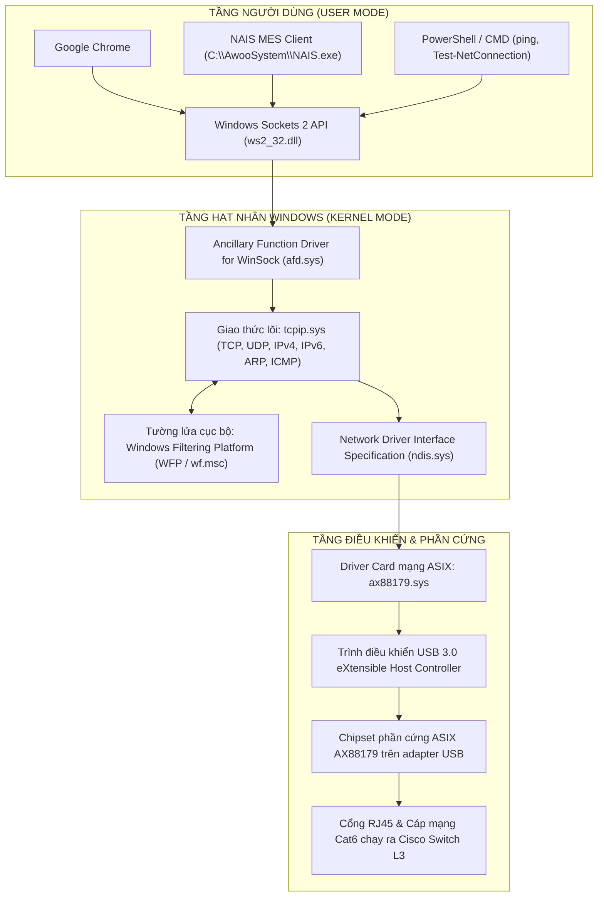
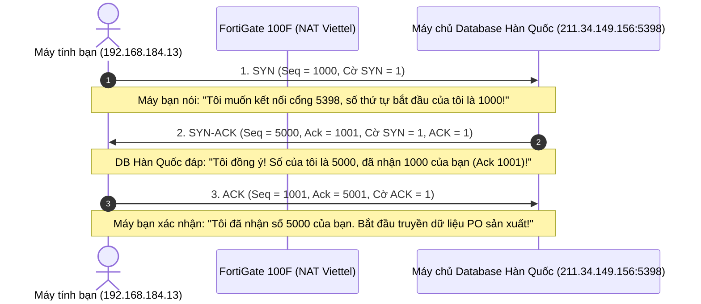
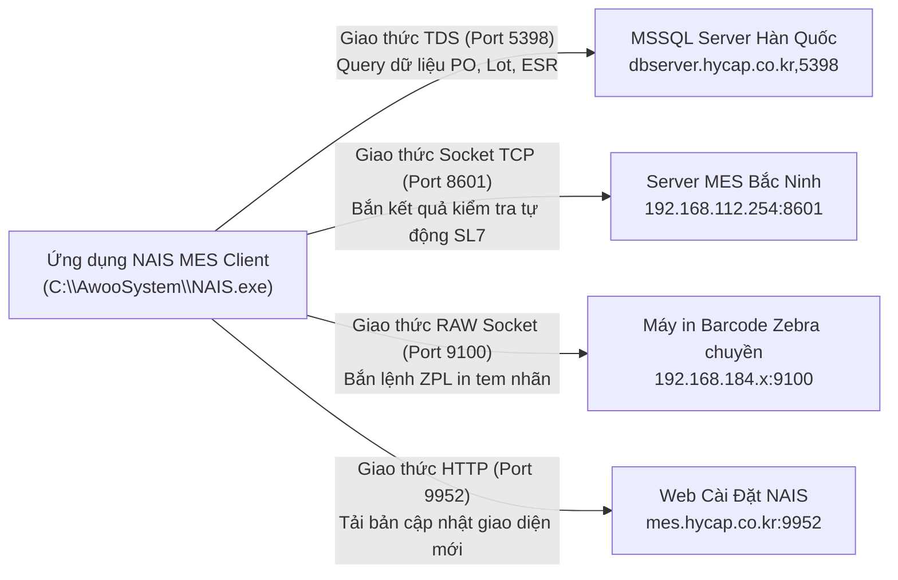
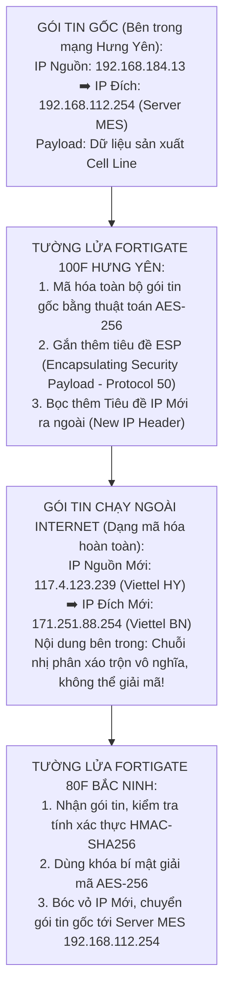

# 📘 TẬP 1: GIÁO TRÌNH NỀN TẢNG MẠNG MÁY TÍNH & KIẾN TRÚC HỆ THỐNG DOANH NGHIỆP
> **Chương trình đào tạo chuyên sâu từ mức độ vi mô (Bit, Byte) đến kiến trúc hạ tầng tổng thể**  
> **Dành riêng cho Kỹ sư & Cán bộ Vận hành Nhà máy Vinatech**  
> **100% Thực chiến & Sống động:** Lấy trực tiếp chiếc máy tính bạn đang ngồi (`192.168.184.13`), Card mạng ASIX AX88179, Cisco Catalyst Core Switch L3 (`192.168.184.1`), Tường lửa FortiGate 100F Hưng Yên (`10.0.0.1`), phần mềm NAIS MES (`C:\AwooSystem\`), Database Hàn Quốc (`dbserver.hycap.co.kr,5398`) và Hub Bắc Ninh (`192.168.0.254`) làm ví dụ xuyên suốt.  
> **Phương pháp tiếp cận:** Giải phẫu từ khái niệm nhỏ nhất, nhìn thấu từng bit nhị phân, từng byte tiêu đề gói tin, từng dòng lệnh hệ điều hành Windows!

---

## 📑 MỤC LỤC CHI TIẾT
1. [Chương 1: Khái niệm Nguyên tử — Bit, Byte, Xung điện & Mã hóa Nhị phân](#chương-1-khái-niệm-nguyên-tử--bit-byte-xung-điện--mã-hóa-nhị-phân)
2. [Chương 2: Kiến trúc Ngăn xếp Mạng Hệ điều hành Windows 11 trên máy bạn](#chương-2-kiến-trúc-ngăn-xếp-mạng-hệ-điều-hành-windows-11-trên-máy-bạn)
3. [Chương 3: Tầng 2 (Data Link) — Khung tin Ethernet, Địa chỉ MAC, Giao thức ARP & Thẻ VLAN 802.1Q](#chương-3-tầng-2-data-link--khung-tin-ethernet-địa-chỉ-mac-giao-thức-arp--thẻ-vlan-8021q)
4. [Chương 4: Tầng 3 (Network) — Tiêu đề gói tin IPv4 & Toán nhị phân Subnetting `/21` chi tiết từng Bit](#chương-4-tầng-3-network--tiêu-đề-gói-tin-ipv4--toán-nhị-phân-subnetting-21-chi-tiết-từng-bit)
5. [Chương 5: Tầng 4 (Transport) — Tiêu đề TCP Segment, Bắt tay 3 bước & Cổng Port Dịch vụ](#chương-5-tầng-4-transport--tiêu-đề-tcp-segment-bắt-tay-3-bước--cổng-port-dịch-vụ)
6. [Chương 6: Bộ ba Dịch vụ Mạng Cốt lõi — DHCP (DORA), Phân giải DNS & Bảng Định tuyến Windows](#chương-6-bộ-ba-dịch-vụ-mạng-cốt-lõi--dhcp-dora-phân-giải-dns--bảng-định-tuyến-windows)
7. [Chương 7: Tầng 7 (Application) — Các Giao thức Ứng dụng Sản xuất MES Vinatech](#chương-7-tầng-7-application--các-giao-thức-ứng-dụng-sản-xuất-mes-vinatech)
8. [Chương 8: Tường lửa FortiGate, Bảng Quản lý Phiên (Session State Table) & Cơ chế NAT](#chương-8-tường-lửa-fortigate-bảng-quản-lý-phiên-session-state-table--cơ-chế-nat)
9. [Chương 9: Bảo mật Đa Nhà máy — Bản chất Đóng gói Đường hầm IPsec VPN (ESP Protocol 50)](#chương-9-bảo-mật-đa-nhà-máy--bản-chất-đóng-gói-đường-hầm-ipsec-vpn-esp-protocol-50)
10. [Chương 10: 10 Bài thực hành Lệnh Vi mô (Micro-Labs) ngay trên máy tính của bạn](#chương-10-10-bài-thực-hành-lệnh-vi-mô-micro-labs-ngay-trên-máy-tính-của-bạn)

---

## CHƯƠNG 1: KHÁI NIỆM NGUYÊN TỬ — BIT, BYTE, XUNG ĐIỆN & MÃ HÓA NHỊ PHÂN

Mọi hệ thống mạng máy tính đồ sộ nhất hành tinh, mọi máy chủ cơ sở dữ liệu sản xuất hay tường lửa hàng trăm triệu đồng, xét đến cùng đều bắt đầu từ **1 đơn vị thông tin nhỏ nhất: Con số 0 hoặc con số 1**.

```
[THANG ĐO ĐƠN VỊ DỮ LIỆU TỪ NHỎ NHẤT ĐẾN LỚN]
 1 Bit (b)         = 0 hoặc 1 (Trạng thái có điện hoặc không có điện)
 1 Nibble          = 4 bits (Đúng bằng 1 ký tự Hex: 0 đến F)
 1 Byte (B)/Octet  = 8 bits (Đủ chứa 1 ký tự ASCII như chữ 'A')
 1 Kilobyte (KB)   = 1.024 Bytes
 1 Megabyte (MB)   = 1.024 KB
 1 Gigabyte (GB)   = 1.024 MB
```

### 1.1. Bit là gì và làm thế nào 0 và 1 truyền qua dây cáp mạng máy tính bạn?
* **Bản chất vật lý:** Trên máy tính bạn đang ngồi, chiếc adapter **ASIX AX88179** nối với dây cáp mạng Cat6 UTP cắm vào ổ tường. Bên trong sợi dây cáp mạng đó có **8 lõi đồng xoắn đôi thành 4 cặp** (Cam, Xanh lá, Xanh dương, Nâu).
* **Truyền tín hiệu điện:** Ở tốc độ Gigabit (1.000 Mbps - 1000BASE-T), cả 4 cặp dây đồng đều truyền nhận đồng thời (Full Duplex).
  * Card mạng không chỉ đơn giản bật/tắt điện áp 0V và 5V mà sử dụng công nghệ điều chế **PAM-5 (Pulse Amplitude Modulation 5 mức điện áp)**: `-2V, -1V, 0V, +1V, +2V`.
  * Mỗi bước nhảy điện áp truyền đi được biểu diễn thành các bit `00, 01, 10, 11`.
  * Với tần số dao động **125 triệu lần mỗi giây (125 MHz)** trên cả 4 cặp dây, card mạng tạo ra lưu lượng:
    $$125 \text{ MHz} \times 2 \text{ bits/bước} \times 4 \text{ cặp dây} = 1.000.000.000 \text{ bits/giây (1 Gbps)!}$$
* **Ý nghĩa thực tế:** Khi bạn bấm lưu một Lot sản xuất trên phần mềm NAIS, hàng triệu xung điện vi mô này bắn qua lõi đồng Cat6 tới Cisco Core Switch chỉ trong vài phần triệu giây!

### 1.2. Byte và Hệ thập lục phân (Hexadecimal - Hex):
* **Byte (Octet):** Tập hợp của 8 bit nhị phân. Ví dụ: `11000000` (ở hệ thập phân chính là số `192`).
* **Tại sao trong mạng lại dùng hệ Hex (Hệ cơ số 16)?**
  * Viết số nhị phân `100111000110100111010011010010110100001001000111` quá dài và con người rất dễ đọc nhầm.
  * Vì thế, người ta gom **cứ 4 bit nhị phân thành 1 ký tự Hex** (từ `0` đến `9` và `A, B, C, D, E, F`):
    * `0000` = `0`, `1001` = `9`, `1010` = `A`, `1011` = `B`, `1100` = `C`, `1101` = `D`, `1110` = `E`, `1111` = `F`.
  * Như vậy, **1 Byte (8 bit) luôn được viết gọn gàng bằng đúng 2 ký tự Hex (từ `00` đến `FF`)**.
* **Thực tế trên máy bạn:**
  * Địa chỉ MAC card mạng của bạn là `9C-69-D3-4B-42-47`. Đây chính là **6 Byte** viết dưới dạng Hex!
  * `9C` = `10011100`
  * `69` = `01101001`
  * ... Toàn bộ địa chỉ MAC của bạn gồm đúng 48 bit nhị phân (6 Bytes $\times$ 8 bits = 48 bits).

---

## CHƯƠNG 2: KIẾN TRÚC NGĂN XẾP MẠNG HỆ ĐIỀU HÀNH WINDOWS 11 TRÊN MÁY BẠN

Khi bạn mở một ứng dụng (Chrome hoặc phần mềm MES NAIS), dữ liệu không nhảy ngay ra dây mạng mà đi qua một ngăn xếp hệ thống (Network Subsystem) cực kỳ chặt chẽ trong lòng hệ điều hành **Windows 11 (OS Build 26100)**:



### Giải mã từng trạm kiểm soát trong Windows máy bạn:
1. **`ws2_32.dll` (Winsock API):** Cung cấp các hàm lập trình tiêu chuẩn `socket()`, `connect()`, `send()`, `recv()`. Khi NAIS muốn gọi Database, nó gọi hàm `connect(ip='211.34.149.156', port=5398)`.
2. **`tcpip.sys`:** Bộ não mạng của Windows. Chịu trách nhiệm chia nhỏ dữ liệu thành các đoạn (Segment), gắn tiêu đề TCP, đánh số thứ tự (Sequence number), dán địa chỉ IP nguồn `192.168.184.13` và IP đích.
3. **Windows Filtering Platform (`bfe.sys` / `wf.msc`):** Bộ lọc tường lửa Windows. Nếu bạn vô tình để card mạng ở chế độ **Public Network**, bộ lọc này sẽ lập tức chặn cổng `445` (khiến máy anh Cường `MrCuong-ProductionHY` không thể vào lấy file chia sẻ của bạn).
4. **`ndis.sys`:** Chuẩn giao tiếp trung gian giữa hệ điều hành Windows và phần cứng của mọi hãng card mạng trên thế giới.
5. **`ax88179.sys`:** Driver chuyên biệt của hãng ASIX chuyển các khung tin số thành lệnh giao tiếp qua bus USB 3.0, đưa tới chip mạng phần cứng và biến thành dòng điện phát ra dây cáp Cat6!

---

## CHƯƠNG 3: TẦNG 2 (DATA LINK) — KHUNG TIN ETHERNET, ĐỊA CHỈ MAC, GIAO THỨC ARP & THẺ VLAN 802.1Q

Ở Tầng 2, các máy tính không nói chuyện bằng địa chỉ IP mà nói chuyện bằng **Khung tin Ethernet (Ethernet Frame)** và **Địa chỉ vật lý MAC**.

### 3.1. Cấu trúc vi mô của một Khung tin Ethernet II (Tổng cộng: 14 Bytes tiêu đề + Dữ liệu + 4 Bytes kiểm tra lỗi):

```
┌──────────────┬──────────────┬──────────────┬──────────────┬──────────────────┬──────────────┐
│  Preamble &  │ Destination  │    Source    │  EtherType   │     Payload      │   FCS / CRC  │
│     SFD      │  MAC Address │  MAC Address │   (Type)     │   (IP Packet)    │  (Checksum)  │
│   8 Bytes    │   6 Bytes    │   6 Bytes    │   2 Bytes    │ 46 - 1.500 Bytes │   4 Bytes    │
└──────────────┴──────────────┴──────────────┴──────────────┴──────────────────┴──────────────┘
```

* **Preamble & SFD (8 Bytes):** Chuỗi bit đồng bộ nhịp đồng hồ `10101010...` kết thúc bằng `10101011` (Start Frame Delimiter) để báo cho bộ nhận trên switch biết: *"Khung tin bắt đầu từ đây!"*.
* **Destination MAC (6 Bytes):** Địa chỉ MAC của thiết bị chặng tiếp theo (ví dụ: MAC của Cisco Core Switch `E4-4E-2D-4B-8D-51`).
* **Source MAC (6 Bytes):** Địa chỉ MAC của máy gửi (chính là MAC máy bạn `9C-69-D3-4B-42-47`).
* **EtherType (2 Bytes):** Xác định dữ liệu bên trong là gì:
  * `0x0800`: Gói tin IPv4 (lướt web, gửi dữ liệu MES).
  * `0x0806`: Bản tin hỏi địa chỉ ARP.
  * `0x8100`: Khung có gắn thẻ phân vùng VLAN (802.1Q).
* **Payload (46 đến 1.500 Bytes):** Chứa gói tin IP. Kích thước tối đa chuẩn là **MTU = 1.500 Bytes**.
* **FCS / CRC32 (4 Bytes):** Mã kiểm tra tính toàn vẹn (Frame Check Sequence). Card mạng người nhận tính lại toán học, nếu dây cáp bị nhiễu làm sai dù chỉ 1 bit 0 thành 1, khung tin sẽ bị tiêu hủy ngay tại chỗ!

---

### 3.2. Cấu trúc địa chỉ vật lý MAC 48-bit (6 Bytes):
Địa chỉ MAC được khắc vĩnh viễn vào chip nhớ ROM của card mạng từ lúc xuất xưởng:
* **24 bit đầu (3 Bytes đầu) = OUI (Organizationally Unique Identifier):** Mã định danh nhà sản xuất do tổ chức quốc tế IEEE cấp phép.
  * Card của bạn: `9C-69-D3` $\rightarrow$ Thuộc về **ASIX Electronics Corp**.
  * Switch của xưởng: `E4-4E-2D` $\rightarrow$ Thuộc về **Cisco Systems, Inc.**
  * Máy tính anh Cường: `BC-0F-F3` $\rightarrow$ Thuộc về **Dell / HP Workstation**.
* **24 bit sau (3 Bytes sau) = Serial Number:** Số sê-ri phần cứng duy nhất của chiếc card đó.

---

### 3.3. Giải phẫu Bản tin Giao thức Phân giải Địa chỉ ARP (Address Resolution Protocol):
Máy tính bạn có IP `192.168.184.13`. Khi bạn gõ `ping 192.168.184.36` (máy anh Cường quản lý sản xuất):
1. Máy bạn tự hỏi: *"Làm sao gửi được khung tin Ethernet cho IP 192.168.184.36 khi tôi chưa biết địa chỉ MAC của anh ấy?"*.
2. Máy bạn lập tức tạo một bản tin **ARP Request** (Dài đúng 28 Bytes):
   * `Hardware Type`: `1` (Ethernet)
   * `Protocol Type`: `0x0800` (IPv4)
   * `Opcode`: `1` (Request - Đang hỏi)
   * `Sender MAC`: `9C-69-D3-4B-42-47` (Máy bạn)
   * `Sender IP`: `192.168.184.13`
   * `Target MAC`: `00-00-00-00-00-00` (Chưa biết)
   * `Target IP`: `192.168.184.36`
3. Máy bạn bọc bản tin này vào khung Ethernet với **Destination MAC là `FF-FF-FF-FF-FF-FF` (Broadcast - Gửi cho toàn bộ xưởng)**.
4. Cisco Core Switch nhận được bản tin, nhân bản ra tất cả các cổng trong VLAN 184.
5. Máy tính `MrCuong-ProductionHY` nhận được, thấy hỏi đúng IP của mình liền gửi lại bản tin **ARP Reply** (`Opcode = 2`): *"Tôi là 192.168.184.36, MAC của tôi là `BC-0F-F3-C0-F9-E3`!"*.
6. Máy bạn lưu ngay cặp `192.168.184.36 ↔ BC-0F-F3-C0-F9-E3` vào **Bảng ARP Cache** (xem bằng lệnh `arp -a`).

---

### 3.4. Bản chất Phân vùng Mạng VLAN & Thẻ gắn 802.1Q Tag:
Tại nhà máy Hưng Yên, tại sao máy tính của bạn và các đầu ghi Camera NVR lại cùng nằm trong **VLAN 184** mà không phải VLAN khác?
* **Access Port (Cổng truy cập):** Dây cáp mạng từ máy bạn cắm vào cổng số 12 trên switch. Cổng này được cấu hình là cổng Access thuộc VLAN 184. Khung tin chạy trên dây từ máy bạn tới switch **hoàn toàn bình thường (Untagged)**.
* **Trunk Port (Cổng đường trục `Link-to-L3`):** Cổng nối giữa Cisco Core Switch (`10.0.0.2`) sang FortiGate 100F (`10.0.0.1`) phải chở dữ liệu của cả 8 VLAN khác nhau.
  * Lúc này, Cisco Switch tự động **chèn thêm 4 Bytes thẻ 802.1Q (VLAN Tag)** vào giữa Source MAC và EtherType:
    ```
    ┌────────────────┬────────┬─────────────────────────────┐
    │  TPID (2 Bytes)│  PCP   │ DEI │   VLAN ID (VID)       │
    │     0x8100     │ 3 bits │1 bit│ 12 bits (Chứa số 184) │
    └────────────────┴────────┴─────────────────────────────┘
    ```
  * Số 184 ở dạng nhị phân 12 bit là: **`0000 1011 1000`**.
  * Khi FortiGate 100F nhận được khung tin, nó đọc 12 bit này và biết chính xác: *"Gói tin này thuộc về VLAN 184, cần áp dụng Rule #4 `[VLAN184-to-INTERNET]`!"*.

---

## CHƯƠNG 4: TẦNG 3 (NETWORK) — TIÊU ĐỀ GÓI TIN IPV4 & TOÁN NHỊ PHÂN SUBNETTING `/21` CHI TIẾT TỪNG BIT

Ở Tầng 3, dữ liệu được đóng thành **Gói tin IP (IP Packet)**. Đây là tầng quyết định lộ trình định tuyến xuyên qua các nhà máy Vinatech trên toàn cầu.

### 4.1. Cấu trúc vi mô của Tiêu đề IPv4 Header (Chuẩn 20 Bytes):

```
 0                   1                   2                   3
 0 1 2 3 4 5 6 7 8 9 0 1 2 3 4 5 6 7 8 9 0 1 2 3 4 5 6 7 8 9 0 1
+-+-+-+-+-+-+-+-+-+-+-+-+-+-+-+-+-+-+-+-+-+-+-+-+-+-+-+-+-+-+-+-+
|Version|  IHL  |Type of Service|          Total Length         |
+-+-+-+-+-+-+-+-+-+-+-+-+-+-+-+-+-+-+-+-+-+-+-+-+-+-+-+-+-+-+-+-+
|         Identification        |Flags|      Fragment Offset    |
+-+-+-+-+-+-+-+-+-+-+-+-+-+-+-+-+-+-+-+-+-+-+-+-+-+-+-+-+-+-+-+-+
|  Time to Live |    Protocol   |        Header Checksum        |
+-+-+-+-+-+-+-+-+-+-+-+-+-+-+-+-+-+-+-+-+-+-+-+-+-+-+-+-+-+-+-+-+
|                       Source IP Address                       |
+-+-+-+-+-+-+-+-+-+-+-+-+-+-+-+-+-+-+-+-+-+-+-+-+-+-+-+-+-+-+-+-+
|                    Destination IP Address                     |
+-+-+-+-+-+-+-+-+-+-+-+-+-+-+-+-+-+-+-+-+-+-+-+-+-+-+-+-+-+-+-+-+
```

* **Version (4 bits):** Luôn bằng `4` (IPv4: nhị phân `0100`).
* **IHL (Internet Header Length - 4 bits):** Bằng `5` (tức $5 \times 32 \text{ bits} = 160 \text{ bits} = 20 \text{ Bytes}$).
* **Total Length (16 bits):** Độ dài toàn bộ gói tin (tối đa $2^{16} - 1 = 65.535 \text{ Bytes}$).
* **Time to Live (TTL - 8 bits):** "Hạn sống" của gói tin (thường Windows đặt mặc định là 128, Linux/FortiGate là 64 hoặc 255).
  * Mỗi khi gói tin chạy qua 1 thiết bị định tuyến (Switch L3 hoặc FortiGate), bộ định tuyến sẽ **trừ TTL đi 1 đơn vị**.
  * Nếu mạng bị lặp vòng (Routing Loop), khi TTL chạm số 0, gói tin sẽ bị hủy để không làm sập mạng.
* **Protocol (8 bits):** Chỉ rõ dữ liệu bên trong là giao thức gì:
  * Số `6` (`0x06`): Giao thức **TCP** (dữ liệu web, MES, database).
  * Số `17` (`0x11`): Giao thức **UDP** (hỏi tên miền DNS).
  * Số `1` (`0x01`): Giao thức **ICMP** (lệnh ping).
  * Số `50` (`0x32`): Giao thức **ESP** (Đường hầm bảo mật IPsec VPN).
* **Source IP (32 bits = 4 Bytes):** Địa chỉ máy gửi (`192.168.184.13`).
* **Destination IP (32 bits = 4 Bytes):** Địa chỉ máy nhận (ví dụ `192.168.112.254` máy chủ Bắc Ninh).

---

### 4.2. Toán Nhị phân Subnetting chi tiết từng bit — Giải mã Subnet `/21` (`255.255.248.0`):
Làm thế nào chiếc máy tính của bạn biết được một địa chỉ IP khác nằm **cùng phòng với mình (nội bộ)** hay **ở xa bên ngoài (cần gửi cho Gateway)**?
Máy tính thực hiện phép toán logic **Bitwise AND (Nhân logic từng bit)** giữa Địa chỉ IP của nó và Mặt nạ Subnet Mask.

#### Bước 1: Biến đổi IP máy bạn (`192.168.184.13`) sang 32 bit nhị phân:
* Octet 1: $192 = 128 + 64 = \mathbf{11000000_2}$
* Octet 2: $168 = 128 + 32 + 8 = \mathbf{10101000_2}$
* Octet 3: $184 = 128 + 32 + 16 + 8 = \mathbf{10111000_2}$
* Octet 4: $13 = 8 + 4 + 1 = \mathbf{00001101_2}$
$$\text{IP: } \underbrace{11000000.10101000.10111}_{\text{21 bit đầu}} \ \underbrace{000.00001101}_{\text{11 bit sau}}$$

#### Bước 2: Biến đổi Subnet Mask (`255.255.248.0` = `/21`) sang 32 bit nhị phân:
* Octet 1: $255 = \mathbf{11111111_2}$
* Octet 2: $255 = \mathbf{11111111_2}$
* Octet 3: $248 = 128 + 64 + 32 + 16 + 8 = \mathbf{11111000_2}$ (Đúng 5 bit 1 đầu tiên!)
* Octet 4: $0 = \mathbf{00000000_2}$
$$\text{Mask: } \underbrace{11111111.11111111.11111}_{\text{Đúng 21 bit 1 liên tục (/21)}} \ \underbrace{000.00000000}_{\text{11 bit 0 dành cho Host ID}}$$

#### Bước 3: Phép toán Bitwise AND (1 AND 1 = 1, còn lại = 0):
```
IP:   11000000 . 10101000 . 10111000 . 00001101  (192.168.184.13)
Mask: 11111111 . 11111111 . 11111000 . 00000000  (255.255.248.0)
──────────────────────────────────────────────────────────────────
AND:  11000000 . 10101000 . 10111000 . 00000000  (192.168.184.0)
```
➡️ **Kết quả:** Địa chỉ mạng định danh (Network ID) là **`192.168.184.0`**!

#### Bước 4: Tính Địa chỉ Broadcast & Dải IP sử dụng:
* Còn lại **11 bit 0** dành cho máy trạm (Host ID).
* Để tìm địa chỉ **Broadcast (Quảng bá)**, ta bật toàn bộ 11 bit 0 này thành **bit 1**:
  * Octet 3: `10111` + `111` = `10111111` (Hệ thập phân: $128+32+16+8+4+2+1 = \mathbf{191}$)
  * Octet 4: `11111111` (Hệ thập phân: $\mathbf{255}$)
  ➡️ Địa chỉ Broadcast là: **`192.168.191.255`**!
* **Dải IP khả dụng cho thiết bị:**
  * IP đầu tiên: `192.168.184.1` (gán cho Cisco Core Switch Gateway).
  * IP cuối cùng: `192.168.191.254`.
  * Tổng số máy tính: $2^{11} - 2 = 2.048 - 2 = \mathbf{2.046 \text{ thiết bị}}$!

---

### 4.3. Bảng Ma trận Subnet `/21` của toàn bộ 4 Nhà máy Vinatech:
Nhờ sự tính toán toán học chính xác của kiến trúc sư mạng, 4 nhà máy không bao giờ bị đè dải IP lên nhau:

| Nhà máy | Dải mạng CIDR | Subnet Mask nhị phân | Dải IP khả dụng | Gateway nội bộ |
| :--- | :---: | :---: | :--- | :--- |
| **Hưng Yên (Bạn đang ngồi)** | `192.168.184.0/21` | `11111111.11111111.11111000.0` | `192.168.184.1` ➡️ `192.168.191.254` | `192.168.184.1` (Cisco Switch L3) |
| **Bắc Ninh (Trung tâm Hub)** | `192.168.0.0/21` | `11111111.11111111.11111000.0` | `192.168.0.1` ➡️ `192.168.7.254` | `192.168.0.254` (FortiGate 80F) |
| **Bắc Giang 1 (Xưởng 1)** | `192.168.120.0/21` | `11111111.11111111.11111000.0` | `192.168.120.1` ➡️ `192.168.127.254` | `192.168.120.1` (FortiGate 80F) |
| **Bắc Giang 2 (Xưởng 2)** | `192.168.200.0/21` | `11111111.11111111.11111000.0` | `192.168.200.1` ➡️ `192.168.207.254` | `192.168.200.1` (FortiGate 60F) |

---

## CHƯƠNG 5: TẦNG 4 (TRANSPORT) — TIÊU ĐỀ TCP SEGMENT, BẮT TAY 3 BƯỚC & CỔNG PORT DỊCH VỤ

Nếu Tầng 3 đưa dữ liệu đến đúng chiếc máy tính, thì **Tầng 4 chịu trách nhiệm đưa dữ liệu đến đúng phần mềm đang mở trên chiếc máy tính đó** thông qua khái niệm **Cổng dịch vụ (Port)**.

### 5.1. Cấu trúc vi mô của Tiêu đề TCP Header (Chuẩn 20 Bytes):

```
 0                   1                   2                   3
 0 1 2 3 4 5 6 7 8 9 0 1 2 3 4 5 6 7 8 9 0 1 2 3 4 5 6 7 8 9 0 1
+-+-+-+-+-+-+-+-+-+-+-+-+-+-+-+-+-+-+-+-+-+-+-+-+-+-+-+-+-+-+-+-+
|          Source Port          |       Destination Port        |
+-+-+-+-+-+-+-+-+-+-+-+-+-+-+-+-+-+-+-+-+-+-+-+-+-+-+-+-+-+-+-+-+
|                        Sequence Number                        |
+-+-+-+-+-+-+-+-+-+-+-+-+-+-+-+-+-+-+-+-+-+-+-+-+-+-+-+-+-+-+-+-+
|                    Acknowledgment Number                      |
+-+-+-+-+-+-+-+-+-+-+-+-+-+-+-+-+-+-+-+-+-+-+-+-+-+-+-+-+-+-+-+-+
|  Data |           |U|A|P|R|S|F|                               |
| Offset| Reserved  |R|C|S|S|Y|I|            Window             |
|       |           |G|K|H|T|N|N|                               |
+-+-+-+-+-+-+-+-+-+-+-+-+-+-+-+-+-+-+-+-+-+-+-+-+-+-+-+-+-+-+-+-+
|           Checksum            |        Urgent Pointer         |
+-+-+-+-+-+-+-+-+-+-+-+-+-+-+-+-+-+-+-+-+-+-+-+-+-+-+-+-+-+-+-+-+
```

* **Source Port (16 bits):** Cổng nguồn động (Ephemeral port) do Windows tự sinh ngẫu nhiên từ `49152` đến `65535` cho phiên kết nối của bạn.
* **Destination Port (16 bits):** Cổng đích của phần mềm máy chủ nhận dữ liệu (ví dụ: `5398` cho Database MSSQL).
* **Sequence Number (32 bits):** Đánh số thứ tự từng byte dữ liệu. Nhờ số này, dù các gói tin đi trên Internet bị đảo lộn thứ tự, máy nhận vẫn ghép lại thành văn bản hoàn chỉnh 100%.
* **Acknowledgment Number (32 bits):** Số báo nhận: *"Tôi đã nhận được đến byte N, hãy gửi tiếp từ byte N+1"*.
* **6 Cờ điều khiển cốt lõi (Control Flags):**
  * `SYN` (Synchronize): Yêu cầu bắt tay mở kết nối.
  * `ACK` (Acknowledge): Xác nhận đã nhận được dữ liệu.
  * `FIN` (Finish): Yêu cầu đóng kết nối trong hòa bình.
  * `RST` (Reset): Cắt kết nối khẩn cấp (khi cổng đích bị đóng hoặc có tấn công).
  * `PSH` (Push): Đẩy dữ liệu lên tầng ứng dụng ngay lập tức mà không đợi đầy bộ đệm.
* **Window Size (16 bits):** Kích thước cửa sổ nhận (Flow control) giúp máy trạm yếu không bị máy chủ khủng gửi dữ liệu dồn dập làm tràn bộ nhớ.

---

### 5.2. Giải phẫu Quá trình Bắt tay 3 bước (TCP Three-Way Handshake) sống động:
Khi bạn mở phần mềm NAIS MES (`C:\AwooSystem\`) để kết nối đến Database `dbserver.hycap.co.kr,5398`:



* Sau bước 3, socket chuyển sang trạng thái **`ESTABLISHED`** (Đang kết nối). Lúc này phần mềm mới gửi câu lệnh SQL!

---

### 5.3. Bảng Tra cứu Cổng Port Dịch vụ Đang Chạy Sống tại Vinatech:

| Port | Giao thức | Dịch vụ tương ứng | IP Thực tế trong hệ thống | Nghiệp vụ cụ thể |
| :---: | :---: | :--- | :--- | :--- |
| **`5398`** | TCP | **Database MSSQL (`SmartFactoryV2`)** | `dbserver.hycap.co.kr` (`211.34.149.156`) | NAIS MES đọc ghi dữ liệu lệnh sản xuất, Lot, Cell Test. |
| **`9952`** | TCP | **Web Cập nhật & Cài đặt NAIS** | `mes.hycap.co.kr` (`211.34.149.156`) | Tải bộ cài đặt và đồng bộ version phần mềm MES. |
| **`8601`** | TCP | **Core Server MES Bắc Ninh** | `192.168.112.254:8601` | Điều khiển API dây chuyền sản xuất tự động SL7 (Qua VPN 6ms). |
| **`9100`** | TCP | In tem mã vạch RAW qua LAN | `192.168.184.x:9100` | Máy in công nghiệp Zebra / Sato nhận lệnh in tem Lot trực tiếp. |
| **`8000`** | TCP | Video Stream Đầu ghi NVR | `192.168.184.10:8000` / `.11:8000` | Truyền luồng hình ảnh camera giám sát xưởng sản xuất Hưng Yên. |
| **`445`** | TCP | Chia sẻ File Windows (SMB) | `192.168.184.36` (Anh Cường) / `184.34` | Chia sẻ file Excel, quy trình sản xuất nội bộ giữa các máy trạm. |
| **`4443`** | TCP | Web Quản trị FortiGate Hưng Yên | `https://10.0.0.1:4443` | Cổng bạn đăng nhập quản trị hệ thống mạng nhà máy FG-100F. |
| **`443`** | TCP | Web Quản trị Bắc Ninh / Bắc Giang | `https://42.112.60.211` | Cổng quản trị từ xa các chi nhánh khác. |
| **`22 / 23`**| TCP | Quản trị Cisco Core Switch L3 | `192.168.184.1` | Cổng SSH (22) và Telnet (23) cấu hình định tuyến switch. |
| **`3389`** | TCP | Remote Desktop (RDP) | `192.168.184.45:3389` | Điều khiển từ xa máy tính công nghiệp gắn liền với chuyền máy. |
| **`53`** | UDP | Máy chủ hỏi tên miền (DNS) | `8.8.8.8` và `8.8.4.4` | Phân giải tên miền thành địa chỉ IP. |

---

## CHƯƠNG 6: BỘ BA DỊCH VỤ MẠNG CỐT LÕI — DHCP (DORA), PHÂN GIẢI DNS & BẢNG ĐỊNH TUYẾN WINDOWS

Để máy tính của bạn có thể hoạt động trơn tru trong mạng mà bạn không cần phải tự cấu hình thủ công mỗi ngày, có 3 dịch vụ âm thầm chạy ngầm:

### 6.1. Chu trình Cấp phát IP tự động DHCP DORA (4 Bước):
Khi bạn cắm dây mạng USB ASIX vào máy tính:
1. **D - Discover (Khám phá):** Máy bạn chưa có IP, liền gửi gói tin Broadcast: *"Có máy chủ DHCP nào ở đây không, cấp cho tôi xin 1 IP!"* (IP nguồn `0.0.0.0`, IP đích `255.255.255.255`, cổng UDP 67/68).
2. **O - Offer (Đề nghị):** Máy chủ DHCP trên mạng trả lời: *"Tôi có IP `192.168.184.13` còn trống, bạn có muốn lấy không?"*.
3. **R - Request (Yêu cầu):** Máy bạn xác nhận: *"Tôi đồng ý nhận IP `192.168.184.13`!"*.
4. **A - Acknowledge (Xác nhận):** DHCP Server gửi gói tin cuối cùng chốt hợp đồng thuê (Lease Time), đồng thời gửi kèm:
   * Subnet Mask: `255.255.248.0`
   * Default Gateway: `192.168.184.1`
   * DNS Server: `8.8.8.8`

---

### 6.2. Cơ chế Phân giải Tên miền DNS (Domain Name System):
Con người chỉ nhớ được tên chữ (`dbserver.hycap.co.kr`), nhưng card mạng chỉ hiểu số IP (`211.34.149.156`).
* **Bước 1 (Kiểm tra bộ đệm cục bộ):** Windows kiểm tra file `C:\Windows\System32\drivers\etc\hosts` và DNS Cache trên RAM máy bạn (`ipconfig /displaydns`).
* **Bước 2 (Gửi truy vấn DNS):** Nếu chưa có, Windows gửi gói tin UDP cổng 53 tới `8.8.8.8` (Google Public DNS): *"Cho tôi xin IP của dbserver.hycap.co.kr"*.
* **Bước 3 (Đệ quy quốc tế):** Máy chủ Google tra cứu hệ thống máy chủ tên miền gốc (.kr ➡️ co.kr ➡️ hycap.co.kr).
* **Bước 4 (Trả lời):** Google trả lời về máy bạn kết quả: **A Record = `211.34.149.156`** với thời gian sống TTL = 84 giây. Máy bạn ghi vào RAM và tiến hành kết nối!

---

### 6.3. Bảng Định tuyến Cục bộ (Windows Routing Table) trên máy bạn:
Bạn có thể tự xem bảng chỉ đường của máy tính mình bằng lệnh: `route print` hoặc `Get-NetRoute -AddressFamily IPv4`.
* **Dòng quan trọng nhất cuộc đời máy tính của bạn:**
  ```text
  Network Destination        Netmask          Gateway       Interface  Metric
            0.0.0.0          0.0.0.0    192.168.184.1  192.168.184.13      25
  ```
* **Ý nghĩa:** `0.0.0.0/0` đại diện cho **"Toàn bộ thế giới bên ngoài"**. Bất cứ gói tin nào có địa chỉ đích không thuộc dải mạng nội bộ `192.168.184.0/21`, Windows sẽ tự động đẩy sang **Default Gateway `192.168.184.1` (Cisco Core Switch)** để nhờ chuyển đi tiếp!

---

## CHƯƠNG 7: TẦNG 7 (APPLICATION) — CÁC GIAO THỨC ỨNG DỤNG SẢN XUẤT MES VINATECH

Ở Tầng 7, dữ liệu mang ý nghĩa nghiệp vụ sản xuất thực sự của nhà máy:



1. **Giao thức TDS (Tabular Data Stream - Cổng 5398):** Giao thức độc quyền của Microsoft SQL Server. Dữ liệu lệnh sản xuất, cấu trúc BOM linh kiện tụ điện Supercapacitor được đóng gói thành các bảng dữ liệu dạng nhị phân tối ưu tốc độ truyền.
2. **Giao thức Socket TCP Ứng dụng MES (Cổng 8601):** Sử dụng các chuỗi bản tin chuẩn hóa để giao tiếp thời gian thực với máy móc tự động hóa SL7 tại Bắc Ninh.
3. **Ngôn ngữ ZPL (Zebra Programming Language) qua Cổng in RAW 9100:** Khi bạn bấm in tem trên phần mềm MES, phần mềm sinh ra các đoạn mã dạng text như:
   ```text
   ^XA
   ^FO50,50^ADN,36,20^FDVINATECH SUPERCAPACITOR^FS
   ^FO50,100^BCN,100,Y,N,N^FDVJ240927001^FS
   ^XZ
   ```
   Đoạn mã này được đẩy thẳng vào cổng TCP `9100` của máy in tem Zebra đặt ngay trên chuyền sản xuất để in ra nhãn dán lên thùng hàng!

---

## CHƯƠNG 8: TƯỜNG LỬA FORTIGATE, BẢNG QUẢN LÝ PHIÊN (SESSION STATE TABLE) & CƠ CHẾ NAT

Thiết bị tường lửa FortiGate không hoạt động giống như một chiếc Router thông thường, mà nó là một **Stateful Firewall (Tường lửa giám sát trạng thái kết nối)**.

### 8.1. Bảng Trạng thái Phiên (Session State Table) trên FortiGate 100F:
Mỗi khi máy bạn tạo 1 kết nối ra ngoài Internet, FortiGate ghi lại 1 dòng vào RAM phần cứng của chip ASIC:

```
[BẢNG QUẢN LÝ PHIÊN THỰC TẾ TRÊN FORTIGATE 100F]
 Session ID: 981245
 Protocol: TCP (6) | State: ESTABLISHED
 ├── Chiều đi (Original):
 │    IP Nguồn: 192.168.184.13  | Port Nguồn: 54120
 │    IP Đích:  211.34.149.156  | Port Đích:  5398
 └── Chiều về (Reply - Đã qua Source NAT):
      IP Nguồn: 211.34.149.156  | Port Nguồn: 5398
      IP Đích:  117.4.123.239   | Port Đích:  62100 (Port NAT công cộng)
```

### 8.2. Tại sao cơ chế này bảo vệ an toàn tuyệt đối cho bạn?
1. **Khi bạn gửi dữ liệu đi:** Tường lửa thấy khớp **Rule #4 `[VLAN184-to-INTERNET]`**, nó cho phép đi qua, thay IP `192.168.184.13` thành IP Viettel công cộng `117.4.123.239:62100` (Source NAT).
2. **Khi Database Hàn Quốc trả lời về:** Gói tin mang đích đến là `117.4.123.239:62100`. FortiGate tra bảng Session: Thấy đúng là phản hồi của phiên ID `981245` do bạn khởi tạo, nó liền đổi lại thành `192.168.184.13:54120` và chuyển về cho bạn.
3. **Khi Hacker từ Internet chủ động tấn công:** Nếu một kẻ xấu bên ngoài cố tình gửi gói tin tấn công vào IP `117.4.123.239`, FortiGate tra bảng Session: Thấy không có phiên làm việc nào do máy tính nội bộ tạo ra từ trước ➡️ **Lập tức ném bỏ (DROP) gói tin vào thùng rác ngay tại cổng WAN!**

---

## CHƯƠNG 9: BẢO MẬT ĐA NHÀ MÁY — BẢN CHẤT ĐÓNG GÓI ĐƯỜNG HẦM IPSEC VPN (ESP PROTOCOL 50)

Làm thế nào để dữ liệu từ máy bạn gửi sang Bắc Ninh cách xa 50km chạy qua mạng Internet công cộng mà không bị ai nhìn trộm hay đánh cắp bí mật công nghệ?



### Bản chất kỹ thuật của IPsec Tunnel Mode:
* Giao thức sử dụng là **ESP (IP Protocol số 50)**, không dùng TCP hay UDP.
* Mọi hacker hay thậm chí chính nhà mạng viễn thông Viettel/VNPT khi bắt được gói tin này trên đường cáp quang cũng chỉ thấy hai đầu IP công cộng `117.4.123.239` và `171.251.88.254` đang nói chuyện với nhau.
* Toàn bộ địa chỉ IP nội bộ `192.168.184.13` và dữ liệu sản xuất bên trong đều được "tàng hình" 100%!

---

## CHƯƠNG 10: 10 BÀI THỰC HÀNH LỆNH VI MÔ (MICRO-LABS) NGAY TRÊN MÁY TÍNH CỦA BẠN

Hãy mở cửa sổ dòng lệnh (PowerShell hoặc CMD) và tự mình thực hiện 10 bài thực hành để tận mắt quan sát từng khái niệm vừa học:

### 🛠️ Lab 1: Soi chi tiết Card mạng & Driver
```powershell
Get-NetAdapter | Format-Table Name, InterfaceDescription, MacAddress, LinkSpeed, Status
```
* **Mục tiêu quan sát:** Tìm dòng `Ethernet 5`, thấy tên chip `ASIX AX88179`, MAC `9C-69-D3-4B-42-47`, tốc độ `1 Gbps`.

### 🛠️ Lab 2: Xem chi tiết cấu hình IPv4 & Subnet Mask /21
```powershell
Get-NetIPAddress -InterfaceAlias 'Ethernet 5' -AddressFamily IPv4 | Format-List IPAddress, PrefixLength
```
* **Mục tiêu quan sát:** Thấy `IPAddress : 192.168.184.13` và `PrefixLength : 21` (chính là `/21` = `255.255.248.0`).

### 🛠️ Lab 3: Xem Bảng Phân giải Địa chỉ MAC (ARP Cache)
```cmd
arp -a
```
* **Mục tiêu quan sát:** Tìm dòng `192.168.184.1`, bạn sẽ thấy địa chỉ MAC `e4-4e-2d-4b-8d-51` của Cisco Core Switch.

### 🛠️ Lab 4: Bắn tín hiệu sang máy anh Cường quản lý sản xuất
```cmd
ping 192.168.184.36
```
* **Mục tiêu quan sát:** Thấy thời gian phản hồi `time<1ms` chứng minh 2 máy cùng cắm vào 1 switch Layer 2 trong xưởng.

### 🛠️ Lab 5: Kiểm tra cổng dịch vụ Camera NVR xưởng (Port 8000)
```powershell
Test-NetConnection -ComputerName 192.168.184.10 -Port 8000
```
* **Mục tiêu quan sát:** `TcpTestSucceeded : True` chứng minh đầu ghi NVR đang mở cổng video streaming.

### 🛠️ Lab 6: Kiểm tra kết nối Database SQL Server Hàn Quốc (Port 5398)
```powershell
Test-NetConnection -ComputerName dbserver.hycap.co.kr -Port 5398
```
* **Mục tiêu quan sát:** Xem quá trình DNS phân giải ra `211.34.149.156` và bắt tay 3 bước TCP thành công vào cổng `5398`.

### 🛠️ Lab 7: Đo tốc độ đường hầm IPsec VPN sang Bắc Ninh
```cmd
ping 192.168.0.254
ping 192.168.112.254
```
* **Mục tiêu quan sát:** Thời gian phản hồi đúng **`6ms`**, chứng minh đường hầm mã hóa liên tỉnh đang chạy siêu tốc.

### 🛠️ Lab 8: Xem bảng định tuyến đường đi của Windows
```powershell
Get-NetRoute -DestinationPrefix '0.0.0.0/0' | Format-Table DestinationPrefix, NextHop, InterfaceAlias, RouteMetric
```
* **Mục tiêu quan sát:** `NextHop` là `192.168.184.1` (mọi dữ liệu ra thế giới đều qua người gác cổng này).

### 🛠️ Lab 9: Xem bộ nhớ đệm DNS Cache trên máy bạn
```powershell
Get-DnsClientCache | Select-Object -First 10 Entry, Data, TimeToLive
```
* **Mục tiêu quan sát:** Các tên miền mà máy bạn vừa tra cứu được lưu tạm trên RAM để không phải hỏi lại server.

### 🛠️ Lab 10: Nhìn thấy 5 trạm dừng chân thực tế của gói tin ra Internet
```cmd
tracert -d 8.8.8.8
```
* **Mục tiêu quan sát:** Trạm 1 là Cisco Switch (`192.168.184.1`), Trạm 2 là FortiGate 100F (`10.0.0.1`), Trạm 3 là Gateway Viettel (`27.68.227.153`)... Bạn đã hoàn toàn làm chủ kiến trúc mạng từ con số 0!
