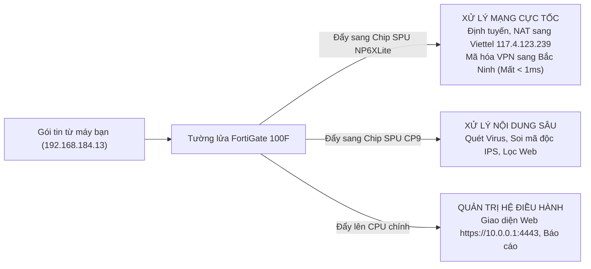
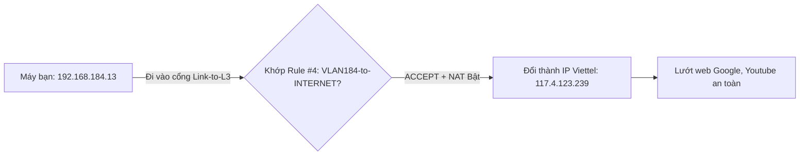
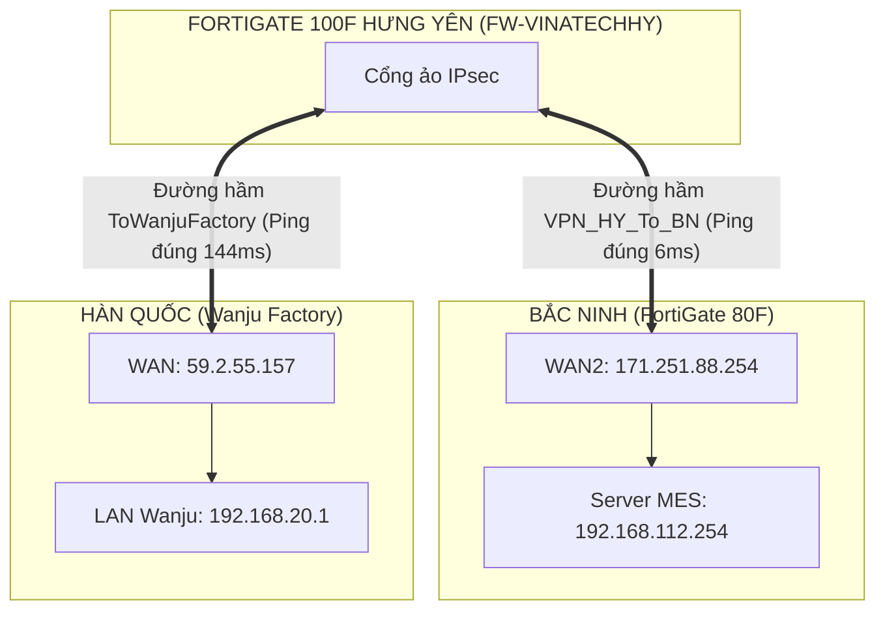

# 📙 TẬP 2: CẨM NANG TOÀN THƯ QUẢN TRỊ TƯỜNG LỬA FORTINET FORTIGATE (FORTIOS MASTER HANDBOOK)
> **Tài liệu đào tạo thực chiến chuẩn Quản trị viên An ninh Mạng Vinatech (FortiOS Mastery)**  
> **100% Căn cứ trên 2 thiết bị thực tế:**  
> 1. **FortiGate 100F Hưng Yên (`FW-VINATECHHY`)**: Thiết bị trực tiếp kiểm soát chiếc máy tính bạn đang ngồi (`192.168.184.13`).  
> 2. **FortiGate 80F Bắc Ninh (`FortiGate-80F`)**: Máy chủ trung tâm lưu trữ toàn bộ hệ thống CSDL MES sản xuất.  
> **Nguyên tắc:** Mỗi nút bấm, mỗi menu đều dẫn chứng chính xác luật đang chạy tại nhà máy.

---

## 📑 MỤC LỤC
1. [Phần 1: Trái tim phần cứng FortiGate 100F & 80F tại Vinatech (Kiến trúc ASIC)](#phần-1-trái-tim-phần-cứng-fortigate-100f--80f-tại-vinatech-kiến-trúc-asic)
2. [Phần 2: Hướng dẫn đăng nhập & Khám phá Dashboard của FortiGate 100F Hưng Yên](#phần-2-hướng-dẫn-đăng-nhập--khám-phá-dashboard-của-fortigate-100f-hưng-yên)
3. [Phần 3: Quản trị Cổng mạng & Nhóm cân bằng tải `SDWAN-VINATECH` (VNPT + Viettel)](#phần-3-quản-trị-cổng-mạng--nhóm-cân-bằng-tải-sdwan-vinatech-vnpt--viettel)
4. [Phần 4: Mổ xẻ Firewall Policy - Trọng tâm Rule #4 `[VLAN184-to-INTERNET]` bảo vệ bạn](#phần-4-mổ-xẻ-firewall-policy---trọng-tâm-rule-4-vlan184-to-internet-bảo-vệ-bạn)
5. [Phần 5: Virtual IPs (VIP) Thực tế: Mở cổng MES `18601` và Đầu ghi Camera `8001/8002`](#phần-5-virtual-ips-vip-thực-tế-mở-cổng-mes-18601-và-đầu-ghi-camera-80018002)
6. [Phần 6: Lớp giáp bảo mật nâng cao (Security Profiles - AV, Web Filter, IPS, App Control)](#phần-6-lớp-giáp-bảo-mật-nâng-cao-security-profiles---av-web-filter-ips-app-control)
7. [Phần 7: Chuyên sâu Mạng riêng ảo VPN (Đường hầm `VPN_HY_To_BN` và `ToWanjuFactory`)](#phần-7-chuyên-sâu-mạng-riêng-ảo-vpn-đường-hầm-vpn_hy_to_bn-và-towanjufactory)
8. [Phần 8: Quản trị Tài khoản Admin `hainv`, Khóa IP `Trusted Hosts` & Cảnh báo an ninh](#phần-8-quản-trị-tài-khoản-admin-hainv-khóa-ip-trusted-hosts--cảnh-báo-an-ninh)
9. [Phần 9: Quy trình Sao lưu cấu hình `.conf` & Cơ chế Dự phòng nóng (HA)](#phần-9-quy-trình-sao-lưu-cấu-hình-conf--cơ-chế-dự-phòng-nóng-ha)
10. [Phần 10: Giám sát, Nhật ký & Bắt gói tin thời gian thực của máy bạn (Log & Sniffer)](#phần-10-giám-sát-nhật-ký--bắt-gói-tin-thời-gian-thực-của-máy-bạn-log--sniffer)

---

## PHẦN 1: TRÁI TIM PHẦN CỨNG FORTIGATE 100F & 80F TẠI VINATECH (KIẾN TRÚC ASIC)

Tại 4 cơ sở của Vinatech, hệ thống tường lửa đang sử dụng các dòng máy chuyên dụng của hãng **Fortinet**:
* **Hưng Yên (Nơi quản lý máy của bạn):** Dòng **FortiGate 100F** (Thiết bị gắn tủ Rack 1U công suất lớn).
* **Bắc Ninh & Bắc Giang 1:** Dòng **FortiGate 80F**.
* **Bắc Giang 2:** Dòng **FortiGate 60F**.



### Tại sao FortiGate 100F tại Hưng Yên xử lý hàng ngàn máy mà CPU chỉ 5% - 15%?
* Trên FortiGate 100F có 2 con chip độc quyền:
  1. **NP6XLite (Network Processor):** Đảm nhiệm toàn bộ việc chuyển tiếp gói tin, thực hiện NAT và mã hóa đường hầm VPN sang Bắc Ninh và Hàn Quốc bằng phần cứng tốc độ ánh sáng (Hardware Acceleration).
  2. **CP9 (Content Processor):** Chuyên trách quét virus, giải mã SSL mà không tốn 1 giọt sức mạnh nào của CPU chính.

---

## PHẦN 2: HƯỚNG DẪN ĐĂNG NHẬP & KHÁM PHÁ DASHBOARD CỦA FORTIGATE 100F HƯNG YÊN

Từ chính chiếc máy tính bạn đang ngồi (`192.168.184.13`), bạn có thể mở web quản trị Hưng Yên ngay lập tức:

### 2.1. Các bước đăng nhập thực tế:
1. Mở trình duyệt Chrome/Edge, gõ: `https://10.0.0.1:4443`
2. Bấm **Nâng cao (Advanced)** ➡️ Chọn **Tiếp tục truy cập 10.0.0.1 (không an toàn)**.
3. Nhập tài khoản:
   * **Username:** `hainv`
   * **Password:** `Vina@123`
4. Bấm **Login**. Khi màn hình hỏi đổi mật khẩu hiện ra, chọn **Later** hoặc **Cancel**.

### 2.2. Khám phá Dashboard của FortiGate 100F:
* **System Information Widget:**
  * **Host Name:** `FW-VINATECHHY`
  * **Serial Number:** Mã định danh phần cứng của máy Hưng Yên (dùng khi bảo hành).
  * **Firmware:** Phiên bản FortiOS đang chạy.
  * **System Time:** Giờ chuẩn đồng bộ NTP với quốc tế.
  * **Uptime:** Số ngày thiết bị đã chạy liên tục không tắt nguồn.
* **System Resources Widget:**
  * Biểu đồ **CPU** và **Memory**: Bạn sẽ thấy mức sử dụng rất thấp (thường < 20%), chứng minh chip ASIC đang gánh tải phần cứng hoàn hảo.

---

## PHẦN 3: QUẢN TRỊ CỔNG MẠNG & NHÓM CÂN BẰNG TẢI `SDWAN-VINATECH` (VNPT + VIETTEL)

Vào menu **Network ➡️ Interfaces**, bạn sẽ nhìn thấy sơ đồ cổng thực tế của Hưng Yên:

### 3.1. Danh mục các cổng mạng thực tế tại Hưng Yên:
| Cổng mạng | Vai trò | Địa chỉ IP | Ý nghĩa thực tế |
| :--- | :--- | :--- | :--- |
| **`Link-to-L3`** | LAN Aggregate | `10.0.0.1 / 255.255.255.0` | **Đường cáp quang gộp** nối sang Core Switch L3 (`10.0.0.2`). Gói tin từ máy bạn (`192.168.184.13`) đi vào tường lửa qua cổng này! |
| **`wan1`** | WAN | `14.251.8.52 / 255.255.255.255` | Đường Internet cáp quang nhà mạng **VNPT** (Alias: `WAN1-VNPT`). |
| **`wan2`** | WAN | `117.4.123.239 / 255.255.255.255` | Đường Internet cáp quang nhà mạng **Viettel** (Alias: `WAN-VIETTEL`). |
| **`dmz`** | DMZ | `10.10.10.1 / 255.255.255.0` | Vùng mạng cách ly máy chủ bảo mật. |
| **`lan`** | LAN Switch | `192.168.100.99 / 255.255.255.0` | Cổng cắm cứu hộ kỹ thuật tại chỗ trong phòng máy. |

### 3.2. Nhóm SD-WAN `SDWAN-VINATECH`:
* FortiGate 100F gộp cả 2 đường `wan1` (VNPT) và `wan2` (Viettel) vào một cụm mang tên **`SDWAN-VINATECH`**.
* Cứ mỗi giây, FortiGate tự đo độ trễ (Latency) và tỷ lệ rớt mạng (Packet Loss).
* **Thực tế lúc này:** Máy tính của bạn đang được định tuyến đi ra thế giới qua cổng **`wan2` (Viettel `117.4.123.239`)**. Nếu xe tải ngoài đường quẹt đứt dây Viettel, FortiGate tự động nhảy sang đường VNPT `14.251.8.52` trong 1 giây mà bạn không hề bị mất kết nối!

---

## PHẦN 4: MỔ XẺ FIREWALL POLICY - TRỌNG TÂM RULE #4 `[VLAN184-to-INTERNET]` BẢO VỆ BẠN

Vào menu **Policy & Objects ➡️ Firewall Policy**, bạn sẽ thấy danh sách 15 luật của Hưng Yên. Hãy bấm vào dòng luật số 4:

### 4.1. Giải mã Rule #4 đang trực tiếp phục vụ máy của bạn:
```text
Tên luật:        VLAN184-to-INTERNET (Rule ID: 4)
Incoming:        Link-to-L3 (Nhận dữ liệu từ Core Switch VLAN 184 gửi sang)
Outgoing:        SDWAN-VINATECH (Cụm Internet VNPT + Viettel)
Source Address:  Dải mạng VLAN 184 (192.168.184.0/21 - Bao gồm máy bạn 192.168.184.13)
Destination:     all (Toàn bộ các website trên thế giới)
Service:         ALL (Cho phép mọi dịch vụ Web, DNS, Ping...)
Action:          ACCEPT (Cho phép lưu thông)
NAT:             ENABLE (Bắt buộc bật để biến IP máy bạn thành IP Viettel 117.4.123.239)
```



### 4.2. Tại sao lại chia các Rule theo từng VLAN?
* Bạn sẽ thấy:
  * `Rule #1`: Dành riêng cho `VLAN10-to-INTERNET` (Phòng Server).
  * `Rule #2`: Dành riêng cho `VLAN150-to-INTERNET` (Văn phòng xưởng).
  * `Rule #4`: Dành riêng cho `VLAN184-to-INTERNET` (Khu vực Chuyền sản xuất của bạn).
* **Mục đích:** Để IT có thể giới hạn tốc độ (Traffic Shaping) hoặc chặn xem video/mạng xã hội đối với từng phòng ban riêng biệt mà không làm ảnh hưởng đến các phòng ban khác.

---

## PHẦN 5: VIRTUAL IPS (VIP) THỰC TẾ: MỞ CỔNG MES `18601` VÀ ĐẦU GHI CAMERA `8001/8002`

Vào menu **Policy & Objects ➡️ Virtual IPs**, bạn sẽ nhìn thấy danh sách các cổng mở thực tế:

### 5.1. Hai cổng xem Camera Hưng Yên từ xa:
* **`NVR-01`**: Mở cổng `8001` ngoài Internet ➡️ Trỏ thẳng vào đầu ghi Camera xưởng 1: `192.168.184.10:8000`.
* **`NVR-02`**: Mở cổng `8002` ngoài Internet ➡️ Trỏ thẳng vào đầu ghi Camera xưởng 2: `192.168.184.11:8000`.
* 👉 **Chú ý:** Cả 2 đầu ghi camera này đều mang IP `192.168.184.x`, nghĩa là **chúng đang ngồi chung một mạng VLAN 184 với chính chiếc máy tính của bạn**!

### 5.2. Cổng máy chủ MES sản xuất tại Bắc Ninh:
* Tại tường lửa Bắc Ninh (`42.112.60.211`):
  * VIP: `42.112.60.211:18601` ➡️ Trỏ thẳng vào máy chủ ứng dụng MES `192.168.112.254:8601`.
  * Nhờ cấu hình này, các máy móc tự động và chuyên gia dù ở bất kỳ đâu trên thế giới đều có thể đồng bộ dữ liệu sản xuất về Vinatech.

---

## PHẦN 6: LỚP GIÁP BẢO MẬT NÂNG CAO (SECURITY PROFILES - AV, WEB FILTER, IPS, APP CONTROL)

Trên mỗi dòng Firewall Policy, người quản trị có thể bật thêm các lớp áo giáp:

1. **Antivirus Profile:**
   * Khi bạn tải file từ mạng về máy tính `192.168.184.13`, chip CP9 của FortiGate 100F sẽ soi từng bit dữ liệu. Nếu phát hiện file có chứa mã độc tống tiền (Ransomware), nó sẽ ngắt kết nối ngay lập tức và chặn file không cho tải về máy bạn.
2. **Web Filter Profile:**
   * Chặn truy cập vào các trang web độc hại, cờ bạc, lừa đảo (Phishing).
3. **Application Control Profile:**
   * Nhận diện chính xác ứng dụng: Ngăn chặn công nhân chạy các phần mềm tải torrent hoặc phần mềm điều khiển máy tính lén lút qua mạng nội bộ.

---

## PHẦN 7: CHUYÊN SÂU MẠNG RIÊNG ẢO VPN (ĐƯỜNG HẦM `VPN_HY_To_BN` VÀ `ToWanjuFactory`)

Vào menu **VPN ➡️ IPsec Tunnels**, bạn sẽ thấy 2 đường hầm huyết mạch của Hưng Yên:



### 1. Đường hầm `VPN_HY_To_BN` (Nối Hưng Yên 🔄 Bắc Ninh):
* **Cổng cắm thực tế:** Chạy qua cổng `wan1` (VNPT `14.251.8.52`).
* **Địa chỉ IP đối tác Bắc Ninh:** `171.251.88.254` (Cổng `wan2` của Bắc Ninh).
* **Thời gian truyền dữ liệu:** Đúng **6 mili-giây**.
* **Trạng thái thực tế:** 🟢 **UP (Hoạt động hoàn hảo 24/7)**.

### 2. Đường hầm `ToWanjuFactory` (Nối Hưng Yên 🔄 Nhà máy mẹ Wanju Hàn Quốc):
* **Địa chỉ IP đối tác Hàn Quốc:** `59.2.55.157`.
* **Dải mạng nội bộ đầu Hàn Quốc:** `192.168.20.0/24`.
* **Thời gian truyền dữ liệu xuyên biển:** **144 mili-giây**.
* **Trạng thái thực tế:** 🟢 **UP (Hoạt động hoàn hảo 24/7)**.

---

## PHẦN 8: QUẢN TRỊ TÀI KHOẢN ADMIN `hainv`, KHÓA IP `TRUSTED HOSTS` & CẢNH BÁO AN NINH

Vào menu **System ➡️ Administrators**:

### 8.1. Tài khoản thực tế tại Hưng Yên:
* **Tên đăng nhập:** `hainv`
* **Quyền hạn (Admin Profile):** `Admin-Modify` (Cho phép xem và chỉnh sửa cấu hình hệ thống).
* **Mật khẩu:** `Vina@123`

### 8.2. Kỹ thuật bảo vệ cấp bách: Khóa IP quản trị (Trusted Hosts)
* Hiện tại tài khoản `hainv` đang để `Trusted Hosts: 0.0.0.0/0` (Nghĩa là bất kỳ ai biết mật khẩu đều có thể đăng nhập được).
* **Khuyến nghị bảo mật:** Nên khóa lại, chỉ cho phép địa chỉ IP của bạn (`192.168.184.13`) hoặc dải IP phòng IT mới được phép mở trang web quản trị này!

---

## PHẦN 9: QUY TRÌNH SAO LƯU CẤU HÌNH `.CONF` & CƠ CHẾ DỰ PHÒNG NÓNG (HA)

### 9.1. Các bước tải bản Backup từ FortiGate 100F về máy tính bạn:
1. Nhìn lên góc trên cùng bên phải màn hình web ➡️ Bấm chuột vào chữ **`hainv`**.
2. Chọn dòng **Configuration** ➡️ Chọn tiếp **Backup**.
3. Tại ô *Backup to*: Chọn **Local PC**.
4. Bấm nút **OK**.
5. Trình duyệt của bạn (`192.168.184.13`) sẽ lập tức tải về file cấu hình có tên dạng:
   ```text
   FW-VINATECHHY_20260927_xxxx.conf
   ```
6. Bạn hãy cất file này vào thư mục an toàn trên máy tính của bạn. Đây chính là bản sao lưu bảo hiểm toàn bộ hệ thống mạng của nhà máy Hưng Yên!

---

## PHẦN 10: GIÁM SÁT, NHẬT KÝ & BẮT GÓI TIN THỜI GIAN THỰC CỦA MÁY BẠN

### 10.1. Tự xem nhật ký lướt web của chính máy bạn:
1. Vào menu **Log & Report ➡️ Forward Traffic**.
2. Bấm vào ô tìm kiếm (Search), gõ đúng địa chỉ IP của bạn:
   ```text
   Source: 192.168.184.13
   ```
3. Nhấn **Enter**. Bạn sẽ nhìn thấy toàn bộ mọi gói tin mà máy bạn vừa gửi ra Internet:
   * Giờ giấc chính xác từng giây.
   * Địa chỉ website bạn vừa mở.
   * Gói tin được áp dụng **Rule ID: 4**.
   * Hành động: `Accept`.

### 10.2. Lệnh CLI bắt gói tin thời gian thực của máy bạn (Packet Sniffer):
Bấm vào biểu tượng CLI Console (`>_`) trên thanh tiêu đề và gõ lệnh:
```text
diagnose sniffer packet any 'host 192.168.184.13' 4
```
*Bạn sẽ tận mắt nhìn thấy các gói tin từ card mạng ASIX của bạn bay qua màn hình FortiGate theo thời gian thực! Để dừng lại, chỉ cần nhấn tổ hợp phím `Ctrl + C`.*
