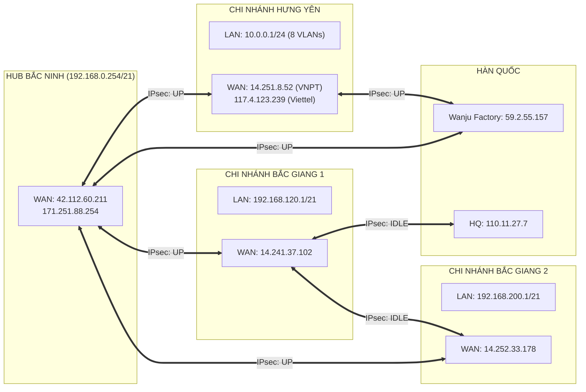

# 📕 TẬP 3: HỒ SƠ KỸ THUẬT MẠNG THỰC TẾ & BẢN ĐỒ AN NINH 4 NHÀ MÁY VINATECH
> **Tài liệu bàn giao & Hồ sơ thẩm định an ninh mạng (Production Network Audit Report)**  
> **Nguồn dữ liệu:** Trích xuất 100% trực tiếp từ 4 thiết bị FortiGate đang hoạt động phục vụ sản xuất.  
> **Cơ sở khảo sát:** Bắc Ninh (FGT-80F), Hưng Yên (FG-100F), Bắc Giang 1 (FGT-80F), Bắc Giang 2 (FGT-60F).

---

## 📑 MỤC LỤC
1. [Hồ sơ kỹ thuật Cơ sở Bắc Ninh (Hub Trung tâm)](#1-hồ-sơ-kỹ-thuật-cơ-sở-bắc-ninh-hub-trung-tâm)
2. [Hồ sơ kỹ thuật Cơ sở Hưng Yên (Nhà máy lớn - Core L3 Switch)](#2-hồ-sơ-kỹ-thuật-cơ-sở-hưng-yên-nhà-máy-lớn---core-l3-switch)
3. [Hồ sơ kỹ thuật Cơ sở Bắc Giang 1 (Nhà xưởng 1)](#3-hồ-sơ-kỹ-thuật-cơ-sở-bắc-giang-1-nhà-xưởng-1)
4. [Hồ sơ kỹ thuật Cơ sở Bắc Giang 2 (Nhà xưởng 2)](#4-hồ-sơ-kỹ-thuật-cơ-sở-bắc-giang-2-nhà-xưởng-2)
5. [Bảng đối chiếu tổng hợp & Toàn bộ 67 Firewall Policies](#5-bảng-đối-chiếu-tổng-hợp--toàn-bộ-67-firewall-policies)
6. [Báo cáo Thẩm định Rủi ro An ninh Mạng (Security Audit & Recommendations)](#6-báo-cáo-thẩm-định-rủi-ro-an-ninh-mạng-security-audit--recommendations)

---

## 1. HỒ SƠ KỸ THUẬT CƠ SỞ BẮC NINH (HUB TRUNG TÂM)

### 1.1. Thông số Phần cứng & Hệ điều hành:
* **Model:** FortiGate 80F (`FGT80F`)
* **Hostname:** `FortiGate-80F`
* **URL Quản trị:** `https://42.112.60.211`
* **Cổng SSL-VPN:** `10443` (Dải IP cấp cho VPN: `VPN_POOL_172`)
* **DNS Servers:** Sử dụng máy chủ DNS nội bộ và nhà mạng.

### 1.2. Cấu hình Cổng mạng (Interfaces):
| Tên Cổng | Loại Cổng (Type) | Vai trò (Role) | Địa chỉ IP / Subnet Mask | Quyền truy cập quản trị |
| :--- | :--- | :--- | :--- | :--- |
| `wan1` | Vật lý (Physical) | WAN | `42.112.60.211 / 255.255.255.255` | ping, https, http, fgfm |
| `wan2` | Vật lý (Physical) | WAN | `171.251.88.254 / 255.255.255.252` | ping, https, http, fgfm |
| `internal` | Hardware Switch | LAN | `192.168.0.254 / 255.255.248.0` (`/21`) | ping, https, ssh, http, fgfm |
| `fortilink` | Aggregate | Undefined | `10.255.1.1 / 255.255.255.0` | ping, fabric |
| `ssl.root` | Tunnel ảo | VPN | `0.0.0.0 / 0.0.0.0` | Cổng vào SSL-VPN Client |

### 1.3. Cấu hình Cấp phát IP tự động (DHCP Server):
* **Cổng áp dụng:** `internal`
* **Dải IP cấp tự động:** `192.168.4.1` ➡️ `192.168.7.254` (Tổng cộng hơn 1.000 IP cho máy trạm).
* **Default Gateway:** `192.168.0.254`

### 1.4. Cổng mở ra ngoài Internet (Virtual IPs - Port Forwarding):
* `42.112.60.211:43381` ➡️ `192.168.112.18:3389` (Remote Desktop máy chủ 112.18).
* `42.112.60.211:43382` ➡️ `192.168.112.19:3389` (Remote Desktop máy chủ 112.19).
* `42.112.60.211:6005` ➡️ `192.168.112.254:6005` (Truyền thông sản xuất).
* `42.112.60.211:18601` ➡️ `192.168.112.254:8601` (**Server Ứng dụng MES cốt lõi**).

### 1.5. Danh mục 21 Firewall Policies tại Bắc Ninh:
1. `Rule #1 [Internet]`: `internal` ➡️ `SD_WAN` | Nguồn: all ➡️ Đích: all | Action: ACCEPT | **NAT: Bật**.
2. `Rule #2 [vnp BN to BG]`: `internal` ➡️ `vpn bn - bg` | Action: ACCEPT | NAT: Tắt.
3. `Rule #3 [vpn BG to BN]`: `vpn bn - bg` ➡️ `internal` | Action: ACCEPT | NAT: Tắt.
4. `Rule #4 [FromWanjuFactory2]`: `ToWanjuFactory2` ➡️ `internal` | Action: ACCEPT | NAT: Tắt.
5. `Rule #5 [ToWanjuFactory2]`: `internal` ➡️ `ToWanjuFactory2` | Action: ACCEPT | NAT: Tắt.
6. `Rule #7 & #8 [vpn_VPN_BN_to_BG200_...]`: Thông tuyến dữ liệu 2 chiều với xưởng Bắc Giang 2.
7. `Rule #9 & #10 [Allow_SSLVPN_...]`: Cấp phép cho người làm việc từ xa truy cập vào mạng LAN và Wanju.
8. `Rule #11 & #17`: Tiếp nhận luồng dữ liệu công cộng đi vào nội bộ.
9. `Rule #13 & #14`: Thông tuyến giữa dải DHCP và máy chủ `192.168.112.x`.
10. `Rule #15 & #16`: Thông tuyến VPN 2 chiều với cơ sở Hà Nam (`118.70.181.215`).
11. `Rule #18 [Auto-Allow-RDP]`: Cấp phép luồng điều khiển từ xa.
12. `Rule #19 & #20`: Điều hướng tự động VPN sang mạng nội bộ.
13. `Rule #21 [VPN_HY_ALL_TO_BN]`: Hưng Yên truy cập sang toàn bộ mạng Bắc Ninh.
14. `Rule #22 [VPN_BN_TO_HY_ALL]`: Bắc Ninh truy cập sang toàn bộ mạng Hưng Yên.
15. `Rule #23 [SL7AutoLineApi]`: Mở luồng API điều khiển dây chuyền sản xuất tự động SL7.

---

## 2. HỒ SƠ KỸ THUẬT CƠ SỞ HƯNG YÊN (NHÀ MÁY LỚN - CORE L3 SWITCH)

### 2.1. Thông số Phần cứng & Hệ điều hành:
* **Model:** FortiGate 100F (`FG100F` - Thiết bị rackmount công suất cao).
* **Hostname:** `FW-VINATECHHY`
* **URL Quản trị:** `https://10.0.0.1:4443` (hoặc qua IP WAN `14.251.8.52`).
* **Cổng SSL-VPN:** `10443`

### 2.2. Cấu hình Cổng mạng (Interfaces) & Đường truyền LACP 2 Gbps:
| Tên Cổng | Loại Cổng | Vai trò | Địa chỉ IP / Subnet | Ghi chú vận hành & Liên kết vật lý |
| :--- | :--- | :--- | :--- | :--- |
| `Link-to-L3` | Aggregate (LACP Active) | LAN Core | `10.0.0.1 / 255.255.255.0` | **Gộp 2 cổng vật lý `port1` + `port2` (Băng thông 2 Gbps)** nối thẳng sang Cisco Core Switch L3 (`10.0.0.2`). Chịu tải hơn 7.6 TB dữ liệu! |
| `wan1` | Vật lý (Alias: `WAN1-VNPT`) | WAN | `14.251.8.52 / 32` | Đường truyền Internet VNPT (PPPoE qua `ppp2`, Gateway `123.29.4.132`). |
| `wan2` | Vật lý (Alias: `WAN-VIETTEL`) | WAN | `117.4.123.239 / 32` | Đường truyền Internet Viettel (PPPoE qua `ppp3`, Gateway `27.68.227.153`). |
| `dmz` | Vật lý | DMZ | `10.10.10.1 / 255.255.255.0` | Phân vùng cách ly máy chủ kỹ thuật. |
| `lan` | Hardware Switch | LAN Local | `192.168.100.99 / 255.255.255.0` | Cổng cắm bảo trì kỹ thuật tại chỗ (Có DHCP cấp `192.168.100.110-210`). |
| `mgmt` | Vật lý | Management | `192.168.1.99 / 255.255.255.0` | Cổng cứu hộ quản trị chuyên dụng (Có DHCP cấp `192.168.1.110-210`). |
| `fortilink` | Aggregate | FortiLink | `10.255.1.1 / 255.255.255.0` | Gộp 2 cổng quang 10G `x1` + `x2` sẵn sàng cho FortiSwitch Fabric. |

### 2.3. Bảng định tuyến 8 Phân vùng VLAN qua Core Switch Layer 3:
Hệ thống mạng Hưng Yên được phân chia thành 8 VLAN tối ưu hóa theo quy chuẩn công nghiệp:

| Tên VLAN | Phân vùng chức năng | Địa chỉ Mạng & Subnet Mask | Dải IP khả dụng (Host Pool) | Gateway (Cisco L3) |
| :--- | :--- | :--- | :--- | :--- |
| **VLAN 10** | Đường liên kết Link-to-L3 | `10.0.0.0 / 255.255.255.0` (`/24`) | `10.0.0.1` - `10.0.0.254` (254 IP) | `10.0.0.2` (Cisco) / `10.0.0.1` (FortiGate) |
| **VLAN 150** | `VLAN150-MGMT` (Quản trị IT) | `192.168.150.0 / 255.255.255.0` (`/24`) | `192.168.150.1` - `192.168.150.254` (254 IP) | `192.168.150.1` |
| **VLAN 155** | `VLAN155-SERVER` (Máy chủ nội bộ) | `192.168.155.0 / 255.255.255.0` (`/24`) | `192.168.155.1` - `192.168.155.254` (254 IP) | `192.168.155.1` |
| **VLAN 160** | `VLAN160-FACTORY` (Xưởng Sản xuất, PLC, MES) | `192.168.160.0 / 255.255.240.0` (`/20`) | `192.168.160.1` - `192.168.175.254` (**4.094 IP**) | `192.168.160.1` |
| **VLAN 184** | `VLAN184-OFFICE` (Văn phòng, Kỹ sư, Máy bạn) | `192.168.184.0 / 255.255.248.0` (`/21`) | `192.168.184.1` - `192.168.191.254` (**2.046 IP**) | `192.168.184.1` |
| **VLAN 220** | `VLAN220-CCTV` (Camera Giám sát An ninh) | `192.168.220.0 / 255.255.252.0` (`/22`) | `192.168.220.1` - `192.168.223.254` (**1.022 IP**) | `192.168.220.1` |
| **VLAN 228** | `VLAN228-WIFI` (Mạng Không dây Xưởng/VP) | `192.168.228.0 / 255.255.252.0` (`/22`) | `192.168.228.1` - `192.168.231.254` (**1.022 IP**) | `192.168.228.1` |
| **VLAN 234** | `VLAN234-Printer` (Máy in Tem Nhãn & Mã vạch) | `192.168.234.0 / 255.255.255.0` (`/24`) | `192.168.234.1` - `192.168.234.254` (254 IP) | `192.168.234.1` |

> 📌 **Ghi chú kiến trúc:** FortiGate 100F định tuyến toàn bộ 8 dải mạng trên về Gateway `10.0.0.2` (Cổng Trunk/Aggregate của Cisco L3 Switch). FortiGate **không bật DHCP** trên các VLAN này; việc cấp phát IP và chuyển tiếp DHCP hoàn toàn do Cisco Core Switch hoặc DHCP Server nội bộ xử lý!

### 2.3.1. Cổng mở từ ngoài Internet vào Hệ thống Camera (Virtual IPs - VIP):
Hệ thống cho phép Ban Giám đốc và An ninh xem camera xưởng từ xa thông qua 4 quy tắc VIP trên cổng `wan1` (`14.251.8.52`):
* `14.251.8.52:8001` ➡️ `192.168.184.10:8000` (Luồng truyền hình ảnh NVR-01 Xưởng 1).
* `14.251.8.52:8002` ➡️ `192.168.184.11:8000` (Luồng truyền hình ảnh NVR-02 Xưởng 2).
* `14.251.8.52:8003` ➡️ `192.168.184.10:443` (Trang Web SSL Quản trị Camera NVR-01).
* `14.251.8.52:8004` ➡️ `192.168.184.11:443` (Trang Web SSL Quản trị Camera NVR-02).

### 2.3.2. Đo lường Sức khỏe Đường truyền SD-WAN Hưng Yên (Live SLA Metrics):
Tường lửa FortiGate 100F giám sát liên tục 2 đường truyền Internet qua cơ chế SLA Health Check (Ping `8.8.8.8` định kỳ):
* **Đường `wan2` (Viettel `117.4.123.239`):** 
  * Độ trễ (Latency): **24.06 ms** | Độ biến thiên trễ (Jitter): **0.28 ms** | Tỷ lệ rớt gói (Packet Loss): **0.0%**.
  * Số phiên hoạt động: **5.243 sessions** (Đang đảm nhận phần lớn lưu lượng văn phòng & MES).
* **Đường `wan1` (VNPT `14.251.8.52`):**
  * Độ trễ (Latency): **35.16 ms** | Độ biến thiên trễ (Jitter): **0.18 ms** | Tỷ lệ rớt gói: **0.0%**.
  * Số phiên hoạt động: **3.558 sessions** (Đảm nhận IPsec VPN và VIP xem Camera).

### 2.4. Hạ tầng Thiết bị Chuyển mạch Core Switch Layer 3 (Cisco Catalyst):
* **Hãng sản xuất:** Cisco Systems, Inc. (Nhận diện qua OUI MAC `e4:4e:2d`).
* **Địa chỉ MAC Gateway:** `e4:4e:2d:4b:8d:51`.
* **Địa chỉ IP quản trị & Gateway VLAN 184:** `192.168.184.1` (đồng thời xuất hiện tại `10.0.0.2` trên cổng LACP và `192.168.160.11` trên VLAN sản xuất).
* **Cổng dịch vụ quản trị đang mở:**
  * Cổng `80` (HTTP Web GUI) & `443` (HTTPS Web GUI).
  * Cổng `22` (SSH - Quản trị dòng lệnh bảo mật).
  * Cổng `23` (Telnet - Cần lưu ý bảo mật vì truyền mật khẩu dạng rõ).
* **Vai trò trong nhà máy:**
  * Thực hiện định tuyến liên phân vùng (**Inter-VLAN Routing**) giữa 8 VLAN nội bộ xưởng mà không cần đẩy gói tin lên FortiGate, giúp giảm tải tối đa cho tường lửa.
  * Đóng vai trò là Default Gateway trực tiếp cho máy tính của bạn và toàn bộ máy trạm, máy in chuyền sản xuất trên VLAN 184.
  * Cổng kết nối Uplink: Cấu hình địa chỉ IP `10.0.0.2` kết nối sang cổng `Link-to-L3` (`10.0.0.1`) của FortiGate 100F qua đường LACP Active 2 Gbps.

### 2.5. Danh bạ Thiết bị Sống trên Phân vùng VLAN 184 (Dây chuyền Sản xuất & Văn phòng Hưng Yên):
Qua quá trình quét phân giải ARP và dò quét cổng dịch vụ thực tế, đây là danh mục máy móc và nhân sự đang cùng hoạt động trên VLAN 184:

| Địa chỉ IP | Địa chỉ MAC | Hostname / Tên thiết bị | Cổng dịch vụ mở | Vai trò & Vị trí thực tế |
| :--- | :--- | :--- | :--- | :--- |
| `192.168.184.1` | `e4:4e:2d:4b:8d:51` | *(Cisco Core Switch L3)* | 80, 443, 22, 23 | Cổng Gateway ra mạng cho toàn bộ VLAN 184. |
| `192.168.184.10` | *(VIP FortiGate)* | `NVR-01` | 80, 443, 8000 | Đầu ghi camera giám sát xưởng sản xuất 1 (SDK Hikvision/Dahua). |
| `192.168.184.11` | *(VIP FortiGate)* | `NVR-02` | 80, 443, 8000 | Đầu ghi camera giám sát xưởng sản xuất 2 (SDK Hikvision/Dahua). |
| `192.168.184.13` | `9c:69:d3:4b:42:47` | `DESKTOP-RJJSEQU` | *(Workstation)* | **Chính là chiếc máy tính bạn đang ngồi** (Kỹ sư Vinatech). |
| `192.168.184.34` | `30:56:0f:23:6f:40` | `Admin-PC` | 135, 445 (SMB) | Máy tính quản trị kỹ thuật / Chia sẻ file nội bộ xưởng. |
| `192.168.184.36` | `bc:0f:f3:c0:f9:e3` | `MrCuong-ProductionHY` | 135, 445 (SMB) | Máy tính Quản lý điều hành sản xuất Hưng Yên (Anh Cường). |
| `192.168.184.42` | `2c:58:b9:0c:72:c9` | `PC-Thu-PRODUCTION` | 135, 445 (SMB) | Máy tính giám sát chuyền sản xuất Hưng Yên (Chị/Anh Thu). |
| `192.168.184.45` | `e8:cf:83:9e:71:d7` | `Industrial-PC-01` | 80, 443, 3389 (RDP) | Máy trạm công nghiệp điều khiển máy móc dây chuyền (Hỗ trợ Remote Desktop). |

### 2.6. Mô hình Tích hợp Hệ thống Phần mềm Sản xuất (MES System Architecture):
* **Ứng dụng máy trạm (Client Application):** Cài đặt tại đường dẫn `C:\AwooSystem\` (Phần mềm NAIS MES SmartFactory).
* **Máy chủ Cơ sở Dữ liệu Trung tâm (Central MES DB Server):**
  * Tên miền & Cổng: `dbserver.hycap.co.kr,5398` (Phân giải IP: `211.34.149.156` tại Hàn Quốc).
  * Database: `SmartFactoryV2` (chứa toàn bộ dữ liệu PO, Lot, linh kiện) và `SmartFramework`.
  * Luồng truyền thông: Máy trạm Hưng Yên (`192.168.184.13`) ➡️ Switch L3 (`192.168.184.1`) ➡️ FortiGate 100F (`10.0.0.1`) ➡️ NAT qua đường Viettel `wan2` (`117.4.123.239`) ➡️ Server Hàn Quốc cổng `5398`.
* **Máy chủ Ứng dụng & Cập nhật NAIS:**
  * URL: `http://mes.hycap.co.kr:9952/` (IP: `211.34.149.156`).
* **Máy chủ Ứng dụng Nội bộ Bắc Ninh (Central Factory MES Server):**
  * IP & Cổng: `192.168.112.254:8601` (chạy dịch vụ Core MES cho dây chuyền tự động SL7).
  * Luồng truyền thông: Máy trạm Hưng Yên ➡️ FortiGate 100F ➡️ Chui qua đường hầm **IPsec VPN `VPN_HY_To_BN`** ➡️ FortiGate 80F Bắc Ninh ➡️ Server `192.168.112.254` (Độ trễ siêu tốc: **6ms**).

### 2.7. Danh mục 15 Firewall Policies tại Hưng Yên:
* **Rule #1, #2, #4, #6, #7, #8, #9, #16:** Cho phép từng VLAN tương ứng đi qua cụm `SDWAN-VINATECH` để ra ngoài Internet (Bật NAT). Cụ thể, máy tính của bạn thuộc VLAN 184 được cấp quyền bởi **Rule #4 `[VLAN184-to-INTERNET]`**.
* **Rule #10 [LAN-test]:** Cổng kỹ thuật ra mạng Internet thử nghiệm.
* **Rule #11 [SSLVPN-to-LAN]:** Người dùng VPN từ xa được phép truy cập vào hệ thống nội bộ qua `Link-to-L3`.
* **Rule #12 [VPN_HY_ALL_TO_BN]:** Hưng Yên gửi dữ liệu sang Bắc Ninh (Tắt NAT - Chạy luồng MES và dữ liệu quản lý).
* **Rule #13 [VPN_BN_TO_HY_ALL]:** Nhận dữ liệu từ Bắc Ninh gửi sang Hưng Yên (Tắt NAT).
* **Rule #14 & #15 [FromWanjuFactory] / [ToWanjuFactory]:** Thông tuyến dữ liệu 2 chiều với nhà máy mẹ Wanju Hàn Quốc (`192.168.20.0/24`).
* **Rule #17 [ALL-to-NVR]:** Cấu hình Virtual IP cho phép ban giám đốc hoặc kỹ sư từ xa truy cập đầu ghi NVR `192.168.184.10` và `192.168.184.11` qua cổng 8000.

---

## 3. HỒ SƠ KỸ THUẬT CƠ SỞ BẮC GIANG 1 (NHÀ XƯỞNG 1)

### 3.1. Thông số Phần cứng & Hệ điều hành:
* **Model:** FortiGate 80F (`FGT80F`)
* **Hostname:** `FortiGate-80F`
* **URL Quản trị:** `https://14.241.37.102`
* **Cổng SSL-VPN:** `4430`

### 3.2. Cấu hình Cổng mạng & DHCP:
* `wan1`: `14.241.37.102` (VNPT)
* `wan2`: FPT (Cổng phụ dự phòng)
* `internal`: `192.168.120.1 / 255.255.248.0` (`/21`).
  * DHCP cấp phát: `192.168.124.1` ➡️ `192.168.127.254`.

### 3.3. Danh mục 24 Firewall Policies tại Bắc Giang 1:
* **Rule #15 [Internet]:** Cho phép toàn xưởng ra Internet qua `wan1` và SD-WAN (Bật NAT).
* **Rule #4 & #5 [FromWanjuFactory] / [ToWanjuFactory]:** Kết nối với xưởng Wanju Hàn Quốc.
* **Rule #10 & #11 [vpn_vpn bg-bn_...]:** Thông tuyến 2 chiều với Bắc Ninh.
* **Rule #12 & #13 [VPN_BG1_TO_BG2] / [VPN_BG2_TO_BG1]:** Thông tuyến dữ liệu nội bộ với xưởng Bắc Giang 2.
* **Rule #20 & #21 [FromBG1ToHQ] / [FromHQToBG1]:** Thông tuyến với Trụ sở chính Hàn Quốc (`110.11.27.7`).
* **Rule #23 & #24:** Quản lý điều hướng người dùng VPN từ xa.
* **Rule #206 đến #227:** Các rule cấp quyền điều hướng SSL-VPN sang các phân vùng mạng khác nhau.

---

## 4. HỒ SƠ KỸ THUẬT CƠ SỞ BẮC GIANG 2 (NHÀ XƯỞNG 2)

### 4.1. Thông số Phần cứng & Mạng:
* **Model:** FortiGate 60F (`FGT60F`)
* **Hostname:** `FortiGate-60F`
* **URL Quản trị:** `https://14.252.33.178` (Cắm vào cổng `wan2`).
* `internal`: `192.168.200.1 / 255.255.248.0` (`/21`).
  * DHCP cấp phát: `192.168.203.2` ➡️ `192.168.203.254`.
* `dmz`: `10.10.10.1 / 255.255.255.0`.

### 4.2. Danh mục 7 Firewall Policies tại Bắc Giang 2:
1. `Rule #1 [Internal]`: `internal` ➡️ `SD WAN` | Cho phép ra Internet (Bật NAT).
2. `Rule #2 & #3 [ToWanjuFactory] / [FromWanjuFactory]`: Thông tuyến với nhà máy Wanju Hàn Quốc.
3. `Rule #4 & #5 [vpn_VPN_BG200_to_BN_...]`: Thông tuyến với Hub trung tâm Bắc Ninh.
4. `Rule #6 & #7 [VPN_BG2_TO_BG1] / [VPN_BG1_TO_BG2]`: Thông tuyến dữ liệu với xưởng Bắc Giang 1.

---

## 5. BẢNG ĐỐI CHIẾU TỔNG HỢP & ĐƯỜNG HẦM KẾT NỐI

---

## 6. BÁO CÁO THẨM ĐỊNH RỦI RO AN NINH MẠNG (SECURITY AUDIT & RECOMMENDATIONS)

Từ kết quả thẩm định chuyên sâu cấu hình ngầm của hệ thống, chúng tôi phát hiện **5 rủi ro bảo mật quan trọng** cần báo cáo Trưởng phòng IT xử lý:

### 🚨 Rủi ro 1: Danh sách tài khoản Administrator bất thường
* **Hiện trạng phát hiện:**
  * Tại **Bắc Ninh**: Tồn tại các tài khoản `fortics`, `fortinet-ajpifn`, `fortinet-jywvz`, `fortiroot1`, `sysmon_svc`.
  * Tại **Bắc Giang 1**: Tồn tại các tài khoản `AdminLocalTechF0rti`, `djohn`, `fortinet-abgngz`, `fortinet-djlxx`, `fortinet-kvtsz`, `fortiroot1`.
* **Đánh giá mức độ:** **NGHIÊM TRỌNG (HIGH RISK)**.
* **Nguyên nhân kỹ thuật:** Các tên tài khoản dạng `fortinet-xxxx` hoặc `fortiroot1` thường xuất hiện trong các đợt bị khai thác lỗ hổng xác thực của FortiOS cũ (ví dụ lỗ hổng CVE-2022-40684 hoặc CVE-2024-21762) khi tin tặc hoặc script độc hại xâm nhập và bí mật tạo backdoor để duy trì quyền truy cập vĩnh viễn.
* **Khuyến nghị khắc phục:**
  1. Xác minh ngay với đơn vị SI (tích hợp hệ thống) xem các tài khoản này do bên nào tạo.
  2. Vô hiệu hóa hoặc Xóa bỏ ngay các tài khoản không xác định được danh tính.
  3. Cài đặt **Trusted Hosts** cho tài khoản `admin` chính: Chỉ cho phép đăng nhập từ IP nội bộ của phòng IT.

### ⚠️ Rủi ro 2: Sử dụng thuật toán mã hóa lỗi thời trên một số đường hầm VPN
* **Hiện trạng phát hiện:**
  * Đường hầm `vpn bg-bn` tại Bắc Giang 1 sử dụng thuật toán mã hóa cổ xưa: **`des-sha1`**!
  * Đường hầm `ToWanjuFactory` và `VPN_BG1_TO_BG2` sử dụng: **`3des-sha1`**!
* **Đánh giá mức độ:** **TRUNG BÌNH (MEDIUM RISK)**.
* **Nguyên nhân kỹ thuật:** Thuật toán DES và 3DES đã bị Viện Tiêu chuẩn và Kỹ thuật Quốc gia Mỹ (NIST) khai tử vì quá yếu, có thể bị giải mã trong thời gian ngắn. Đồng thời việc dùng DES bắt CPU FortiGate phải xử lý phần mềm, không tận dụng được chip tăng tốc NP/CP.
* **Khuyến nghị khắc phục:** Nâng cấp cấu hình Phase 1 và Phase 2 của các đường hầm này lên tiêu chuẩn **`aes256-sha256`** hoặc **`aes128-sha256`**.

### ⚠️ Rủi ro 3: Mở trực tiếp cổng RDP (Remote Desktop) ra Internet
* **Hiện trạng phát hiện:** Bắc Ninh đang mở cổng `43381` và `43382` trỏ thẳng vào cổng RDP `3389` của máy chủ `192.168.112.18` và `192.168.112.19`.
* **Đánh giá mức độ:** **CẦN LƯU Ý (MEDIUM RISK)**.
* **Khuyến nghị khắc phục:** RDP là mục tiêu tấn công dò quét mật khẩu (Brute-force) hàng đầu của tin tặc trên Internet. Khuyến nghị đóng các cổng VIP này và yêu cầu kỹ sư **kết nối qua SSL-VPN trước**, sau đó mới điều khiển máy tính bằng IP nội bộ.

### ⚠️ Rủi ro 4: Cổng dịch vụ Quản trị Telnet (Port 23) và HTTP (Port 80) mở trần trên Core Switch L3
* **Hiện trạng phát hiện:** Cisco Core Switch Hưng Yên (`192.168.184.1`) đang mở các cổng `23` (Telnet), `80` (HTTP), `22` (SSH), `443` (HTTPS) trên cùng phân vùng VLAN 184 với toàn bộ máy trạm của công nhân và kỹ sư sản xuất.
* **Đánh giá mức độ:** **TRUNG BÌNH (MEDIUM RISK)**.
* **Nguyên nhân kỹ thuật:** Giao thức Telnet và HTTP gửi thông tin đăng nhập và mật khẩu dưới dạng văn bản thuần (Clear-text). Nếu máy tính của bất kỳ ai trong chuyền sản xuất bị nhiễm phần mềm nghe lén (Sniffer), mật khẩu của Core Switch sẽ bị đánh cắp toàn bộ.
* **Khuyến nghị khắc phục:**
  1. Tắt dịch vụ Telnet (`no transport input telnet` trên line vty) và chỉ cho phép duy nhất SSHv2 (`transport input ssh`).
  2. Tạo riêng một **Management VLAN** (ví dụ VLAN 99) để quản trị thiết bị mạng, cấm truy cập quản trị từ các VLAN máy trạm sản xuất (VLAN 184).

### ⚠️ Rủi ro 5: Mô hình Workgroup tự do và nguy cơ mã độc lây lan qua giao thức SMB (Port 445)
* **Hiện trạng phát hiện:** Các máy tính sản xuất trong xưởng (`MrCuong-ProductionHY`, `Admin-PC`, `PC-Thu-PRODUCTION`, `DESKTOP-RJJSEQU`) đang chạy ở chế độ **`WORKGROUP`** độc lập, đồng thời đều mở cổng dịch vụ Windows File Sharing `135` và `445` (SMB).
* **Đánh giá mức độ:** **TIỀM ẨN NGUY HIỂM (POTENTIAL RISK)**.
* **Nguyên nhân kỹ thuật:** Trong môi trường mạng xưởng sản xuất, giao thức SMB Port 445 là con đường lây lan số một của các chủng mã độc tống tiền nguy hiểm (WannaCry, NotPetya, LockBit). Nếu một công nhân cắm USB lạ nhiễm virus vào máy, virus sẽ quét toàn bộ dải mạng `192.168.184.0/21` qua cổng 445 để lây lan sang các máy điều hành khác.
* **Khuyến nghị khắc phục:**
  1. Đảm bảo Windows Firewall trên toàn bộ máy trạm bật chế độ chặn kết nối vào (Inbound) cho cổng 445 nếu máy đó không có nhu cầu làm File Server.
  2. Kích hoạt tính năng **Private Network** thay vì Public Network trên card mạng xưởng.
  3. Cài đặt phần mềm Endpoint Antivirus/EDR tập trung cho toàn bộ máy tính sản xuất.
