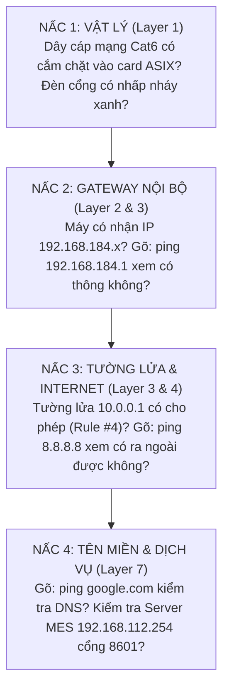

# 📗 TẬP 4: SỔ TAY XỬ LÝ SỰ CỐ MẠNG & TƯỜNG LỬA THỰC CHIẾN (FORTIGATE TROUBLESHOOTING PLAYBOOK)
> **Cẩm nang bỏ túi của Kỹ sư Vận hành Hạ tầng & IT Helpdesk Vinatech**  
> **Áp dụng trực tiếp:** Dựa trên cấu hình sống của chiếc máy tính bạn đang ngồi (`192.168.184.13`), Tường lửa Hưng Yên (FortiGate 100F), Hub Bắc Ninh (FortiGate 80F), Bắc Giang 1, Bắc Giang 2 và Wanju Hàn Quốc.  
> **Phương pháp:** Đi thẳng vào triệu chứng ➡️ Nguyên nhân gốc rễ ➡️ Từng cú click chuột trên web ➡️ Câu lệnh kiểm tra chính xác.

---

## 📑 MỤC LỤC
1. [Quy trình chẩn đoán sự cố mạng chuẩn quốc tế 4 nấc thang](#1-quy-trình-chẩn-đoán-sự-cố-mạng-chuẩn-quốc-tế-4-nấc-thang)
2. [12 Kịch bản sự cố thực tế kinh điển tại nhà máy Vinatech](#2-12-kịch-bản-sự-cố-thực-tế-kinh-điển-tại-nhà-máy-vinatech)
   - Kịch bản 1: Toàn bộ nhà máy mất kết nối Internet (Hưng Yên hoặc Bắc Ninh)
   - Kịch bản 2: Mất kết nối đường hầm VPN (Hưng Yên 🔄 Bắc Ninh hoặc Hưng Yên 🔄 Wanju Hàn Quốc)
   - Kịch bản 3: Phần mềm NAIS MES báo lỗi Database hoặc không kết nối được Server
   - Kịch bản 4: Máy tính nhận IP lạ `169.254.x.x` hoặc báo "No Internet Access"
   - Kịch bản 5: Mạng giật lag, nghẽn băng thông - Tìm máy thủ phạm ngốn mạng trong xưởng
   - Kịch bản 6: Chat Zalo được nhưng không mở được Web (Lỗi máy chủ DNS)
   - Kịch bản 7: Cần mở một cổng dịch vụ mới ra Internet cho chuyên gia Hàn Quốc
   - Kịch bản 8: Tạo tài khoản VPN cho nhân viên mới làm việc từ xa
   - Kịch bản 9: Tường lửa bị đơ giật, CPU vọt lên 90% - 100%
   - Kịch bản 10: Quy trình khôi phục cấu hình sau sự cố chập điện
   - Kịch bản 11: Mất tín hiệu hình ảnh Camera giám sát xưởng (Đầu ghi NVR `192.168.184.10` / `.11`)
   - Kịch bản 12: Không mở được thư mục chia sẻ file nội bộ (`MrCuong-ProductionHY` / `Admin-PC`)
3. [Bảng tra cứu câu lệnh FortiGate CLI chẩn đoán chuyên sâu](#3-bảng-tra-cứu-câu-lệnh-fortigate-cli-chẩn-đoán-chuyên-sâu)
4. [Bảng tra cứu câu lệnh mạng thực hành ngay trên máy tính của bạn](#4-bảng-tra-cứu-câu-lệnh-mạng-thực-hành-ngay-trên-máy-tính-của-bạn)

---

## 1. QUY TRÌNH CHẨN ĐOÁN SỰ CỐ MẠNG CHUẨN QUỐC TẾ 4 NẤC THANG

Khi có người dùng kêu: *"Mất mạng rồi em ơi!"*, hãy áp dụng phương pháp **Bottom-Up (Từ dưới lên trên)** theo đúng thông số máy tính bạn:



---

## 2. 12 KỊCH BẢN SỰ CỐ THỰC TẾ KINH ĐIỂN TẠI NHÀ MÁY VINATECH

---

### 🔴 KỊCH BẢN 1: TOÀN BỘ NHÀ MÁY MẤT KẾT NỐI INTERNET
* **Hiện tượng:** Tất cả máy tính trong xưởng đều không vào được mạng, biểu tượng mạng dưới góc phải màn hình hiện quả địa cầu xám hoặc chấm than vàng.
* **Quy trình xử lý từng bước:**
  1. **Bước 1 - Đăng nhập vào Tường lửa:**
     * Nếu bạn đang ở Hưng Yên (máy `192.168.184.13`): Mở trình duyệt gõ `https://10.0.0.1:4443` (User: `hainv` / Pass: `Vina@123`).
     * Nếu bạn hỗ trợ Bắc Ninh từ xa: Mở `https://42.112.60.211` (User: `admin` / Pass: `Vinatechvina2025`).
  2. **Bước 2 - Kiểm tra cổng mạng tại menu `Network ➡️ Interfaces`:**
     * Nhìn vào cổng `wan1` (VNPT) và `wan2` (Viettel):
       * Nếu cả 2 đều hiện chấm **Đỏ/Xám (Link Down)**: Rút dây mạng, mất điện phòng máy, hoặc đứt toàn bộ cáp quang ngoài đường.
  3. **Bước 3 - Kiểm tra nhóm SD-WAN tại menu `Network ➡️ SD-WAN`:**
     * Xem biểu đồ Performance SLA: Xem đường nào bị mất gói tin (Packet Loss). Nếu một đường chết, kiểm tra xem đường còn lại có tự động nhảy lên gánh tải không.

---

### 🔴 KỊCH BẢN 2: MẤT KẾT NỐI ĐƯỜNG HẦM VPN (HƯNG YÊN 🔄 BẮC NINH HOẶC WANJU HÀN QUỐC)
* **Hiện tượng:** Máy bạn (`192.168.184.13`) vào mạng Internet Google bình thường, nhưng gõ `ping 192.168.0.254` (Bắc Ninh) hoặc `ping 192.168.20.1` (Hàn Quốc) báo lỗi `Request timed out`.
* **Quy trình xử lý:**
  1. Đăng nhập vào FortiGate 100F Hưng Yên (`https://10.0.0.1:4443`).
  2. Vào **VPN ➡️ IPsec Tunnels**.
  3. Tìm đường hầm:
     * Nối Bắc Ninh: **`VPN_HY_To_BN`**
     * Nối Wanju Hàn Quốc: **`ToWanjuFactory`**
  4. Quan sát cột **Status**:
     * Nếu hiện **Màu đỏ (DOWN)**: Nhấp chuột phải vào tên đường hầm ➡️ Bấm chọn **Bring Up**.
     * Đợi 3 - 5 giây: Nếu chuyển sang **Xanh lá cây (UP)** ➡️ Đã khôi phục thành công!
  5. Nếu bấm *Bring Up* mà vẫn đỏ:
     * Bấm vào nút CLI Console (`>_`) góc trên cùng bên phải và gõ lệnh kiểm tra bắt tay IKE:
       ```text
       diagnose vpn ike log-filter rem-addr4 171.251.88.254
       diagnose debug application ike -1
       diagnose debug enable
       ```
     * Xem thông báo lỗi: Nếu báo `no response from peer` nghĩa là cổng `wan2` của Bắc Ninh (`171.251.88.254`) đang bị mất điện hoặc đứt mạng Viettel.

---

### 🔴 KỊCH BẢN 3: PHẦN MỀM NAIS MES BÁO LỖI DATABASE HOẶC KHÔNG KẾT NỐI ĐƯỢC SERVER
* **Hiện tượng:** Khi kỹ sư hoặc công nhân mở phần mềm NAIS tại `C:\AwooSystem\`, phần mềm báo lỗi:
  * *"Cannot connect to dbserver.hycap.co.kr"* hoặc *"Timeout expired"*.
  * Hoặc máy in tem Barcode không in được khi bấm thao tác trên chuyền.
* **Quy trình phân lập nguyên nhân 4 bước:**
  1. **Bước 1: Kiểm tra kết nối Cơ sở Dữ liệu SQL Server Hàn Quốc:**
     * Mở PowerShell trên máy bạn gõ:
       ```powershell
       Test-NetConnection -ComputerName dbserver.hycap.co.kr -Port 5398
       ```
     * Nếu `TcpTestSucceeded : False`:
       * Kiểm tra xem tên miền có phân giải được IP `211.34.149.156` không (`Resolve-DnsName dbserver.hycap.co.kr`). Nếu không phân giải được ➡️ Lỗi DNS (xem Kịch bản 6).
       * Kiểm tra xem đường cáp quang Viettel WAN2 trên FortiGate có đang bị quá tải hoặc rớt mạng quốc tế không.
  2. **Bước 2: Kiểm tra kết nối Máy chủ Ứng dụng MES Bắc Ninh (`192.168.112.254`):**
     * Gõ lệnh PowerShell:
       ```powershell
       Test-NetConnection -ComputerName 192.168.112.254 -Port 8601
       ```
     * Nếu `TcpTestSucceeded : False`:
       * Kiểm tra ngay đường hầm VPN Bắc Ninh: `ping 192.168.0.254`. Nếu VPN chết ➡️ Xem Kịch bản 2 để Bring Up lại đường hầm `VPN_HY_To_BN`.
       * Nếu ping được nhưng port 8601 không thông: Service Core MES trên server Bắc Ninh bị dừng ➡️ Cần liên hệ phòng Server Bắc Ninh khởi động lại service.
  3. **Bước 3: Kiểm tra Máy in tem Barcode tại chỗ trên dây chuyền:**
     * Máy in tem (Zebra/Sato) trong xưởng thường dùng IP tĩnh trong dải `192.168.184.x` (ví dụ `192.168.184.200`) và cổng in mạng RAW `9100`.
     * Gõ: `ping [IP_Máy_In]` và `Test-NetConnection [IP_Máy_In] -Port 9100`. Nếu không thông, kiểm tra dây mạng cắm vào máy in tem và nguồn điện máy in.
  4. **Bước 4: Quy trình Cài lại NAIS khi client bị hỏng file cấu hình:**
     * Xóa toàn bộ file trong thư mục: `C:\AwooSystem\`
     * Mở trình duyệt truy cập: `http://mes.hycap.co.kr:9952/` để tải lại bộ cài.
     * Cấu hình **New System**:
       * `Alias: nais`
       * `Url: http://mes.hycap.co.kr:9952`

---

### 🔴 KỊCH BẢN 4: MÁY TÍNH NHẬN IP LẠ `169.254.x.x` HOẶC BÁO "NO INTERNET ACCESS"
* **Bản chất:** Máy tính không xin được IP từ máy chủ DHCP nên hệ điều hành Windows tự gán dải cấp cứu `169.254.x.x`.
* **Cách xử lý tại chỗ:**
  1. Mở `cmd` gõ lệnh nhả IP và xin lại:
     ```cmd
     ipconfig /release
     ipconfig /renew
     ```
  2. Nếu vẫn báo lỗi: Kiểm tra dây cáp mạng cắm vào máy trạm xem có bị tuột hoặc gãy chốt nhựa không.
  3. Kiểm tra xem cổng chia mạng (Switch nhánh) của bàn làm việc đó có bị ai vô tình rút phích cắm điện không.

---

### 🔴 KỊCH BẢN 5: MẠNG GIẬT LAG, NGHẼN BĂNG THÔNG - TÌM MÁY THỦ PHẠM
* **Quy trình truy tìm thủ phạm trên FortiGate 100F:**
  1. Đăng nhập vào `https://10.0.0.1:4443`.
  2. Vào **Log & Report ➡️ Forward Traffic**.
  3. Nhìn lên tiêu đề cột **Bytes (Sent/Received)**, bấm chuột vào để sắp xếp từ **Lớn nhất đến Nhỏ nhất**.
  4. Bạn sẽ thấy ngay máy tính ở dòng đầu tiên:
     * Cột **Source**: IP của máy thủ phạm (ví dụ `192.168.184.88`).
     * Cột **Destination**: Đang kết nối tới đâu (ví dụ đang tải phim 4K hoặc file dung lượng hàng chục GB).
  5. *Cách khóa mạng máy thủ phạm trong 30 giây:*
     * Vào **Policy & Objects ➡️ Firewall Policy**.
     * Tạo 1 Rule mới: `Source: 192.168.184.88` ➡️ `Destination: all` ➡️ `Action: DENY`.
     * Kéo rule này **lên trên đầu bảng**. Máy tính đó sẽ bị ngắt mạng ngay lập tức, toàn bộ nhà máy sẽ mượt mà trở lại!

---

### 🔴 KỊCH BẢN 6: CHAT ZALO ĐƯỢC NHƯNG KHÔNG MỞ ĐƯỢC TRANG WEB (LỖI DNS)
* **Kiểm chứng nhanh trên máy bạn:**
  ```cmd
  ping 8.8.8.8       -> Thấy trả lời (Reply from 8.8.8.8) bình thường
  ping google.com    -> Báo lỗi "Could not find host"
  ```
  ➡️ **Kết luận 100% máy chủ phân giải tên miền DNS bị lỗi!**
* **Xử lý nhanh:**
  1. Vào **Network ➡️ DNS** trên FortiGate.
  2. Đổi máy chủ *Primary DNS* thành `8.8.8.8` (Google) hoặc `1.1.1.1` (Cloudflare).
  3. Bấm **Apply**. Mở CMD trên máy bạn gõ: `ipconfig /flushdns` để xóa bộ nhớ đệm là xong.

---

### 🔴 KỊCH BẢN 7: CẦN MỞ MỘT CỔNG DỊCH VỤ MỚI CHO ĐỐI TÁC
* **Ví dụ:** Nhà máy mua thêm máy trạm mới (IP `192.168.184.99`, chạy web cổng `8080`), muốn chuyên gia bên ngoài truy cập từ xa qua cổng `8888`.
* **Thực hiện đúng chuẩn 2 bước:**
  * **Bước 1:** Vào **Policy & Objects ➡️ Virtual IPs ➡️ Create New**:
    * `Name`: `VIP_May_Moi`
    * `Interface`: `wan2` (Viettel)
    * `External IP`: `117.4.123.239`
    * `Mapped IP`: `192.168.184.99`
    * Bật `Port Forwarding`: External port `8888` ➡️ Map to port `8080`.
    * Bấm **OK**.
  * **Bước 2:** Vào **Firewall Policy ➡️ Create New**:
    * `Name`: `Cho_Phep_Vao_May_Moi`
    * `Incoming`: `wan2` ➡️ `Outgoing`: `Link-to-L3`
    * `Source`: `all` (hoặc an toàn nhất là chỉ điền IP của đối tác).
    * `Destination`: Chọn `VIP_May_Moi`.
    * `Action`: `ACCEPT`.
    * Bấm **OK**.

---

### 🔴 KỊCH BẢN 8: TẠO TÀI KHOẢN VPN CHO NHÂN VIÊN MỚI
1. Vào **User & Authentication ➡️ Local Users ➡️ Create New**:
   * Nhập tên đăng nhập (ví dụ: `nguyenvana`) và mật khẩu.
2. Vào **User & Authentication ➡️ User Groups**:
   * Bấm đúp vào nhóm VPN ➡️ Thêm `nguyenvana` vào nhóm.
3. Hướng dẫn nhân viên tải app **FortiClient VPN**:
   * Địa chỉ Gateway: `14.251.8.52` (Cổng `wan1` Hưng Yên).
   * Cổng kết nối (Port): **`10443`**.

---

### 🔴 KỊCH BẢN 9: TƯỜNG LỬA BỊ ĐƠ GIẬT, CPU VỌT LÊN 90% - 100%
* Mở CLI Console trên FortiGate gõ lệnh xem tiến trình nào đang chiếm CPU:
  ```text
  get system performance top
  ```
* Nếu thấy tiến trình `ipsengine` chiếm 90%:
  * Gõ lệnh khởi động lại tiến trình IPS mà không làm mất mạng:
    ```text
    diagnose test application ipsmonitor 99
    ```

---

### 🔴 KỊCH BẢN 10: QUY TRÌNH SAO LƯU (BACKUP) & KHÔI PHỤC (RESTORE)
* **Cách làm:**
  1. Bấm vào chữ **`hainv`** ở góc trên cùng bên phải màn hình web.
  2. Chọn **Configuration ➡️ Backup**.
  3. Chọn lưu vào **Local PC** ➡️ Bấm **OK**.
  4. File `.conf` sẽ được lưu về máy bạn. Cất file này vào nơi an toàn. Khi có sự cố hỏng hóc, chỉ cần vào chọn **Restore** và nạp lại file này là toàn bộ hệ thống phục hồi như cũ!

---

### 🔴 KỊCH BẢN 11: MẤT TÍN HIỆU HÌNH ẢNH CAMERA GIÁM SÁT XƯỞNG (ĐẦU GHI NVR 192.168.184.10 / .11)
* **Hiện tượng:** Màn hình tivi phòng bảo vệ hoặc điện thoại của ban giám đốc không xem được hình ảnh camera xưởng sản xuất Hưng Yên.
* **Quy trình xử lý thực tế 3 bước:**
  1. **Bước 1 - Kiểm tra đầu ghi tại chỗ (Local Test):**
     * Từ máy bạn (`192.168.184.13`), mở PowerShell gõ:
       ```powershell
       Test-NetConnection -ComputerName 192.168.184.10 -Port 8000
       Test-NetConnection -ComputerName 192.168.184.11 -Port 8000
       ```
     * Nếu `TcpTestSucceeded : False` ➡️ Đầu ghi NVR bị mất điện, treo cứng, hoặc switch cắm đầu ghi bị rút dây mạng.
  2. **Bước 2 - Kiểm tra giao diện Web quản trị đầu ghi:**
     * Mở Chrome trên máy bạn gõ: `http://192.168.184.10` hoặc `http://192.168.184.11`. Nếu vào được trang đăng nhập nghĩa là phần cứng NVR đang chạy tốt.
  3. **Bước 3 - Kiểm tra chính sách xem từ xa trên FortiGate:**
     * Đăng nhập vào `https://10.0.0.1:4443` ➡️ Vào **Policy & Objects ➡️ Firewall Policy**.
     * Tìm **Rule #17 `[ALL-to-NVR]`**: Kiểm tra xem rule này có đang BẬT (Xanh) không, và Virtual IP `VIP_NVR` có trỏ đúng vào cổng 8000 của đầu ghi hay không.

---

### 🔴 KỊCH BẢN 12: KHÔNG MỞ ĐƯỢC THƯ MỤC CHIA SẺ FILE NỘI BỘ (MÁY ANH CƯỜNG / ADMIN-PC)
* **Hiện tượng:** Bạn gõ `\\192.168.184.36` (máy anh Cường) hoặc `\\192.168.184.34` (`Admin-PC`) để lấy file biểu mẫu nhưng Windows báo lỗi: *"The network path was not found (0x80070035)"*.
* **Quy trình xử lý nhanh 3 bước:**
  1. **Bước 1 - Ping kiểm tra máy đích có đang bật không:**
     ```cmd
     ping 192.168.184.36
     ```
     * Nếu `Request timed out`: Máy tính của đồng nghiệp đang tắt nguồn hoặc chuyển sang chế độ Sleep.
  2. **Bước 2 - Kiểm tra cổng chia sẻ file SMB (Port 445):**
     ```powershell
     Test-NetConnection -ComputerName 192.168.184.36 -Port 445
     ```
     * Nếu ping được nhưng cổng 445 bị chặn (`False`): Do máy đối tác đang để cấu hình mạng là **Public Network** nên Windows Firewall tự động chặn cổng 445.
  3. **Bước 3 - Khắc phục trên máy chia sẻ:**
     * Bấm vào biểu tượng mạng trên máy đối tác ➡️ Chuyển từ **Public** sang **Private Network**.
     * Vào **Control Panel ➡️ Network and Sharing Center ➡️ Advanced sharing settings** ➡️ Bật **Turn on file and printer sharing**.

---

## 3. BẢNG TRA CỨU CÂU LỆNH FORTIGATE CLI CHẨN ĐOÁN CHUYÊN SÂU

| Câu lệnh CLI | Chức năng thực tế | Khi nào dùng? |
| :--- | :--- | :--- |
| `get system status` | Xem thông tin phần cứng, bản quyền, số ngày chạy | Kiểm tra tổng quan máy Hưng Yên / Bắc Ninh. |
| `get system performance status` | Xem CPU, RAM, số lượng phiên kết nối (Sessions) | Kiểm tra máy có bị quá tải không. |
| `get router info routing-table all` | Xem toàn bộ bảng chỉ đường của tường lửa | Kiểm tra xem gói tin có biết đường đi ra không. |
| `diagnose sniffer packet any 'host 192.168.184.13' 4` | **Bắt gói tin sống của chính chiếc máy bạn** | Soi xem máy bạn có gửi dữ liệu tới tường lửa không. |
| `diagnose vpn tunnel list` | Xem số lượng byte dữ liệu gửi qua VPN | Kiểm tra đường hầm nối Bắc Ninh / Hàn Quốc có chạy dữ liệu không. |
| `execute ping 192.168.0.254` | Ping từ chính tường lửa Hưng Yên sang Bắc Ninh | Kiểm tra hai con tường lửa có nhìn thấy nhau không. |

---

## 4. BẢNG TRA CỨU CÂU LỆNH MẠNG THỰC HÀNH NGAY TRÊN MÁY TÍNH CỦA BẠN

| Câu lệnh (gõ trên CMD / PowerShell máy bạn) | Kết quả thực tế đo được trên máy bạn | Ý nghĩa & Ứng dụng thực tế |
| :--- | :--- | :--- |
| `ipconfig /all` | Thấy IP `192.168.184.13`, Gateway `192.168.184.1`, card ASIX | Máy bạn đang kết nối tốt trong VLAN 184. |
| `arp -a` | Thấy MAC Cisco Switch `e4-4e-2d-4b-8d-51` và các máy hàng xóm | Kiểm tra bảng phân giải địa chỉ MAC Layer 2 nội bộ xưởng. |
| `ping 192.168.184.1` | **Time < 1 ms** | Dây cáp LAN cắm từ card ASIX tới Cisco Core Switch cực kỳ hoàn hảo. |
| `ping 192.168.184.36` | **Time < 1 ms** | Kiểm tra thông mạch tới máy tính Quản lý sản xuất (`MrCuong-ProductionHY`). |
| `Test-NetConnection 192.168.184.10 -Port 8000` | **TcpTestSucceeded : True** | Kiểm tra đầu ghi Camera giám sát xưởng NVR 01 đang phát luồng video. |
| `ping 10.0.0.1` | **Time < 1 ms** | Thông sang Tường lửa FortiGate 100F qua cổng `Link-to-L3`. |
| `ping 192.168.0.254` | **Time = 6 ms** | Đường hầm IPsec VPN sang nhà máy Bắc Ninh đang sống và siêu tốc! |
| `ping 192.168.112.254` | **Time = 6 ms** | Kết nối trực tiếp vào máy chủ MES sản xuất Bắc Ninh hoàn hảo. |
| `Test-NetConnection 192.168.112.254 -Port 8601` | **TcpTestSucceeded : True** | Kiểm tra dịch vụ truyền thông dây chuyền sản xuất tự động SL7. |
| `Test-NetConnection dbserver.hycap.co.kr -Port 5398` | **TcpTestSucceeded : True** | Kiểm tra kết nối Database SQL Server `SmartFactoryV2` sang Hàn Quốc. |
| `ping 192.168.20.1` | **Time = 144 ms** | Kết nối xuyên cáp quang biển sang nhà máy Wanju Hàn Quốc thông suốt. |
| `ping 8.8.8.8` | **Time = 25 ms** | Đường mạng Viettel `wan2` ra Internet ổn định. |
| `tracert -d 8.8.8.8` | Thấy 5 trạm dừng chân rõ ràng | Nhìn thấy toàn bộ hành trình vật lý của gói tin từ bàn phím ra thế giới! |
