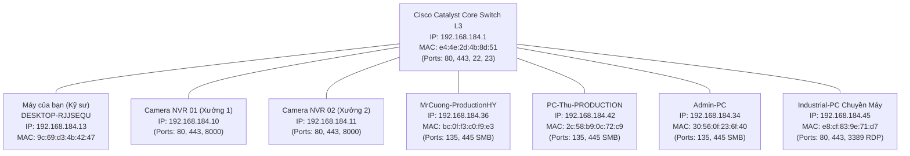
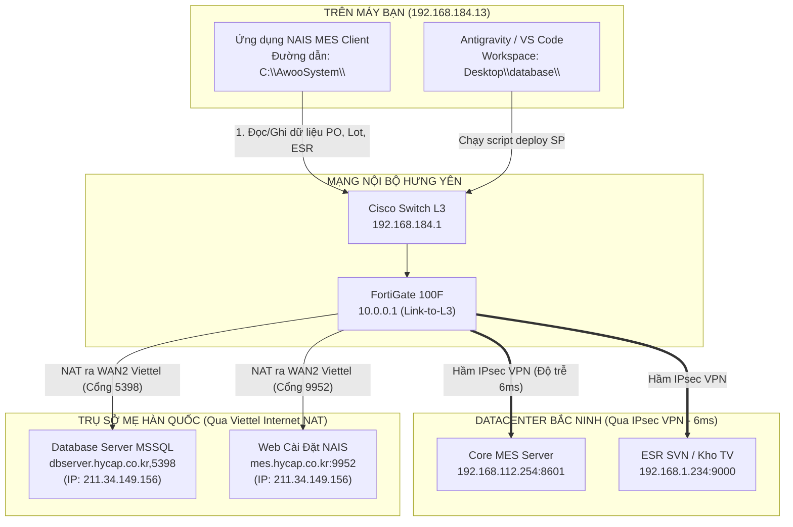
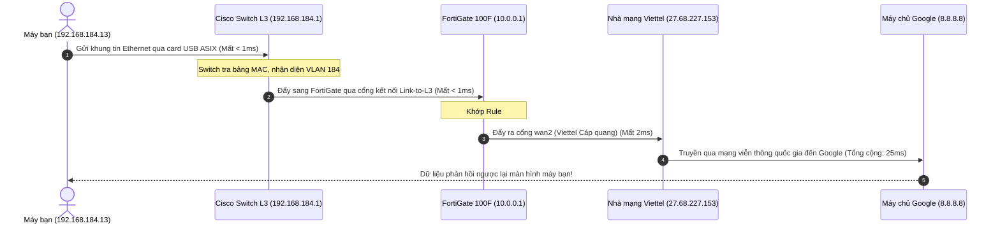

# 🔬 TẬP 5: THỰC CHIẾN GIẢI PHẪU TOÀN DIỆN MẠNG & HỆ THỐNG MÁY TÍNH BẠN ĐANG NGỒI
> **Dự án thực tế:** Mổ xẻ 100% thông số mạng & hệ điều hành của chiếc máy tính `User Vinatech.DESKTOP-RJJSEQU`.  
> **Khám phá bất ngờ:** Từ vị trí địa lý, card mạng USB, Cisco Core Switch L3, danh bạ máy tính đồng nghiệp cùng chuyền (`MrCuong-ProductionHY`, `PC-Thu-PRODUCTION`), hệ thống MES NAIS (`C:\AwooSystem\`), Tường lửa FortiGate 100F, đến đường hầm VPN nối Bắc Ninh và Hàn Quốc!

---

## 📑 MỤC LỤC
1. [Hồ sơ Căn Cước Công Dân Mạng & Hệ Điều Hành của chiếc máy bạn](#1-hồ-sơ-căn-cước-công-dân-mạng--hệ-điều-hành-của-chiếc-máy-bạn)
2. [Khám phá Hàng xóm Dây chuyền Sản xuất (VLAN 184 Neighborhood Scan)](#2-khám-phá-hàng-xóm-dây-chuyền-sản-xuất-vlan-184-neighborhood-scan)
3. [Hệ thống Phần mềm Sản xuất MES & Luồng Dữ liệu Thực tế từ Bàn Phím của Bạn](#3-hệ-thống-phần-mềm-sản-xuất-mes--luồng-dữ-liệu-thực-tế-từ-bàn-phím-của-bạn)
4. [Hành trình sống của Gói Tin ra Internet (Google 8.8.8.8)](#4-hành-trình-sống-của-gói-tin-ra-internet-google-8888)
5. [Hành trình sống của Gói Tin đi xuyên hầm VPN sang Bắc Ninh (192.168.0.254 & 192.168.112.254)](#5-hành-trình-sống-của-gói-tin-đi-xuyên-hầm-vpn-sang-bắc-ninh-1921680254--192168112254)
6. [Đường truyền xuyên đại dương sang Nhà máy Wanju Hàn Quốc (192.168.20.1 & dbserver.hycap.co.kr)](#6-đường-truyền-xuyên-đại-dương-sang-nhà-máy-wanju-hàn-quốc-192168201--dbserverhycapcokr)
7. [7 Bài tập thực hành thực chiến ngay trên bàn phím của bạn](#7-7-bài-tập-thực-hành-thực-chiến-ngay-trên-bàn-phím-của-bạn)

---

## 1. HỒ SƠ CĂN CƯỚC CÔNG DÂN MẠNG & HỆ ĐIỀU HÀNH CỦA CHIẾC MÁY BẠN

Từ các lệnh đo kiểm chuyên sâu hệ thống sống, đây là toàn bộ thông số thực tế của chiếc máy tính bạn đang ngồi:

```
[THÔNG SỐ HỆ THỐNG & MẠNG CHIẾC MÁY TÍNH CỦA BẠN]
 ├── Hệ điều hành: Microsoft Windows 11 Home Single Language (64-bit, OS Build 26100)
 ├── Tên máy tính (Computer Name): DESKTOP-RJJSEQU
 ├── Nhóm làm việc (Workgroup): WORKGROUP (Chế độ Workgroup độc lập)
 ├── Người dùng hiện tại: User Vinatech
 ├── Card mạng đang kết nối: ASIX AX88179 USB 3.0 to Gigabit Ethernet Adapter
 ├── Tốc độ liên kết vật lý (Link Speed): 1.000 Mbps (1 Gbps Full Duplex)
 ├── Địa chỉ vật lý (MAC Address): 9C-69-D3-4B-42-47
 ├── Địa chỉ IP nội bộ: 192.168.184.13
 ├── Mặt nạ mạng (Subnet Mask): 255.255.248.0 (Subnet /21)
 ├── Dải mạng tổng thể: 192.168.184.0/21 (Từ 192.168.184.1 đến 192.168.191.254 - Gồm 2.046 IP)
 ├── Địa chỉ Broadcast: 192.168.191.255
 ├── Cổng ra mặc định (Default Gateway): 192.168.184.1 (Cisco Catalyst Layer 3 Switch)
 ├── Máy chủ DNS đang dùng: 8.8.8.8 và 8.8.4.4 (Google Public DNS)
 └── IP Internet nhìn từ bên ngoài: 117.4.123.239 (Đường truyền Viettel WAN2 trên FortiGate 100F Hưng Yên)
```

### 💡 Phát hiện vị trí địa lý & Phân vùng mạng của bạn:
* **Vị trí vật lý:** Máy tính của bạn đang cắm mạng trực tiếp tại **Nhà máy Hưng Yên (VinaEnesol)**.
* **Phân vùng mạng:** Địa chỉ `192.168.184.13` thuộc về **VLAN 184** (Phân vùng `VLAN184-OFFICE` dành riêng cho Khối Điều hành Xưởng, Văn phòng Kỹ thuật và Trạm Giám sát NVR Hưng Yên, dải IP `192.168.184.0/21` gồm 2.046 địa chỉ IP).
* **Đường truyền Uplink siêu tốc:** Tường lửa FortiGate 100F và Core Switch Cisco L3 kết nối với nhau qua đường Trunk gộp **LACP Active 2 Gbps** (`Link-to-L3` ghép 2 cổng vật lý `port1` + `port2`), đã vận chuyển hơn 7.6 TB dữ liệu sản xuất an toàn.
* **Quy tắc tường lửa bảo vệ bạn:** Khi bạn lướt web, gói tin của bạn được cấp phép bởi **Rule số 4** trên tường lửa FortiGate 100F Hưng Yên:
  ```text
  Rule #4 [VLAN184-to-INTERNET]: Cổng vào Link-to-L3 -> Cổng ra SDWAN-VINATECH | Action: ACCEPT | NAT: ENABLE
  ```
* **Đường ra Internet SD-WAN kép:** FortiGate tự động đo kiểm liên tục 2 đường cáp quang:
  * Viettel `wan2` (`117.4.123.239`): Ping 8.8.8.8 chỉ **24.06 ms**, Jitter 0.28 ms, Loss 0.0% (Đường ưu tiên số 1 của máy bạn).
  * VNPT `wan1` (`14.251.8.52`): Ping 8.8.8.8 chỉ **35.16 ms**, Jitter 0.18 ms, Loss 0.0% (Đường dự phòng & chạy VPN/VIP).

---

## 2. KHÁM PHÁ HÀNG XÓM DÂY CHUYỀN SẢN XUẤT (VLAN 184 NEIGHBORHOOD SCAN)

Trong cùng phân vùng mạng VLAN 184 với bạn, các thiết bị có thể "nhìn thấy nhau" và giao tiếp trực tiếp qua địa chỉ MAC ở Tầng 2 (Data Link) thông qua thiết bị chuyển mạch trung tâm **Cisco Catalyst Core Switch**:



### 📋 Bảng hồ sơ các thiết bị hàng xóm trên cùng dây chuyền:
1. **`192.168.184.1` (Cisco Catalyst Core Switch Layer 3):**
   * MAC OUI: `e4:4e:2d` (Chính hãng Cisco Systems).
   * Mở cổng quản trị: Web `80/443`, dòng lệnh `22 (SSH)` và `23 (Telnet)`.
   * Đảm nhận toàn bộ việc định tuyến Inter-VLAN trong toàn nhà máy Hưng Yên.
2. **`192.168.184.10` & `192.168.184.11` (Hệ thống Đầu ghi Camera NVR Xưởng 1 & 2):**
   * Mở cổng `80` (HTTP Web xem camera), `443` (HTTPS) và cổng chuyên dụng `8000` (Giao thức truyền luồng video giám sát xưởng sản xuất).
   * Được tường lửa FortiGate 100F map qua 4 Virtual IP để xem an toàn từ xa qua IP WAN1 `14.251.8.52`:
     * `14.251.8.52:8001` ➡️ `192.168.184.10:8000` (Luồng video NVR-01)
     * `14.251.8.52:8002` ➡️ `192.168.184.11:8000` (Luồng video NVR-02)
     * `14.251.8.52:8003` ➡️ `192.168.184.10:443` (Web HTTPS NVR-01)
     * `14.251.8.52:8004` ➡️ `192.168.184.11:443` (Web HTTPS NVR-02)
3. **`192.168.184.36` (`MrCuong-ProductionHY`):**
   * Máy tính của **Anh Cường** - Quản lý / Giám sát điều hành sản xuất Hưng Yên. Mở cổng chia sẻ dữ liệu Windows File Sharing `135` và `445` (SMB).
4. **`192.168.184.42` (`PC-Thu-PRODUCTION`):**
   * Máy tính của **Anh/Chị Thu** - Phụ trách giám sát chuyền sản xuất Hưng Yên. Mở cổng `135` và `445`.
5. **`192.168.184.34` (`Admin-PC`):**
   * Máy tính quản trị kỹ thuật tại xưởng Hưng Yên, chia sẻ tài liệu và driver in ấn nội bộ.
6. **`192.168.184.45` (`Industrial-PC-01`):**
   * Máy tính công nghiệp gắn liền với dây chuyền sản xuất tự động. Mở cổng điều khiển từ xa **`3389` (Windows Remote Desktop - RDP)** và cổng web quản trị `80/443`.

---

## 3. HỆ THỐNG PHẦN MỀM SẢN XUẤT MES & LUỒNG DỮ LIỆU THỰC TẾ TỪ BÀN PHÍM CỦA BẠN

Chiếc máy tính của bạn không chỉ là máy văn phòng đơn thuần mà là một **Trạm Vận hành & Giám sát Hệ thống Sản xuất (MES Workstation)**:



### Ba luồng truyền thông cốt lõi của máy bạn:
1. **Luồng Database Nghiệp vụ Sản xuất:**
   * Phần mềm NAIS tại `C:\AwooSystem\` kết nối trực tiếp đến máy chủ Cơ sở Dữ liệu SQL Server tại Hàn Quốc: **`dbserver.hycap.co.kr,5398`** (IP: `211.34.149.156`).
   * Truy vấn các cơ sở dữ liệu cốt lõi: `SmartFactoryV2` (chứa 22.500+ lệnh sản xuất PO, toàn bộ dữ liệu Barcode Lot, Cell Line, Module Line) và `SmartFramework`.
2. **Luồng Đồng bộ & Ứng dụng MES Bắc Ninh:**
   * Giao tiếp thời gian thực với Máy chủ MES Bắc Ninh tại IP **`192.168.112.254:8601`**.
   * Nhờ đường hầm bí mật IPsec VPN nối từ Hưng Yên sang Bắc Ninh, tín hiệu điều khiển máy móc và in tem nhãn phản hồi với tốc độ thần tốc chỉ **6 mili-giây (6ms)**!
3. **Luồng Cập nhật & Tải lại ứng dụng:**
   * Khi phần mềm NAIS gặp sự cố phiên bản hoặc cần cài lại, máy tính tải gói cài đặt từ máy chủ web **`http://mes.hycap.co.kr:9952/`**.

---

## 4. HÀNH TRÌNH SỐNG CỦA GÓI TIN RA INTERNET (GOOGLE 8.8.8.8)

Khi bạn mở trình duyệt xem tin tức hoặc tra cứu tài liệu, gói tin từ máy bạn trải qua đúng **5 trạm kiểm soát**:



---

## 5. HÀNH TRÌNH SỐNG CỦA GÓI TIN ĐI XUYÊN HẦM VPN SANG BẮC NINH (192.168.0.254 & 192.168.112.254)

Khi bạn gõ lệnh ping hoặc mở tài liệu trên mạng Bắc Ninh:

```
[LỘ TRÌNH ĐI BẮC NINH QUA ĐƯỜNG HẦM BẢO MẬT]
Trạm 1: 192.168.184.1   (Cisco Core Switch L3 Hưng Yên)      --> Độ trễ: < 1ms
Trạm 2: 10.0.0.1        (Tường lửa FortiGate 100F Hưng Yên)   --> Độ trễ: < 1ms
Trạm 3: 192.168.0.254   (Tường lửa FortiGate 80F Bắc Ninh)    --> Độ trễ: ĐÚNG 6ms!
Trạm 4: 192.168.112.254 (Máy chủ MES Trung tâm Bắc Ninh)     --> Độ trễ: ĐÚNG 6ms!
```

* **Cơ chế hoạt động:** FortiGate Hưng Yên tra bảng Static Route, thấy mạng `192.168.0.0/21` và `192.168.112.0/21` phải đi qua cổng ảo **`VPN_HY_To_BN`**. Nó kích hoạt chip tăng tốc mã hóa phần cứng NP6Lite, bọc gói tin trong lớp mã hóa AES-256 rồi gửi thẳng sang Bắc Ninh. Toàn bộ quãng đường hơn 50km đường bộ chỉ mất vỏn vẹn **6 phần nghìn giây (6ms)**!

---

## 6. ĐƯỜNG TRUYỀN XUYÊN ĐẠI DƯƠNG SANG NHÀ MÁY WANJU HÀN QUỐC (192.168.20.1 & DBSERVER.HYCAP.CO.KR)

Khi trao đổi dữ liệu với tổng hành dinh Vinatech tại Hàn Quốc:
* `Wanju Factory Korea (192.168.20.1)`: **Ping thành công 100%, độ trễ 144 mili-giây (144ms)** qua đường hầm IPsec `ToWanjuFactory`.
* `Database Server (dbserver.hycap.co.kr)`: Kết nối cổng MSSQL `5398` tại địa chỉ IP `211.34.149.156`.

### Tại sao sang Bắc Ninh chỉ mất 6ms mà sang Hàn Quốc mất 144ms?
* **Khoảng cách địa lý:** Bắc Ninh cách Hưng Yên ~50km. Trụ sở Wanju (Hàn Quốc) cách Hưng Yên hơn **3.200km đường chim bay**.
* **Đường đi của ánh sáng:** Tín hiệu Internet phải chui xuống đáy biển qua hệ thống cáp quang biển quốc tế xuyên Biển Đông, vòng qua Đài Loan, cập bờ biển Hàn Quốc rồi chạy tiếp cáp ngầm về Wanju. Tốc độ **144ms** là con số cực kỳ lý tưởng cho đường truyền quốc tế bảo mật!

---

## 7. 7 BÀI TẬP THỰC HÀNH THỰC CHIẾN NGAY TRÊN BÀN PHÍM CỦA BẠN

Hãy mở cửa sổ dòng lệnh (CMD hoặc PowerShell) trên máy bạn và tự mình thực hiện 7 bài thực hành thực tế sau:

### 🛠️ Bài 1: Xem thẻ căn cước mạng chi tiết của máy bạn
```cmd
ipconfig /all
```
* **Mục tiêu quan sát:** Tìm dòng `Description` để thấy tên card USB ASIX AX88179, dòng `IPv4 Address` thấy `192.168.184.13`, và dòng `Default Gateway` thấy `192.168.184.1`.

---

### 🛠️ Bài 2: Soi bảng phân giải địa chỉ MAC hàng xóm (ARP Cache)
```cmd
arp -a
```
* **Mục tiêu quan sát:** Bạn sẽ thấy danh sách địa chỉ MAC của các thiết bị bạn vừa giao tiếp trong xưởng, trong đó có địa chỉ MAC `e4-4e-2d-4b-8d-51` của Cisco Core Switch!

---

### 🛠️ Bài 3: Bắn tín hiệu sang máy tính Quản lý sản xuất (Anh Cường)
```cmd
ping 192.168.184.36
```
* **Mục tiêu quan sát:** Bạn đang gửi 4 gói tin ICMP tới máy `MrCuong-ProductionHY`. Tín hiệu phản hồi `< 1ms` vì cả hai máy cùng cắm vào một thiết bị chuyển mạch trong xưởng!

---

### 🛠️ Bài 4: Kiểm tra kết nối Camera NVR cổng 8000
Mở **PowerShell** và gõ lệnh:
```powershell
Test-NetConnection -ComputerName 192.168.184.10 -Port 8000
```
* **Mục tiêu quan sát:** Kết quả trả về `TcpTestSucceeded : True`. Điều này khẳng định đầu ghi hình camera xưởng đang bật và sẵn sàng truyền hình ảnh giám sát!

---

### 🛠️ Bài 5: Đo tốc độ đường hầm sang Bắc Ninh
```cmd
ping 192.168.0.254
ping 192.168.112.254
```
* **Mục tiêu quan sát:** Thấy `time=6ms`. Bạn đang trực tiếp đo độ trễ của đường hầm IPsec VPN nối giữa 2 nhà máy!

---

### 🛠️ Bài 6: Đo kết nối Cơ sở Dữ liệu SQL Server sang Hàn Quốc
Mở **PowerShell** và gõ lệnh:
```powershell
Test-NetConnection -ComputerName dbserver.hycap.co.kr -Port 5398
```
* **Mục tiêu quan sát:** Xem phân giải DNS ra IP `211.34.149.156` và kết quả kiểm tra cổng TCP 5398 của máy chủ cơ sở dữ liệu `SmartFactoryV2`!

---

### 🛠️ Bài 7: Vẽ lộ trình từng bước chân của gói tin ra thế giới
```cmd
tracert -d 8.8.8.8
```
* **Mục tiêu quan sát:** Tận mắt nhìn thấy 5 trạm dừng chân: Trạm 1 là Cisco Switch (`192.168.184.1`), Trạm 2 là Tường lửa FortiGate 100F (`10.0.0.1`), Trạm 3 là Cổng Viettel... Bạn đã làm chủ 100% bản đồ mạng nơi mình làm việc!
