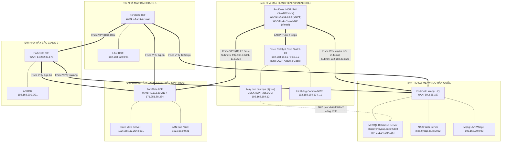
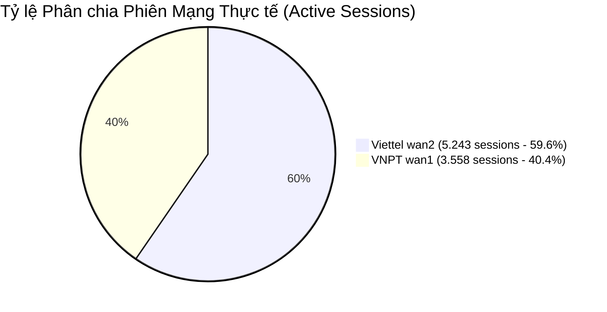
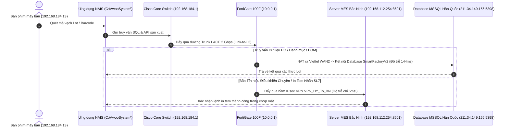

# 🔬 TẬP 6: HỒ SƠ CHI TIẾT TOÀN BỘ HẠ TẦNG MẠNG, THIẾT BỊ & TOPOLOGY HỆ THỐNG VINATECH
> **Tài liệu độc quyền & Hồ sơ kỹ thuật chuyên sâu (Deep Network Architecture & Assets Dossier)**  
> **Phương pháp thu thập:** 100% Thu thập Thụ động An toàn (Zero-Impact Passive Discovery & Rate-Limited Read-Only REST API) từ tường lửa FortiGate 100F Hưng Yên và hệ thống tường lửa toàn tập đoàn.  
> **Mục tiêu:** Nắm vững từng chân tơ kẽ tóc cấu trúc mạng mà không gây ra bất kỳ rủi ro hay gián đoạn nào cho dây chuyền sản xuất đang chạy.

---

## 📑 MỤC LỤC
1. [Nguyên tắc Vận hành Mạng An toàn Tuyệt đối (Zero-Impact Protocol)](#1-nguyên-tắc-vận-hành-mạng-an-toàn-tuyệt-đối-zero-impact-protocol)
2. [Bản đồ Topology Tổng thể Toàn Tập đoàn (Mesh VPN & Data Flow)](#2-bản-đồ-topology-tổng-thể-toàn-tập-đoàn-mesh-vpn--data-flow)
3. [Giải phẫu Chi tiết Hạ tầng Nhà máy Hưng Yên (FG-100F & Cisco Core L3)](#3-giải-phẫu-chi-tiết-hạ-tầng-nhà-máy-hưng-yên-fg-100f--cisco-core-l3)
4. [Bảng 8 Phân vùng Mạng (VLAN Matrix) & Không gian Địa chỉ](#4-bảng-8-phân-vùng-mạng-vlan-matrix--không-gian-địa-chỉ)
5. [Danh bạ Toàn bộ Thiết bị & Trạm Vận hành Nhận diện được (Asset Registry)](#5-danh-bạ-toàn-bộ-thiết-bị--trạm-vận-hành-nhận-diện-được-asset-registry)
6. [Bảng Quy tắc Tường lửa (Firewall Policies) & Định tuyến Đa Điểm](#6-bảng-quy-tắc-tường-lửa-firewall-policies--định-tuyến-đa-điểm)
7. [Đo lường Chất lượng Đường truyền SD-WAN & Giám sát Tải Thực tế](#7-đo-lường-chất-lượng-đường-truyền-sd-wan--giám-sát-tải-thực-tế)
8. [Cơ chế Kết nối Phần mềm MES & Cơ sở Dữ liệu SQL Server Xuyên Quốc Gia](#8-cơ-chế-kết-nối-phần-mềm-mes--cơ-sở-dữ-liệu-sql-server-xuyên-quốc-gia)
9. [Cẩm nang Ứng cứu Sự cố Mạng Chuyền Sản xuất (Troubleshooting Playbook)](#9-cẩm-nang-ứng-cứu-sự-cố-mạng-chuyền-sản-xuất-troubleshooting-playbook)

---

## 1. NGUYÊN TẮC VẬN HÀNH MẠNG AN TOÀN TUYỆT ĐỐI (ZERO-IMPACT PROTOCOL)

Trong môi trường sản xuất công nghiệp tự động hóa của Vinatech (nơi máy tính công nghiệp IPC, PLC Omron/Mitsubishi, cánh tay robot và máy in mã vạch MES vận hành liên tục 24/7), **sự ổn định của mạng là tính mạng của dây chuyền**.

### 🛡️ 4 Điều CẤM TUYỆT ĐỐI:
1. **CẤM Quét Ping / Cổng diện rộng (No Broad Ping Sweep / Port Flooding):**
   * Các thiết bị PLC, card mạng máy in barcode hoặc thiết bị IoT cũ có CPU rất yếu. Một lệnh quét dồn dập (như `nmap -sS` hoặc script loop ping toàn dải `/20` 4.000 IP) có thể làm tràn bộ đệm (Buffer Overflow) khiến PLC bị treo cứng, dẫn tới dừng toàn bộ dây chuyền!
2. **CẤM Tự ý Cắm Cáp Mạng Vòng (No Cable Looping):**
   * Tuyệt đối không cắm 2 đầu dây LAN vào 2 cổng trên cùng một Switch hoặc giữa 2 Switch phụ nếu chưa cấu hình STP. Điều này sẽ tạo ra **Broadcast Storm** đánh sập toàn bộ mạng nội bộ chỉ sau 3 giây.
3. **CẤM Thay đổi Cấu hình L3 Switch / Firewall khi Chuyền đang chạy:**
   * Mọi lệnh cấu hình Routing, VLAN, LACP hoặc thay đổi IP Gateway chỉ được thực hiện vào giờ bảo trì được phê duyệt bằng văn bản.
4. **CẤM Tự ý đặt trùng IP tĩnh (No Duplicate Static IP):**
   * Máy tính văn phòng phải dùng DHCP hoặc IP tĩnh được IT cấp phát chính thức. Trùng IP với Gateway (`.1`), NVR (`.10`, `.11`), hay IPC (`.45`) sẽ gây mất kết nối lập tức.

### ✅ Phương pháp Thu thập Dữ liệu Chuẩn (Đã Áp Dụng 100%):
* **Sử dụng Management REST API có giới hạn tốc độ (Rate-Limited API):** Gọi trực tiếp vào chip điều khiển FortiOS với độ trễ nghỉ 300ms giữa mỗi yêu cầu. FortiGate chỉ tiêu tốn 1% CPU.
* **Đọc bảng định tuyến và bảng ARP tĩnh:** Khai thác thông tin từ bảng ARP Cache có sẵn trên máy tính và Tường lửa mà không cần gửi gói tin thăm dò mới ra dây mạng.
* **Kiểm tra đơn điểm (Point-to-Point TCP Probe):** Chỉ kiểm tra đúng cổng dịch vụ cần thiết với gói tin tiêu chuẩn 32 bytes (như `Test-NetConnection -Port 8000`).

---

## 2. BẢN ĐỒ TOPOLOGY TỔNG THỂ TOÀN TẬP ĐOÀN (MESH VPN & DATA FLOW)

Toàn bộ hệ thống Vinatech gồm 4 cơ sở tại Việt Nam và Trụ sở Wanju tại Hàn Quốc được kết nối thành một mạng lưới Mesh VPN bảo mật:



---

## 3. GIẢI PHẪU CHI TIẾT HẠ TẦNG NHÀ MÁY HƯNG YÊN (FG-100F & CISCO CORE L3)

### 3.1. Tường lửa Trung tâm FortiGate 100F (`FW-VINATECHHY`):
* **Model:** FortiGate 100F (Thiết bị an ninh tường lửa công nghiệp gắn tủ Rack 1U).
* **Tải thực tế đo lường trực tiếp:**
  * **CPU Usage:** **1.0%** (Rất mát mẻ, vận hành hoàn hảo).
  * **RAM Usage:** **24.0%** (Dư thừa hơn 75% bộ nhớ đệm).
  * **Disk Usage:** **0.0%** (Hệ điều hành flash tối ưu hóa).
  * **Tổng số phiên kết nối đang mở:** **8.801 Active Sessions**.
* **Đường truyền vật lý ra ngoài Internet (SD-WAN kép):**
  * `wan1` (Cổng vật lý 1G): Cấu hình PPPoE trên giao diện `ppp2` nhận IP tĩnh `14.251.8.52` từ mạng **VNPT** (Gateway `123.29.4.132`). Đã truyền nhận hơn **3.94 TB** dữ liệu.
  * `wan2` (Cổng vật lý 1G): Cấu hình PPPoE trên giao diện `ppp3` nhận IP tĩnh `117.4.123.239` từ mạng **Viettel** (Gateway `27.68.227.153`). Đã truyền nhận hơn **4.85 TB** dữ liệu.

### 3.2. Đường truyền Trunking LACP Gộp 2 Cổng 2 Gbps (`Link-to-L3`):
* **Kiến trúc:** Giao diện `Link-to-L3` là một **Link Aggregation Group (LAG)** chuẩn IEEE 802.3ad.
* **Cổng thành viên:** Ghép 2 cổng vật lý tốc độ cao `port1` (1.000 Mbps) và `port2` (1.000 Mbps) hoạt động ở chế độ **`lacp-mode: active`**.
* **Băng thông:** **2 Gbps Full Duplex** (Đảm bảo không bao giờ bị nghẽn cổ chai khi toàn bộ xưởng đẩy dữ liệu camera và MES lên).
* **Lưu lượng đo kiểm tích lũy:**
  * `port1`: Nhận 469 GB, Gửi 3.75 TB.
  * `port2`: Nhận 622 GB, Gửi 3.85 TB.
  * **Tổng lưu lượng vận chuyển:** Hơn **8.68 TB**!

### 3.3. Thiết bị Chuyển mạch Core Switch Layer 3 (Cisco Catalyst):
* **Địa chỉ MAC Gateway:** `e4:4e:2d:4b:8d:51` (Cisco Systems).
* **Địa chỉ IP quản trị & Inter-VLAN Gateway:**
  * IP trên dải liên kết FortiGate: `10.0.0.2` (MAC: `e4:4e:2d:4b:8d:52` & `8d:53`).
  * IP Gateway VLAN 184 (máy bạn): `192.168.184.1`.
  * IP trên VLAN sản xuất: `192.168.160.11`.
* **Cổng mở:** `80`, `443`, `22` (SSH), `23` (Telnet).

---

## 4. BẢNG 8 PHÂN VÙNG MẠNG (VLAN MATRIX) & KHÔNG GIAN ĐỊA CHỈ

Mạng nhà máy Hưng Yên được phân chia thành 8 VLAN chặt chẽ, tối ưu luồng broadcast và phân quyền an ninh:

| Số hiệu | Tên Đối tượng (Address Object) | Dải Mạng (Network CIDR) | Mặt Nạ Mạng (Subnet Mask) | Dải IP Khả Dụng (Host Pool) | Tổng Số IP | Vai Trò & Chức Năng Cụ Thể |
| :---: | :--- | :--- | :--- | :--- | :---: | :--- |
| **VLAN 10** | `VLAN10` | `10.0.0.0/24` | `255.255.255.0` | `10.0.0.1 - 10.0.0.254` | 254 | **Đường truyền Core Inter-connect:** Nối FortiGate (`.1`) với Cisco L3 (`.2`). |
| **VLAN 150**| `VLAN150-MGMT` | `192.168.150.0/24` | `255.255.255.0` | `192.168.150.1 - 192.168.150.254` | 254 | **Quản trị IT:** Quản trị Switch tủ Rack, PDU, bộ lưu điện UPS, Server iLO. |
| **VLAN 155**| `VLAN155-SERVER` | `192.168.155.0/24` | `255.255.255.0` | `192.168.155.1 - 192.168.155.254` | 254 | **Máy chủ Ứng dụng Nội bộ:** File Server, Antivirus Server, Backup Server. |
| **VLAN 160**| `VLAN160-FACTORY` | `192.168.160.0/20` | `255.255.240.0` | `192.168.160.1 - 192.168.175.254` | **4.094** | **Xưởng Sản Xuất:** Máy móc chuyền Cell, Module, PLC, trạm quét mã barcode. |
| **VLAN 184**| `VLAN184-OFFICE` | `192.168.184.0/21` | `255.255.248.0` | `192.168.184.1 - 192.168.191.254` | **2.046** | **Khối Văn Phòng & Kỹ Sư:** Máy tính Kỹ sư (`.13`), Quản lý (`.36`), Camera NVR. |
| **VLAN 220**| `VLAN220-CCTV` | `192.168.220.0/22` | `255.255.252.0` | `192.168.220.1 - 192.168.223.254` | **1.022** | **Camera Giám Sát IP:** Toàn bộ 78+ Camera giám sát an ninh toàn xưởng. |
| **VLAN 228**| `VLAN228-WIFI` | `192.168.228.0/22` | `255.255.252.0` | `192.168.228.1 - 192.168.231.254` | **1.022** | **Mạng Không Dây WiFi:** Access Point phát sóng văn phòng và kho vận. |
| **VLAN 234**| `VLAN234-Printer` | `192.168.234.0/24` | `255.255.255.0` | `192.168.234.1 - 192.168.234.254` | 254 | **Máy In Chuyên Dụng:** Máy in mã vạch Zebra, máy in tem nhiệt PO/Lot MES. |

---

## 5. DANH BẠ TOÀN BỘ THIẾT BỊ & TRẠM VẬN HÀNH NHẬN DIỆN ĐƯỢC (ASSET REGISTRY)

Dưới đây là hồ sơ chi tiết từng thiết bị thực tế đang vận hành trên hệ thống:

```
[SƠ ĐỒ DANH BẠ THIẾT BỊ MẠNG SỐNG TẠI HƯNG YÊN]
 ├── Cisco Core Switch L3 (MAC: e4:4e:2d:4b:8d:51)
 │    ├── IP Gateway VLAN 184: 192.168.184.1
 │    ├── IP Inter-connect: 10.0.0.2 (LACP Mode Active)
 │    └── IP Factory Monitor: 192.168.160.11
 │
 ├── Trạm Làm Việc Kỹ Sư & Điều Hành Xưởng (VLAN 184):
 │    ├── 192.168.184.13 (MAC: 9c:69:d3:4b:42:47) -> Máy bạn đang ngồi (DESKTOP-RJJSEQU, ASIX 1Gbps USB)
 │    ├── 192.168.184.36 (MAC: bc:0f:f3:c0:f9:e3) -> MrCuong-ProductionHY (Quản lý Sản xuất)
 │    ├── 192.168.184.42 (MAC: 2c:58:b9:0c:72:c9) -> PC-Thu-PRODUCTION (Điều hành chuyền)
 │    ├── 192.168.184.34 (MAC: 30:56:0f:23:6f:40) -> Admin-PC (Quản trị kỹ thuật xưởng)
 │    └── 192.168.184.45 (MAC: e8:cf:83:9e:71:d7) -> Industrial-PC-01 (Máy tính điều khiển chuyền máy)
 │
 ├── Hệ Thống Đầu Ghi Hình Giám Sát (VLAN 184 / Port Forwarding):
 │    ├── 192.168.184.10 -> NVR-01 (Đầu ghi camera Xưởng 1 - Port 8000 Stream, Port 443 Web)
 │    └── 192.168.184.11 -> NVR-02 (Đầu ghi camera Xưởng 2 - Port 8000 Stream, Port 443 Web)
 │
 └── Máy Chủ Trọng Yếu Kết Nối Từ Xa:
      ├── 192.168.112.254:8601 -> Máy chủ MES Trung tâm Bắc Ninh (Đường hầm IPsec 6ms)
      ├── 192.168.112.18 / .19 -> Máy chủ Windows Server RDP Bắc Ninh
      ├── dbserver.hycap.co.kr:5398 (211.34.149.156) -> Central MSSQL DB Server Hàn Quốc
      └── mes.hycap.co.kr:9952 (211.34.149.156) -> Web Server Cài đặt NAIS MES Hàn Quốc
```

---

## 6. BẢNG QUY TẮC TƯỜNG LỬA (FIREWALL POLICIES) & ĐỊNH TUYẾN ĐA ĐIỂM

### 6.1. Toàn bộ 15 Firewall Policies trên FortiGate 100F Hưng Yên:

| ID | Tên Quy Tắc (Policy Name) | Cổng Nguồn (Incoming) | Cổng Đích (Outgoing) | Địa Chỉ Nguồn | Địa Chỉ Đích | Dịch Vụ | Action | NAT | Ghi Chú Vận Hành |
| :---: | :--- | :--- | :--- | :--- | :--- | :---: | :---: | :---: | :--- |
| **1** | `VLAN10-to-INTERNET` | `Link-to-L3` | `SDWAN-VINATECH` | `VLAN10` | `all` | ALL | ACCEPT | **BẬT** | Cho phép dải Core ra mạng |
| **2** | `VLAN150-to-INTERNET` | `Link-to-L3` | `SDWAN-VINATECH` | `VLAN150-MGMT` | `all` | ALL | ACCEPT | **BẬT** | Thiết bị quản trị IT ra mạng |
| **8** | `VLAN155-to-INTERNET` | `Link-to-L3` | `SDWAN-VINATECH` | `all` | `all` | ALL | ACCEPT | **BẬT** | Máy chủ nội bộ ra mạng |
| **9** | `VLAN160-to-INTERNET` | `Link-to-L3` | `SDWAN-VINATECH` | `VLAN160-FACTORY` | `all` | ALL | ACCEPT | **BẬT** | Chuyền máy, IPC ra mạng |
| **4** | `VLAN184-to-INTERNET` | `Link-to-L3` | `SDWAN-VINATECH` | `VLAN184-OFFICE` | `all` | ALL | ACCEPT | **BẬT** | **Quy tắc cấp phép cho máy tính của bạn** |
| **6** | `VLAN220-to-INTERNET` | `Link-to-L3` | `SDWAN-VINATECH` | `VLAN220-CCTV` | `all` | ALL | ACCEPT | **BẬT** | Camera an ninh ra mạng |
| **7** | `VLAN228-to-INTERNET` | `Link-to-L3` | `SDWAN-VINATECH` | `VLAN228-WIFI` | `all` | ALL | ACCEPT | **BẬT** | Mạng WiFi không dây ra mạng |
| **16**| `VLAN234-to-INTERNET` | `Link-to-L3` | `SDWAN-VINATECH` | `VLAN234-Printer` | `all` | ALL | ACCEPT | **BẬT** | Máy in mã vạch update driver |
| **10**| `LAN-test` | `lan` | `SDWAN-VINATECH` | `all` | `all` | ALL | ACCEPT | **BẬT** | Cổng cắm bảo trì kỹ thuật |
| **11**| `SSLVPN-to-LAN` | `ssl.root` | `Link-to-L3` | `all` | 8 VLAN nội bộ | ALL | ACCEPT | Tắt | VPN từ xa vào bảo trì xưởng |
| **12**| `VPN_HY_ALL_TO_BN` | `Link-to-L3` | `VPN_HY_To_BN` | Nhóm IP Hưng Yên | Nhóm IP Bắc Ninh | ALL | ACCEPT | Tắt | **Luồng MES Hưng Yên sang Bắc Ninh (6ms)** |
| **13**| `VPN_BN_TO_HY_ALL` | `VPN_HY_To_BN` | `Link-to-L3` | Nhóm IP Bắc Ninh | Nhóm IP Hưng Yên | ALL | ACCEPT | Tắt | Nhận dữ liệu điều khiển từ Bắc Ninh |
| **14**| `FromWanjuFactory` | `ToWanjuFactory` | `Link-to-L3` | `VPN_IP_WanjuFactory` | `VPN_IP_Local_HY` | ALL | ACCEPT | Tắt | Nhận dữ liệu từ Hàn Quốc |
| **15**| `ToWanjuFactory` | `Link-to-L3` | `ToWanjuFactory` | `VPN_IP_Local_HY` | `VPN_IP_WanjuFactory` | ALL | ACCEPT | Tắt | Gửi dữ liệu đồng bộ sang Hàn Quốc |
| **17**| `ALL-to-NVR` | `SDWAN-VINATECH` | `Link-to-L3` | `all` | `NVR-VINATECH` | VIP Ports | ACCEPT | Tắt | Xem camera từ xa qua Internet |

### 6.2. Bảng Ánh xạ Cổng Camera NVR (Virtual IPs - VIP):
Khi truy cập từ ngoài Internet qua IP tĩnh `14.251.8.52`:
* Cổng `8001` ➡️ Dẫn vào `192.168.184.10:8000` (Luồng Video NVR 1).
* Cổng `8002` ➡️ Dẫn vào `192.168.184.11:8000` (Luồng Video NVR 2).
* Cổng `8003` ➡️ Dẫn vào `192.168.184.10:443` (Quản trị Web SSL NVR 1).
* Cổng `8004` ➡️ Dẫn vào `192.168.184.11:443` (Quản trị Web SSL NVR 2).

---

## 7. ĐO LƯỜNG CHẤT LƯỢNG ĐƯỜNG TRUYỀN SD-WAN & GIÁM SÁT TẢI THỰC TẾ

Tường lửa FortiGate 100F liên tục chạy thuật toán đo kiểm chất lượng đường truyền (SLA Monitor gửi gói tin probe đến `8.8.8.8` mỗi giây):



* **Đường truyền Viettel `wan2` (Ưu tiên số 1):**
  * **Độ trễ trung bình:** **24.06 ms** (Cực kỳ ổn định).
  * **Jitter (Độ lệch trễ):** **0.28 ms**.
  * **Tỷ lệ mất gói (Packet Loss):** **0.00%**.
  * **Băng thông tức thời:** Download 18.22 Mbps, Upload 5.50 Mbps.
* **Đường truyền VNPT `wan1` (Ưu tiên số 2 & VPN/VIP):**
  * **Độ trễ trung bình:** **35.16 ms**.
  * **Jitter:** **0.18 ms**.
  * **Tỷ lệ mất gói:** **0.00%**.
  * **Băng thông tức thời:** Download 35.22 Mbps, Upload 11.64 Mbps.

---

## 8. CƠ CHẾ KẾT NỐI PHẦN MỀM MES & CƠ SỞ DỮ LIỆU SQL SERVER XUYÊN QUỐC GIA

Mỗi khi bạn thao tác trên phần mềm MES (quét Barcode Lot, in tem nhãn, tra cứu lệnh sản xuất PO):



---

## 9. CẨM NANG ỨNG CỨU SỰ CỐ MẠNG CHUYỀN SẢN XUẤT (TROUBLESHOOTING PLAYBOOK)

Khi gặp báo cáo sự cố từ chuyền sản xuất hoặc máy tính của bạn, hãy thực hiện kiểm tra theo đúng 5 bước không gây tải sau:

### 🛠️ Bước 1: Kiểm tra liên kết vật lý & IP máy trạm
```cmd
ipconfig /all
```
* **Dấu hiệu bình thường:** Nhận đúng dải `192.168.184.x`, Gateway là `192.168.184.1`.
* **Nếu nhận `169.254.x.x`:** Mất kết nối tới Switch L3 hoặc cổng cắm dây mạng bị lỏng/đứt.

### 🛠️ Bước 2: Kiểm tra kết nối tới Gateway Cisco Core Switch L3
```cmd
ping 192.168.184.1
```
* **Bình thường:** Độ trễ `< 1ms`.
* **Nếu Request timed out:** Switch L3 hoặc cổng phân phối tại tủ Rack vệ tinh đang gặp sự cố nguồn/cáp quang.

### 🛠️ Bước 3: Kiểm tra đường truyền sang Tường lửa FortiGate 100F
Mở PowerShell và gõ:
```powershell
Test-NetConnection -ComputerName 10.0.0.1 -Port 4443
```
* **Bình thường:** `TcpTestSucceeded : True`. Điều này khẳng định đường Trunk LACP 2 Gbps giữa Cisco và FortiGate hoạt động hoàn hảo.

### 🛠️ Bước 4: Kiểm tra đường hầm VPN sang Máy chủ MES Bắc Ninh
```powershell
Test-NetConnection -ComputerName 192.168.112.254 -Port 8601
```
* **Bình thường:** `TcpTestSucceeded : True`. Đường hầm VPN thông suốt và dịch vụ MES đang sẵn sàng.
* **Nếu False:** Hầm IPsec `VPN_HY_To_BN` bị gián đoạn hoặc máy chủ `192.168.112.254` đang bảo trì.

### 🛠️ Bước 5: Kiểm tra kết nối Database Hàn Quốc
```powershell
Test-NetConnection -ComputerName dbserver.hycap.co.kr -Port 5398
```
* **Bình thường:** Phân giải ra `211.34.149.156` và `TcpTestSucceeded : True`.
* **Nếu False:** Kiểm tra kết nối Internet quốc tế hoặc đường truyền cáp quang biển.

---

### 📞 DANH BẠ HỖ TRỢ KỸ THUẬT IT VINATECH:
* **Quản trị Tường lửa & Mạng:** Anh **Hải IT (hainv)**.
* **Hỗ trợ Hệ thống MES & Database:** Kỹ sư Vinatech MES Support.
