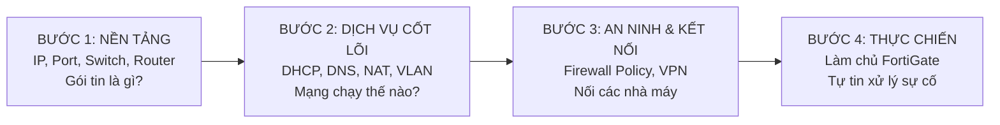
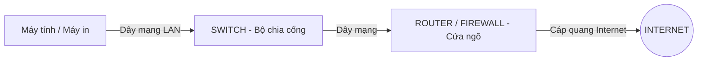

# 🌐 GIÁO TRÌNH NHẬP MÔN MẠNG & HỆ THỐNG (NETWORK & SYSTEM ZERO TO HERO)
> **Dành riêng cho người mới bắt đầu từ con số 0**  
> Học bằng hình tượng đời thực, không dùng thuật ngữ khó hiểu, học đến đâu liên hệ thực tế nhà máy Vinatech đến đó.

---

## 🗺️ LỘ TRÌNH 4 BƯỚC HỌC TỪ CON SỐ 0



---

## 📦 BÀI 1: BẢN CHẤT CỦA MẠNG MÁY TÍNH (VÍ DỤ BƯU ĐIỆN)

Để hiểu mạng, bạn hãy tưởng tượng việc **gửi thư qua bưu điện**:

### 1.1. Gói tin (Network Packet) là gì?
Khi bạn gửi một bức ảnh dung lượng 10MB cho bạn của mình qua Zalo:
* Máy tính **không** gửi nguyên cục 10MB một lần.
* Nó sẽ **cắt nhỏ** bức ảnh đó thành hàng ngàn mẩu nhỏ (mỗi mẩu gọi là một **Packet - Gói tin**).
* Mỗi mẩu nhỏ này được bỏ vào một chiếc "phong bì", dán địa chỉ người gửi, địa chỉ người nhận, đánh số thứ tự từ 1 đến 1000.
* Khi sang đến máy người nhận, máy tính sẽ ghép 1000 mẩu đó lại thành bức ảnh ban đầu.

---

### 1.2. Địa chỉ IP là gì?
**Địa chỉ IP (Internet Protocol)** chính là **Địa chỉ số nhà** của máy tính.
* Giống như nhà bạn ở *Số 10, Đường Lê Lợi*, thì máy tính trong công ty có địa chỉ như: `192.168.0.50`.
* Nếu không có IP, gói tin sẽ không biết gửi về cho ai.
* Địa chỉ IP gồm 4 cụm số ngăn cách bởi dấu chấm (ví dụ: `192.168.0.1`).

#### Phân biệt cực kỳ quan trọng: IP Nội Bộ (Private) vs IP Công Cộng (Public)
| Tiêu chí | IP Nội Bộ (Private IP) | IP Công Cộng (Public IP) |
| :--- | :--- | :--- |
| **Hình tượng** | **Số phòng** trong một tòa nhà chung cư (Phòng 101, 202). | **Địa chỉ cả tòa nhà** trên sổ đỏ (Số 50 đường Nguyễn Trãi). |
| **Phạm vi** | Chỉ có người trong nội bộ nhà máy nhìn thấy nhau. Bên ngoài Internet không gọi trực tiếp vào được. | Cả thế giới Internet nhìn thấy và liên lạc được. |
| **Dải số phổ biến** | `192.168.x.x` hoặc `10.x.x.x` hoặc `172.16.x.x`. | Bất kỳ dải nào do nhà mạng (VNPT, Viettel) cấp. |
| **Thực tế Vinatech** | Máy tính của bạn: `192.168.0.15` (Bắc Ninh). | Tường lửa Bắc Ninh cắm ra Internet: `42.112.60.211`. |

---

### 1.3. Cổng dịch vụ (Port) là gì?
Nếu **Địa chỉ IP là ngôi nhà**, thì **Port là các cánh cửa** bước vào ngôi nhà đó:
* Một máy chủ có thể làm nhiều việc: vừa làm Web, vừa chứa CSDL, vừa điều khiển từ xa.
* Làm sao máy tính biết gói tin gửi đến là để xem Web hay để điều khiển máy tính? ➡️ **Nhờ số Port**.

Các số Port tiêu chuẩn quốc tế cần thuộc lòng:
* **Port 80 (HTTP) / Port 443 (HTTPS):** Cửa dành cho lướt Web.
* **Port 3389 (RDP):** Cửa để điều khiển màn hình máy tính từ xa (Remote Desktop).
* **Port 53 (DNS):** Cửa hỏi đường phân giải tên miền.
* **Port 1433 (SQL Server):** Cửa kết nối cơ sở dữ liệu MES/ERP.

> 💡 **Liên hệ thực tế Vinatech:** Khi bạn thấy cấu hình `42.112.60.211:43381 -> 192.168.112.18:3389`, nghĩa là: Khi ai đó gõ cửa số `43381` ở ngoài Internet, tường lửa sẽ dẫn người đó vào cửa số `3389` (Remote Desktop) của máy tính nội bộ `192.168.112.18`!

---

## 🎛️ BÀI 2: CÁC THIẾT BỊ MẠNG CƠ BẢN (AI LÀM VIỆC GÌ?)

Trong phòng IT hoặc tủ Rack của nhà máy Vinatech, bạn sẽ thấy 3 loại thiết bị chính:



1. **Switch (Bộ chia mạng):**
   * *Nhiệm vụ:* Có hàng chục lỗ cắm dây mạng (24 cổng hoặc 48 cổng). Cắm dây từ máy tính, máy in, máy chấm công vào Switch để chúng nói chuyện được với nhau trong cùng một phòng.
   * *Đặc điểm:* Switch chỉ kết nối nội bộ, không biết cách đưa dữ liệu ra Internet.
2. **Router (Bộ định tuyến):**
   * *Nhiệm vụ:* Giống như "Người dẫn đường" ở ngã tư. Nó biết đường nào đi ra Internet, đường nào đi sang Bắc Giang, đường nào đi sang Hàn Quốc.
3. **Firewall (Tường lửa - FortiGate):**
   * *Nhiệm vụ:* Là một chiếc Router cao cấp được trang bị thêm **"Cảnh sát vũ trang"**. Nó vừa định tuyến gói tin đi đâu, vừa soi từng gói tin xem có an toàn không mới cho qua.

---

## ⚙️ BÀI 3: BỘ BA "NGƯỜI HẦU VÔ HÌNH" CỦA MẠNG MÁY TÍNH

Khi bạn cắm dây mạng vào máy tính và mở trình duyệt gõ `google.com`, có 3 công nghệ âm thầm hoạt động trong chớp mắt:

### 3.1. DHCP (Người phát số nhà tự động)
* Nếu không có DHCP, mỗi lần nhân viên mới mang laptop đến công ty, IT phải ngồi gõ tay từng dòng IP, Subnet Mask, Gateway. Làm sai 1 số là mất mạng hoặc trùng IP.
* **DHCP Server** là máy chủ tự động phát vé IP: Khi laptop vừa cắm dây mạng vào, nó hét lên: *"Có ai cho tôi xin một địa chỉ IP không?"*. DHCP Server của FortiGate sẽ phát cho nó: *"Của bạn đây, dùng IP 192.168.4.15 nhé!"*.
* 💡 **Tại Vinatech:** Tường lửa Bắc Ninh đang đóng vai DHCP Server cấp IP từ `192.168.4.1` đến `192.168.7.254`.

### 3.2. DNS (Danh bạ điện thoại Internet)
* Máy tính chỉ hiểu những con số (ví dụ: `142.250.204.46`), nó không hiểu chữ `google.com`.
* Nhưng con người không thể nhớ nổi hàng triệu dãy số IP.
* **DNS (Domain Name System)** đóng vai trò như cuốn danh bạ: Bạn gõ `google.com`, máy tính hỏi DNS Server ➡️ DNS trả lời: *"IP của nó là 142.250.204.46 đấy"* ➡️ Máy tính kết nối tới IP đó.
* 💡 Khi công ty bị hiện tượng: **Vào Zalo chat được nhưng gõ web không ra**, 99% là máy chủ DNS bị treo!

### 3.3. Default Gateway (Cổng làng / Cửa thoát hiểm)
* Khi máy tính muốn gửi dữ liệu cho một máy khác trong cùng phòng: Nó gửi thẳng.
* Khi máy tính muốn gửi dữ liệu ra ngoài Internet hoặc sang chi nhánh khác: Nó không biết đường đi, nó sẽ ném toàn bộ gói tin cho **Default Gateway** (người gác cổng).
* 💡 **Tại Vinatech Bắc Ninh:** Default Gateway chính là địa chỉ IP của tường lửa: `192.168.0.254`.

---

## 🏢 BÀI 4: HAI KHÁI NIỆM MẠNG DOANH NGHIỆP CẦN BIẾT

### 4.1. NAT (Network Address Translation - Kỹ thuật dùng chung một số điện thoại đại diện)
* Toàn bộ nhà máy Vinatech Bắc Ninh có hơn 1.000 thiết bị. Nhưng nhà mạng VNPT chỉ cấp cho công ty **duy nhất 1 địa chỉ IP Internet** là `42.112.60.211`.
* Làm sao 1.000 máy tính dùng chung được 1 IP này để lướt web mà không bị nhầm lẫn dữ liệu của nhau?
* ➡️ **Kỹ thuật NAT**: Khi máy tính `192.168.4.15` gửi tin ra ngoài, tường lửa FortiGate sẽ dán đè địa chỉ của nó thành `42.112.60.211 kèm số vé (Port)`. Khi dữ liệu từ Google trả về, tường lửa nhìn số vé đó và ném trả lại chính xác cho máy `192.168.4.15`.
* 💡 **Quy tắc:** Trong Firewall Policy, mọi dòng luật cho máy tính ra Internet đều phải **BẬT NAT**.

### 4.2. VPN (Virtual Private Network - Đào hầm xuyên Internet)
* Nhà máy Bắc Ninh và nhà máy Bắc Giang cách nhau hàng chục km. Làm sao để máy in tem ở Bắc Giang có thể kết nối với máy chủ MES ở Bắc Ninh?
* Kéo một sợi dây mạng dài 50km giữa 2 tỉnh là điều bất khả thi và siêu tốn kém.
* ➡️ **Giải pháp:** Cả hai bên đều cắm dây vào mạng Internet bình thường. Sau đó 2 con tường lửa FortiGate tự bắt tay nhau, tạo ra một **"Đường hầm bí mật được mã hóa" (IPsec VPN)** xuyên qua lòng Internet.
* Dữ liệu chạy trong đường hầm này được khóa mã, người ngoài Internet dù có nghe lén cũng chỉ thấy các chuỗi ký tự rác vô nghĩa.
* Nhờ vậy, máy tính ở Bắc Giang chỉ cần gõ IP nội bộ của Bắc Ninh (`192.168.0.254`) là kết nối được ngay như thể ngồi chung phòng!

---

## 🎯 BÀI 5: TƯ DUY XỬ LÝ SỰ CỐ THEO LỚP (TỪ DƯỚI LÊN TRÊN)

Khi một công nhân hoặc sếp báo: **"Mất mạng rồi em ơi!"**, người không biết gì sẽ cuống cuồng bấm lung tung. Người có kiến thức sẽ bình tĩnh kiểm tra theo 4 bước logic:

```
[BƯỚC 4: Ứng dụng]  --> Phần mềm có lỗi không? Trang web có sập không?
       ▲
[BƯỚC 3: Tường lửa] --> Tường lửa có chặn không (Policy)? CPU có 100% không?
       ▲
[BƯỚC 2: Địa chỉ IP] --> Máy có nhận được IP từ DHCP không? Có ping được Gateway không?
       ▲
[BƯỚC 1: Vật lý]     --> Dây mạng có cắm chặt không? Đèn cổng mạng có sáng xanh không?
```

1. **Bước 1 (Kiểm tra dây):** Nhìn đuôi máy tính xem đèn cổng cắm dây mạng có nhấp nháy sáng không. Dây lỏng = không có mạng.
2. **Bước 2 (Kiểm tra IP):** Bấm `Windows + R` ➡️ Gõ `cmd` ➡️ Gõ `ipconfig`.
   * Nếu thấy IP dạng `169.254.x.x`: Máy không xin được IP từ tường lửa ➡️ Kiểm tra DHCP hoặc dây mạng.
   * Nếu có IP đúng (ví dụ `192.168.4.50`): Gõ tiếp lệnh `ping 192.168.0.254`. Nếu thông = Máy tính đã nối tốt tới tường lửa.
3. **Bước 3 (Kiểm tra Internet):** Gõ lệnh `ping 8.8.8.8` (Địa chỉ Google).
   * Nếu thông = Mạng Internet vẫn sống bình thường.
   * Nếu không thông = Tường lửa đang rớt mạng nhà mạng hoặc bị luật chặn.
4. **Bước 4 (Kiểm tra tên miền DNS):** Gõ lệnh `ping google.com`.
   * Nếu ping `8.8.8.8` được mà ping `google.com` báo lỗi = Lỗi máy chủ DNS.

---

## 📝 BÀI TẬP TỰ ĐÁNH GIÁ (GIÚP BẠN KHẮC SÂU KIẾN THỨC)

Hãy tự trả lời 3 câu hỏi sau (Đáp án nằm ngay trong bài học trên):
1. **Câu 1:** Địa chỉ IP `192.168.0.254` là IP Public hay IP Private? Máy tính ở nhà bạn có thể gõ trực tiếp IP này để vào web Bắc Ninh được không?
2. **Câu 2:** Khi bạn gõ `https://42.112.60.211:10443`, số `10443` ở đuôi là cái gì? Nó dẫn bạn đến dịch vụ nào của Vinatech?
3. **Câu 3:** Tại sao khi kết nối giữa Bắc Ninh và Bắc Giang qua VPN thì trong luật Firewall Policy lại phải **Tắt (Disable) NAT**?
