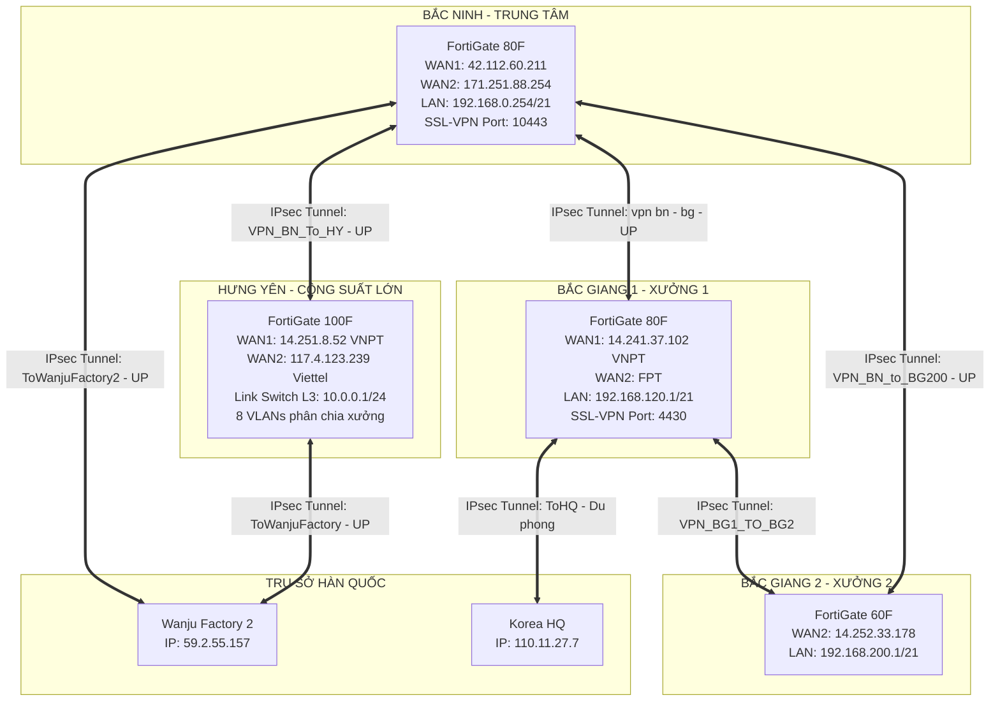

# 🛡️ ĐẠI TỔNG HÀNH DINH TƯỜNG LỬA FORTIGATE — TÀI LIỆU ĐÀO TẠO & CẨM NANG VẬN HÀNH THỰC CHIẾN 4 CƠ SỞ VINATECH
> **Phiên bản Master Audit & Vận hành Chuyên Sâu (2026)**  
> **Áp dụng cho 4 cơ sở:** Bắc Ninh (BN), Hưng Yên (HY), Bắc Giang 1 (BG1), Bắc Giang 2 (BG2).  
> **Tài liệu đào tạo:** Dành cho người bắt đầu từ con số 0 đến khi làm chủ toàn diện hệ thống mạng doanh nghiệp.

---

## 📌 MỤC LỤC CHI TIẾT
1. [Bản đồ mạng & Bảng tra cứu thông số cốt lõi 4 cơ sở](#1-bản-đồ-mạng--bảng-tra-cứu-thông-số-cốt-lõi-4-cơ-sở)
2. [Giải phẫu sâu các cổng mạng vật lý & Dải IP nội bộ](#2-giải-phẫu-sâu-các-cổng-mạng-vật-lý--dải-ip-nội-bộ)
3. [Dịch vụ mở ra ngoài Internet (Virtual IPs - Port Forwarding)](#3-dịch-vụ-mở-ra-ngoài-internet-virtual-ips---port-forwarding)
4. [Hệ thống VPN từ xa (SSL-VPN) & Danh sách tài khoản người dùng](#4-hệ-thống-vpn-từ-xa-ssl-vpn--danh-sách-tài-khoản-người-dùng)
5. [Đường hầm kết nối liên xưởng (IPsec Site-to-Site) & Quốc tế](#5-đường-hầm-kết-nối-liên-xưởng-ipsec-site-to-site--quốc-tế)
6. [Giải mã toàn bộ 67 Firewall Policies trên 4 cơ sở](#6-giải-mã-toàn-bộ-67-firewall-policies-trên-4-cơ-sở)
7. [⚠️ CẢNH BÁO BẢO MẬT: Rà soát tài khoản Administrator bất thường](#7-cảnh-báo-bảo-mật-rà-soát-tài-khoản-administrator-bất-thường)
8. [Cẩm nang thao tác trên giao diện Web (Cầm tay chỉ việc)](#8-cẩm-nang-thao-tác-trên-giao-diện-web-cầm-tay-chỉ-việc)
9. [Kịch bản xử lý sự cố mạng thực tế (Troubleshooting Playbook)](#9-kịch-bản-xử-lý-sự-cố-mạng-thực-tế-troubleshooting-playbook)

---

## 1. BẢN ĐỒ MẠNG & BẢNG TRA CỨU THÔNG SỐ CỐT LÕI 4 CƠ SỞ

Hệ thống mạng Vinatech hoạt động theo mô hình **Hub-and-Spoke (Bắc Ninh làm Trung tâm)**, đồng thời kết nối trực tiếp với 2 nhà máy tại Hàn Quốc (**Wanju Factory** và **HQ Korea**):

### Bảng tra cứu nhanh thông số 4 cơ sở:
| Cơ sở | Model Phần Cứng | IP Quản trị Web / WAN | IP Gateway Mạng Nội Bộ | Dải cấp IP tự động (DHCP) | Cổng SSL-VPN |
| :--- | :--- | :--- | :--- | :--- | :---: |
| **Bắc Ninh** | FortiGate 80F | `https://42.112.60.211` | `192.168.0.254/21` | `192.168.4.1` -> `192.168.7.254` | `10443` |
| **Hưng Yên** | FortiGate 100F | `https://10.0.0.1:4443` *(Hoặc qua WAN `14.251.8.52`)* | `10.0.0.1/24` *(Nối Switch L3)* | Quản lý theo từng VLAN | `10443` |
| **Bắc Giang 1** | FortiGate 80F | `https://14.241.37.102` | `192.168.120.1/21` | `192.168.124.1` -> `192.168.127.254` | `4430` |
| **Bắc Giang 2** | FortiGate 60F | `https://14.252.33.178` | `192.168.200.1/21` | `192.168.203.2` -> `192.168.203.254` | - |

---

## 2. GIẢI PHẪU SÂU CÁC CỔNG MẠNG VẬT LÝ & DẢI IP NỘI BỘ

### 2.1. Bản chất dải mạng Subnet `/21` (`255.255.248.0`):
Thông thường mạng gia đình dùng `/24` (chỉ có 254 địa chỉ IP từ `.1` đến `.254`). Tại Vinatech, do có hàng trăm máy tính, máy in, máy chấm công, robot, MES, máy kiểm tra chất lượng (Cell Test / Aging), hệ thống mạng sử dụng Subnet `/21`:
* **Bắc Ninh:** Bao phủ toàn bộ dải từ `192.168.0.1` đến `192.168.7.254` (**2.046 IP khả dụng**).
  * `192.168.0.1` - `192.168.3.254`: Để dành đặt IP Tĩnh cho Server MES, Máy chủ CSDL, Core Switch, Máy in, Camera.
  * `192.168.4.1` - `192.168.7.254`: Cấp tự động cho máy tính nhân viên văn phòng & công nhân.
* **Bắc Giang 1:** Bao phủ dải `192.168.120.1` đến `192.168.127.254` (DHCP cấp `.124.1` -> `.127.254`).
* **Bắc Giang 2:** Bao phủ dải `192.168.200.1` đến `192.168.207.254` (DHCP cấp `.203.2` -> `.203.254`).
* **Hưng Yên (Kiến trúc phân chia VLAN):**
  * Không dùng 1 dải phẳng mà dùng Core Switch L3 chia tách:
    * `192.168.150.0/24` (VLAN 150)
    * `192.168.155.0/24` (VLAN 155)
    * `192.168.160.0/24` (VLAN 160)
    * `192.168.184.0/21` (VLAN 184 - Dành riêng cho chuyền sản xuất & Camera)
    * `192.168.220.0/24`, `192.168.228.0/24`, `192.168.234.0/24`.

---

## 3. DỊCH VỤ MỞ RA NGOÀI INTERNET (VIRTUAL IPS - PORT FORWARDING)

**Virtual IP (VIP)** là tính năng cho phép người từ ngoài Internet truy cập vào các máy chủ nội bộ bên trong nhà máy thông qua IP công cộng.

### Bảng tổng hợp các dịch vụ đang mở cổng thực tế:
| Cơ sở | Tên VIP Object | IP & Cổng Ngoài (Internet) | IP & Cổng Nội Bộ (Server) | Ý nghĩa thực tế |
| :--- | :--- | :--- | :--- | :--- |
| **Bắc Ninh** | `42.112.60.211_43381` | `42.112.60.211:43381` | `192.168.112.18:3389` | Điều khiển từ xa (RDP) máy chủ `112.18`. |
| **Bắc Ninh** | `42.112.60.211_43382` | `42.112.60.211:43382` | `192.168.112.19:3389` | Điều khiển từ xa (RDP) máy chủ `112.19`. |
| **Bắc Ninh** | `42.112.60.211_6005` | `42.112.60.211:6005` | `192.168.112.254:6005` | Dịch vụ truyền thông hệ thống sản xuất. |
| **Bắc Ninh** | `42.112.60.211_18601` | `42.112.60.211:18601` | `192.168.112.254:8601` | **Cổng MES / Server ứng dụng cốt lõi**. |
| **Hưng Yên** | `NVR-01` | `14.251.8.52:8001` | `192.168.184.10:8000` | Đầu ghi Camera giám sát nhà máy xưởng 1. |
| **Hưng Yên** | `NVR-02` | `14.251.8.52:8002` | `192.168.184.11:8000` | Đầu ghi Camera giám sát nhà máy xưởng 2. |
| **Bắc Giang 1**| `remote_192.168.1.234`| `14.241.37.102:8860` | `192.168.6.6:8860` | Dịch vụ kết nối dữ liệu từ xa. |

---

## 4. HỆ THỐNG VPN TỪ XA (SSL-VPN) & DANH SÁCH TÀI KHOẢN NGƯỜI DÙNG

Khi lãnh đạo, kỹ sư hoặc chuyên gia Hàn Quốc ở nhà hay đi công tác, họ dùng phần mềm **FortiClient** để kết nối vào mạng công ty qua cổng SSL-VPN:

### Danh sách tài khoản người dùng thực tế:
1. **Tại Bắc Ninh (`https://42.112.60.211:10443`):**
   * Dải IP cấp cho người làm từ xa: `172.16.x.x` (`VPN_POOL_172`).
   * Các User được cấp quyền: `yjyu`, `trieu`, `duoc`, `hai`, `em`, `habibkaratas`, `uservn`, `guest`.
2. **Tại Hưng Yên (`https://14.251.8.52:10443`):**
   * Các User được cấp quyền: `hainv`, `tinhnv`, `guest`.
3. **Tại Bắc Giang 1 (`https://14.241.37.102:4430`):**
   * Các User được cấp quyền: `techData`, `habibkaratas`, `fortiuser`, `guest`.

---

## 5. ĐƯỜNG HẦM KẾT NỐI LIÊN XƯỞNG (IPSEC SITE-TO-SITE) & QUỐC TẾ

Tất cả các cơ sở đều được mã hóa bằng giao thức **IPsec VPN (IKEv1/IKEv2)**, sử dụng thuật toán mã hóa 3DES/AES và xác thực SHA:

| Tên Đường Hầm | Điểm Đầu | Điểm Cuối | IP Gateway Đối Tác | Cổng WAN Đi Ra | Trạng Thái |
| :--- | :--- | :--- | :--- | :---: | :---: |
| `ToWanjuFactory2` | Bắc Ninh | Wanju Factory (HQ Hàn Quốc) | `59.2.55.157` | `wan2` | 🟢 **UP** |
| `VPN_BN_To_HY` | Bắc Ninh | Hưng Yên | `14.251.8.52` | `wan2` | 🟢 **UP** |
| `vpn bn - bg` | Bắc Ninh | Bắc Giang 1 | `14.241.37.102` | `wan1` | 🟢 **UP** |
| `VPN_BN_to_BG200` | Bắc Ninh | Bắc Giang 2 | `14.252.33.178` | `wan1` | 🟢 **UP** |
| `ToWanjuFactory` | Hưng Yên | Wanju Factory (HQ Hàn Quốc) | `59.2.55.157` | `wan1` | 🟢 **UP** |
| `VPN_HY_To_BN` | Hưng Yên | Bắc Ninh | `171.251.88.254` | `wan1` | 🟢 **UP** |
| `VPN_BG200_to_BN` | Bắc Giang 2 | Bắc Ninh | `42.112.60.211` | `wan2` | 🟢 **UP** |
| `VPN_HaNam` | Bắc Ninh | Hà Nam | `118.70.181.215` | `wan1` | 🟡 **IDLE** |
| `ToHQ` | Bắc Giang 1 | Trụ sở Korea HQ | `110.11.27.7` | `wan1` | 🟡 **IDLE** |
| `VPN_BG1_TO_BG2` | Bắc Giang 1 | Bắc Giang 2 | `14.252.33.178` | `wan1` | 🟡 **IDLE** |

---

## 6. GIẢI MÃ TOÀN BỘ 67 FIREWALL POLICIES TRÊN 4 CƠ SỞ

### 6.1. Quy tắc cốt lõi của Firewall Policy
* **Thứ tự xét duyệt:** Chạy từ trên xuống dưới (**Top-Down**). Gặp Rule đầu tiên thỏa mãn là thực thi ngay, bỏ qua các rule sau.
* **Quy tắc ngầm định cuối bảng (Implicit Deny):** Nếu một gói tin không trùng khớp với bất kỳ dòng luật nào trong bảng, FortiGate sẽ **TỰ ĐỘNG CHẶN ĐỨNG (DROP/DENY)**.

### 6.2. Phân loại các nhóm Rule thực tế tại Vinatech:
1. **Nhóm Rule Ra Internet (NAT = Enable):**
   * `[Internet]` (Bắc Ninh), `[VLANxx-to-INTERNET]` (Hưng Yên), `[Internet]` (Bắc Giang 1), `[Internal]` (Bắc Giang 2).
   * **Đặc điểm:** Chiều đi từ `internal` ➡️ `SD_WAN` (hoặc `wan1`). Bắt buộc bật NAT để che giấu IP nội bộ và dùng IP công cộng của nhà mạng lướt web.
2. **Nhóm Rule Thông Mạng Liên Xưởng (NAT = Disable):**
   * Các rule tên `[vnp BN to BG]`, `[VPN_BN_TO_HY_ALL]`, `[FromWanjuFactory2]`.
   * **Đặc điểm:** Tắt NAT (Disable) để giữ nguyên vẹn địa chỉ IP gốc của máy tính hai đầu, giúp máy in, máy quét barcode và phần mềm MES nhận diện chính xác nguồn gửi.
3. **Nhóm Rule Đặc thù Sản xuất & Giám sát:**
   * Rule #23 tại Bắc Ninh `[SL7AutoLineApi]`: Luồng dữ liệu cho API của chuyền sản xuất tự động SL7.
   * Rule #17 tại Hưng Yên `[ALL-to-NVR]`: Mở luồng xem camera giám sát từ xa cho ban giám đốc.
   * Rule #18 tại Bắc Ninh `[Auto-Allow-RDP]`: Mở luồng điều khiển máy tính từ xa qua Remote Desktop.

---

## 7. ⚠️ CẢNH BÁO BẢO MẬT: RÀ SOÁT TÀI KHOẢN ADMINISTRATOR BẤT THƯỜNG

> 🚨 **PHÁT HIỆN QUAN TRỌNG TỪ DỮ LIỆU AUDIT:**  
> Tại tường lửa Bắc Ninh và Bắc Giang 1, hệ thống ghi nhận rất nhiều tài khoản Admin cấp cao (**super_admin**) với các tiền tố lạ. Đây là vấn đề bộ phận IT cần kiểm tra kỹ:

* **Tại Bắc Ninh:**
  * `admin`, `forti`, `fortics`, `fortinet-ajpifn`, `fortinet-jywvz`, `fortiroot1`, `fw_health_chk`, `support_fortinet`, `sysmon_svc`, `system`, `systems`.
* **Tại Bắc Giang 1:**
  * `admin`, `AdminLocalTechF0rti`, `Technical_support`, `djohn`, `fgtsecure`, `forti-autosync`, `fortics`, `fortinet-abgngz`, `fortinet-djlxx`, `fortinet-kvtsz`, `fortiroot1`, `ipsecsvc`, `systems`.

🔍 **Khuyến nghị an ninh:**  
Trong lịch sử các phiên bản FortiOS cũ, một số mã độc hoặc lỗ hổng (như CVE-2022-40684) từng tự động sinh ra các tài khoản dạng `fortinet-xxxx` hoặc `fortiroot1` để duy trì quyền truy cập trái phép. Kỹ sư IT nên kiểm tra với đơn vị tích hợp hệ thống xem các tài khoản này do bên nào tạo ra, nếu không dùng cần vô hiệu hóa hoặc xóa bỏ ngay.

---

## 8. CẨM NANG THAO TÁC TRÊN GIAO DIỆN WEB (CẦM TAY CHỈ VIỆC)

### 8.1. Cách kiểm tra trạng thái sức khỏe phần cứng
1. Bấm menu **Dashboard** ➡️ Chọn tab **Status**.
2. Nhìn vào widget **System Information**:
   * Xem **Host Name** và **Uptime** (số ngày đã chạy).
3. Nhìn widget **CPU** và **Memory**:
   * Nếu mức sử dụng < 70%: Hệ thống khỏe mạnh.
   * Nếu vọt lên > 90%: Đang có bão mạng hoặc máy trong nội bộ bị nhiễm mã độc quét cổng.

### 8.2. Cách kiểm tra xem mạng Internet có bị rớt không
1. Bấm menu **Network** ➡️ Chọn **Interfaces**.
2. Nhìn vào cổng `wan1` và `wan2`:
   * Chấm tròn **Xanh lá cây (🟢 Link Up)**: Dây mạng cắm tốt, cổng có tín hiệu.
   * Chấm tròn **Xám hoặc Đỏ (🔴 Link Down)**: Mất tín hiệu vật lý (rút dây mạng, modem nhà mạng bị tắt nguồn hoặc đứt cáp quang).

### 8.3. Cách kiểm tra đường hầm VPN có thông không
1. Bấm menu **VPN** ➡️ Chọn **IPsec Tunnels**.
2. Nhìn vào cột **Status**:
   * Nếu hiện **Xanh lá cây (UP)**: Kết nối thông suốt.
   * Nếu hiện **Màu đỏ (DOWN)**: Đang mất kết nối.
3. *Cách khắc phục nhanh:* Chuột phải vào tên đường hầm ➡️ Chọn **Bring Up** để FortiGate gửi gói tin bắt tay lại với đầu bên kia.

### 8.4. Cách tạo bản Sao Lưu (Backup) cấu hình an toàn
1. Nhìn lên góc trên cùng bên phải màn hình ➡️ Click chuột vào tên tài khoản **`admin`**.
2. Chọn dòng **Configuration** ➡️ Chọn **Backup**.
3. Tại ô *Backup to*: Chọn **Local PC** (Lưu vào máy tính của bạn).
4. Bấm nút **OK**. Trình duyệt sẽ tải về một file có đuôi `.conf`. Cất file này vào thư mục an toàn!

---

## 9. KỊCH BẢN XỬ LÝ SỰ CỐ MẠNG THỰC TẾ (TROUBLESHOOTING PLAYBOOK)

### 🔴 Sự cố 1: Dây chuyền sản xuất mất kết nối máy chủ MES
* **Triệu chứng:** Công nhân không quét được tem mã vạch, máy in không in được nhãn.
* **Các bước điều tra:**
  1. Kiểm tra máy tính sản xuất xem có nhận được IP không (`ipconfig`). Nếu IP là `169.254.x.x` nghĩa là DHCP Server trên tường lửa bị ngắt hoặc Switch nhánh bị mất nguồn.
  2. Vào FortiGate ➡️ **Log & Report** ➡️ **Forward Traffic**.
  3. Gõ IP của máy tính sản xuất vào ô tìm kiếm. Xem các gói tin gửi đến IP máy chủ MES có bị gán nhãn `Action: Deny` hay không.

### 🔴 Sự cố 2: Toàn bộ nhà máy kêu mạng bị chậm như rùa
* **Các bước điều tra:**
  1. Vào **Dashboard** ➡️ Xem biểu đồ **Bandwidth**.
  2. Vào **Log & Report** ➡️ **Forward Traffic**.
  3. Bấm vào tiêu đề cột **Bytes (Sent/Received)** để sắp xếp từ lớn đến bé. Bạn sẽ nhìn thấy ngay địa chỉ IP của máy tính đang tải file hoặc xem video chiếm hết băng thông của công ty.
