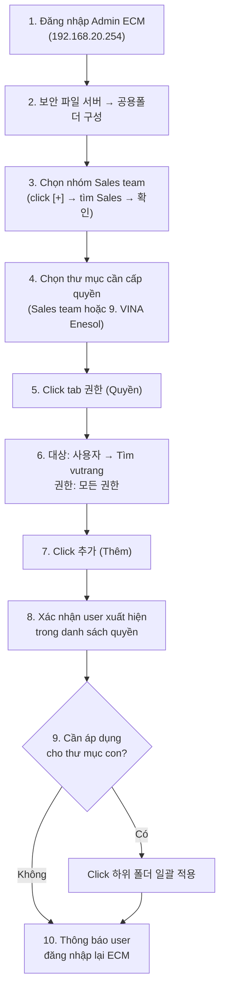

# Hướng Dẫn Phân Quyền Truy Cập Thư Mục Sale cho User trên ECM

## 📋 Tóm tắt yêu cầu

Nhân viên **Vũ Thị Hà Trang** (Vina Enesol_CS team) yêu cầu được cấp quyền truy cập vào ổ dữ liệu chung của **Sale** trên hệ thống ECM để thao tác và lấy dữ liệu phục vụ công việc.

> [!NOTE]
> Hướng dẫn này được tạo dựa trên nghiên cứu thực tế trên hệ thống ECM (192.168.20.254). **Không có thay đổi nào được thực hiện** - chỉ xem và chụp ảnh màn hình.

---

## 🔍 Thông tin đã xác minh trên hệ thống

### Thông tin User cần cấp quyền

| Thông tin | Chi tiết |
|---|---|
| **Tên** | VŨ THỊ HÀ TRANG |
| **ID ECM** | `vutrang@vina.co.kr` |
| **Email** | `vutrang@vina.co.kr` |
| **Tổ chức** | 비나텍 (Vinatec) |
| **Nhóm hiện tại** | Admin-CS |
| **Loại** | 내부 (Nội bộ) |
| **Trạng thái** | 사용 (Đang sử dụng) |
| **Đăng ký bởi** | 관리자가 등록 (Admin đăng ký) |
| **Đăng nhập cuối** | 2026-03-30 10:21:25 |
| **Dung lượng sử dụng** | 5.09 GB / 100 GB |
| **Thời hạn sử dụng** | 2024-10-24 ~ 9999-12-31 (Vô thời hạn) |


### Thông tin User sở hữu thư mục (vvsales28)

| Thông tin | Chi tiết |
|---|---|
| **Tên** | NGUYỄN TRÀ LINH |
| **ID ECM** | `vvsales28@vina.co.kr` |
| **Nhóm** | Sales team |
| **Trạng thái** | 사용 (Đang sử dụng) |
| **Vai trò** | C (겸직자 - Kiêm nhiệm) |
| **Đăng ký bởi** | 시스템 등록 (Hệ thống đăng ký) |


---

## 🗂️ Cấu trúc thư mục trên ECM

### Đường dẫn thư mục cần cấp quyền
- **Loại**: 그룹 공유 (Group Sharing)
- **Đường dẫn**: `/그룹 공유/Sales team/`

### Cây thư mục Sales team:

```
Sales team/
├── 0. Processes and Training
├── 00. Plan and Strategies
├── 1. CS
├── 2. SALES            ← Thư mục dữ liệu Sale chính
├── 3. MARKETING
├── 4. AUDIT
├── 5. Guest visit
├── 6. Report
├── 7. Photos
├── 8. Guest reception invoice & Bill
├── 9. VINA Enesol       ← Thư mục Vina Enesol (liên quan yêu cầu email)
├── 10. Datasheet
└── 11. Key words
```

### Trạng thái quyền hiện tại
- **Tab 권한 (Permission)**: "데이터가 없습니다" (Không có dữ liệu) → Chưa có quyền riêng cho ai
- **Tab 공유 (Share)**: "이 폴더를 공유하지 않습니다" (Thư mục không được chia sẻ)

---

## 📖 Tham khảo: Cách quyền hiển thị khi đã được cấu hình

Để hiểu rõ hơn cách hệ thống hoạt động, tôi đã kiểm tra thư mục **비나텍 사규(Regulation)** - một thư mục đã có quyền được thiết lập sẵn:


**Quan sát quan trọng:**
- Quyền được cấp theo **Nhóm** (그룹), mỗi nhóm có mã code (VD: `ESH (1000_K1020)`, `품질부문 (1000_K1300)`, etc.)
- Mỗi nhóm được cấp **모든 권한** (Toàn quyền) với dropdown có thể chỉnh sửa
- Có thể cấp quyền cho **nhiều đối tượng** cùng lúc trên một thư mục
- Tab **공유** (Share) trên thư mục này vẫn ở trạng thái "Không chia sẻ" → chứng tỏ **quyền được quản lý chủ yếu qua tab 권한, không phải tab 공유**

---

## 📝 Hướng Dẫn Từng Bước Phân Quyền

### Bước 1: Đăng nhập Admin ECM

1. Mở trình duyệt, truy cập: `http://192.168.20.254/admin/main.php`
2. Đăng nhập:
   - **Account**: `VVEAADMIN`
   - **Password**: `VINA!@#TECH2024`

---

### Bước 2: Vào trang Cấu hình Thư mục Công cộng

1. Click menu **보안 파일 서버** (Máy chủ tệp tin bảo mật) ở thanh menu trên
2. Click **공용폴더 구성** (Cấu hình thư mục công cộng) ở sidebar trái


---

### Bước 3: Chọn nhóm "Sales team"

1. Dropdown bên trái cây thư mục: giữ nguyên **조직 및 그룹** (Tổ chức & Nhóm)
2. Click nút **[+]** bên cạnh dropdown → mở popup **그룹 검색** (Tìm kiếm nhóm)


3. Trong popup, có 2 tab:
   - **조직도** (Sơ đồ tổ chức): hiển thị cây tổ chức (비나텍 → 한국 법인 → Vietnam Company)
   - **검색** (Tìm kiếm): tìm theo tên
4. Gõ **Sales** vào ô tìm kiếm → click **검색**
5. Tick chọn **Sales team** từ kết quả
6. Click **확인** (Xác nhận) → cây thư mục Sales team sẽ hiển thị bên trái

---

### Bước 4: Chọn thư mục và mở tab Quyền

> [!IMPORTANT]
> Bạn có **2 lựa chọn** tùy vào phạm vi cần cấp:
> - Click vào **Sales team** (gốc) → cấp quyền cho toàn bộ
> - Click vào **9. VINA Enesol** (hoặc thư mục con cụ thể) → cấp quyền chỉ cho thư mục đó

1. Click chọn thư mục mong muốn trong cây thư mục bên trái
2. Panel bên phải sẽ hiển thị 3 tab: **기본** (Cơ bản) | **권한** (Quyền) | **공유** (Chia sẻ)
3. Click tab **권한** (Quyền)

---

### Bước 5: Thêm quyền cho user VŨ THỊ HÀ TRANG

Giao diện tab **권한** có 2 phần:

**Phần trên - Form thêm quyền mới:**

| Thành phần | Mô tả | Giá trị cần chọn |
|---|---|---|
| **대상** (Đối tượng) | Dropdown chọn loại | Chọn **사용자** (Người dùng) |
| Ô tìm kiếm bên cạnh | Tìm user cụ thể | Tìm và chọn **vutrang** (VŨ THỊ HÀ TRANG) |
| **권한** (Quyền hạn) | Dropdown chọn mức quyền | Chọn **모든 권한** (Toàn quyền) hoặc mức phù hợp |
| **추가** (Thêm) | Nút cam | Click để thêm quyền |

**Phần dưới - Danh sách quyền hiện tại:**
- Hiện tại hiển thị "데이터가 없습니다" (Không có dữ liệu)
- Sau khi thêm, user sẽ xuất hiện ở đây

**Nút cuối trang:**
- **하위 폴더 일괄 적용** (Áp dụng đồng loạt cho thư mục con) - dùng để kế thừa quyền xuống tất cả subfolder

#### Chi tiết thao tác:

1. Tại dropdown **대상** → chọn **사용자** (Người dùng)
   - Khi chọn 사용자, popup **사용자 검색** (Tìm kiếm người dùng) sẽ mở ra
   
2. Trong popup tìm kiếm:
   - Gõ **vutrang** vào ô tìm kiếm
   - Click **검색** (Tìm kiếm)
   - Tick chọn **VŨ THỊ HÀ TRANG** (`vutrang@vina.co.kr`)
   - Click **확인** (Xác nhận)
   
3. Tại dropdown **권한** → chọn mức quyền:
   - **모든 권한** = Toàn quyền (đọc, ghi, xóa, tạo thư mục con)
   - Hoặc mức thấp hơn nếu chỉ cần đọc

4. Click nút **추가** (Thêm) màu cam

5. Kiểm tra: user `VŨ THỊ HÀ TRANG` phải xuất hiện trong bảng "대상 | 권한" phía dưới

6. _(Tùy chọn)_ Click **하위 폴더 일괄 적용** nếu muốn quyền tự động áp dụng cho tất cả thư mục con

> [!TIP]
> Nếu khi click **추가** mà xuất hiện dialog confirm → click **확인** / **OK** để xác nhận.

---

### Bước 6: (Nếu cần) Cấu hình Tab Chia sẻ

> [!NOTE]
> Dựa trên nghiên cứu, thư mục **비나텍 사규(Regulation)** có quyền hoạt động bình thường mà **tab 공유 vẫn ở trạng thái "Không chia sẻ"**. Điều này cho thấy **việc dùng tab 권한 là đủ** và không bắt buộc phải bật chia sẻ.

Nếu vẫn muốn bật chia sẻ:
1. Click tab **공유** (Chia sẻ) trên panel bên phải
2. Chuyển radio button sang **"이 폴더를 공유합니다"** (Chia sẻ thư mục này)
3. Thêm đối tượng chia sẻ tương tự tab 권한
4. Click lưu


---

## 🔄 Quy trình tóm tắt



---

## ⚠️ Lưu ý quan trọng

> [!WARNING]
> **License vượt quá giới hạn**: Hệ thống hiện có **382 người dùng** nhưng chỉ có **350 licenses**.
> - 엠파워 라이센스: 382/350 ❌
> - M드라이브 라이센스: 382/350 ❌
> 
> Tuy nhiên, user `vutrang@vina.co.kr` **đã tồn tại** trên hệ thống nên chỉ cần thêm quyền thư mục, **KHÔNG cần tạo tài khoản mới**.

> [!TIP]
> **Các lưu ý thực tế:**
> - Đường dẫn email: `vvsales28@vina.co.kr's ECM (D:) > <3> Group Sharing > 비나에너솔` tương ứng với `/그룹 공유/Sales team/9. VINA Enesol` trên admin
> - Email ECM của Trang ghi là `vecs@vina.co.kr` nhưng **tài khoản ECM thực tế là `vutrang@vina.co.kr`**
> - Sau khi phân quyền, yêu cầu user **đăng xuất và đăng nhập lại** ECM client
> - Có thể cấp quyền theo **nhóm** (그룹) thay vì **user** (사용자) - tham khảo cách thư mục Regulation được cấu hình

---

## 📊 Bảng tổng hợp giao diện hệ thống ECM

### Menu chính (Top bar)

| Menu | Tiếng Việt | Chức năng |
|---|---|---|
| 기본관리 | Quản lý cơ bản | Quản lý tổ chức, nhóm, user |
| 보안 파일 서버 | Máy chủ file bảo mật | Quản lý thư mục, quyền, chia sẻ |
| PC 저장 제어 | Kiểm soát lưu trữ PC | Chính sách lưu trữ máy trạm |

### Sidebar "보안 파일 서버"

| Menu | Tiếng Việt | Chức năng |
|---|---|---|
| 공용폴더 구성 | Cấu hình thư mục công cộng | **← Dùng để phân quyền** |
| 부서 기본폴더 구성 | Cấu hình thư mục mặc định bộ phận | Tạo cấu trúc thư mục hàng loạt bằng CSV |
| 폴더 비밀번호 관리 | Quản lý mật khẩu thư mục | Đặt password cho thư mục |
| 폴더 조회 | Tra cứu thư mục | Tìm kiếm thư mục trên hệ thống |
| 파일 조회 | Tra cứu tập tin | Tìm kiếm file trên hệ thống |
| 잠금 파일 해제 | Mở khóa file | Gỡ lock file đang bị khóa |
| 삭제 파일 복구 | Phục hồi file đã xóa | Khôi phục file từ thùng rác |

### Dropdown loại thư mục (trong trang 공용폴더 구성)

| Giá trị | Tiếng Việt | Mô tả |
|---|---|---|
| 조직 및 그룹 | Tổ chức & Nhóm | Thư mục theo cấu trúc tổ chức/nhóm |
| 전체 공유 | Chia sẻ toàn bộ | Thư mục chia sẻ cho tất cả |
| 그룹 공유 | Chia sẻ nhóm | Thư mục chia sẻ theo nhóm |
| 프로젝트 | Dự án | Thư mục theo dự án |

### Tab trong panel chi tiết thư mục

| Tab | Tiếng Việt | Chức năng |
|---|---|---|
| 기본 | Cơ bản | Thông tin: Người tạo (생성자), Tên thư mục (폴더 이름), Thứ tự (폴더 시퀀스) |
| 권한 | Quyền | **Phân quyền truy cập** - gán đối tượng (tổ chức/nhóm/user) với mức quyền |
| 공유 | Chia sẻ | Bật/tắt chia sẻ thư mục cho người khác |

### Dropdown "대상" (Đối tượng) trong tab 권한

| Giá trị | Tiếng Việt | Mô tả |
|---|---|---|
| 선택하세요. | Hãy chọn... | Giá trị mặc định |
| 조직 | Tổ chức | Cấp quyền cho toàn bộ tổ chức |
| 그룹 | Nhóm | Cấp quyền cho nhóm cụ thể |
| 사용자 | Người dùng | Cấp quyền cho user cá nhân |

### Dropdown "권한" (Quyền hạn)

| Giá trị | Tiếng Việt | Mô tả |
|---|---|---|
| 모든 권한 | Toàn quyền | Đọc, ghi, xóa, tạo thư mục con |

---

## 📧 Reply mẫu email

Sau khi hoàn thành phân quyền:

> Chào Trang,
> 
> Anh/chị đã cấp quyền truy cập thư mục Sale trên ECM cho tài khoản `vutrang@vina.co.kr` của em.
> 
> Em vui lòng đăng xuất và đăng nhập lại ECM client trên máy tính để quyền mới có hiệu lực. Sau đó kiểm tra trong phần **Group Sharing → Sales team** để xác nhận đã truy cập được.
> 
> Nếu gặp vấn đề gì, em liên hệ lại nhé.
> 
> Trân trọng.

---

## 📹 Video ghi lại quá trình nghiên cứu

Các video dưới đây ghi lại từng bước tôi đã thực hiện khi nghiên cứu hệ thống:

````carousel
**1. Đăng nhập và khám phá tổng quan**

<!-- slide -->
**2. Khám phá cấu trúc thư mục và quyền**

<!-- slide -->
**3. Tìm folder Enesol và kiểm tra quyền**

<!-- slide -->
**4. Nghiên cứu chi tiết user và folder có quyền sẵn**

````
