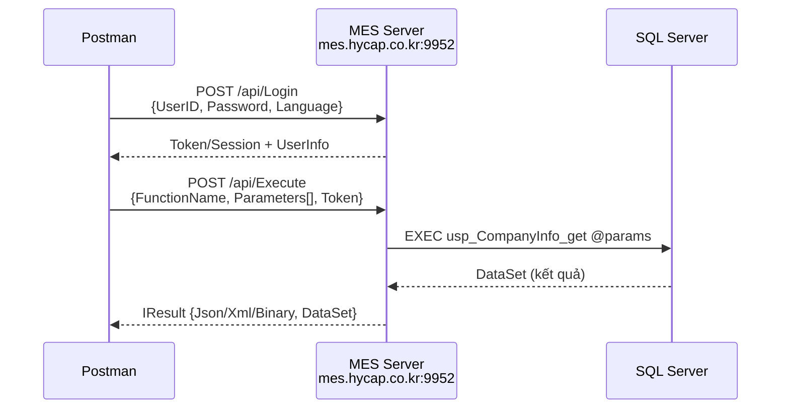

# 🔧 Hướng dẫn: Truy vấn NAIS MES API qua Postman

---

## 1. Kiến trúc API (đã decompile xác nhận)



> [!IMPORTANT]
> Giao thức SmartFramework **không phải REST API thông thường**. Nó sử dụng **binary serialization** (.NET DataSet) qua HTTP. Postman có thể **không hiển thị** response nếu server trả binary.

---

## 2. API Endpoints (từ decompile)

### 2.1 Login — `POST /api/Login`

**Body (JSON):**
```json
{
    "UserID": "92603003",
    "Password": "your_password",
    "Language": 2,
    "DeveloperVersion": ""
}
```

| Field | Type | Giải thích |
|---|---|---|
| `UserID` | string | Mã nhân viên (VD: `92603003` từ App.config) |
| `Password` | string | Mật khẩu |
| `Language` | int (enum) | `0`=Korean, `1`=English, `2`=Vietnamese(?), `3`=Chinese |
| `DeveloperVersion` | string | Để trống `""` cho client thường |

**Response** → `IResult`:
```json
{
    "HasError": false,
    "ErrorMessage": "",
    "Json": "...",
    "DataSetFormat": 0
}
```

### 2.2 Execute (gọi Stored Procedure) — `POST /api/Execute`

**Body (JSON):**
```json
{
    "Name": "usp_CompanyInfo_get",
    "Source": 0,
    "Target": "SmartFramework",
    "Language": 2,
    "UserID": "92603003",
    "DataSetFormat": 0,
    "UseTransaction": false,
    "UseCLRWithXML": false,
    "Timeout": 0,
    "Parameters": [],
    "ReturnTables": [
        { "Index": 0, "Name": "usp_CompanyInfo_get" }
    ]
}
```

**Với SP có tham số:**
```json
{
    "Name": "usp_ProductionOrderInfo_get",
    "Source": 0,
    "Target": "SmartFramework",
    "Language": 2,
    "UserID": "92603003",
    "Parameters": [
        { "Name": "StartDate", "Value": "2026-01-01", "DataType": 0 },
        { "Name": "EndDate", "Value": "2026-03-09", "DataType": 0 }
    ],
    "ReturnTables": [
        { "Index": 0, "Name": "usp_ProductionOrderInfo_get" }
    ]
}
```

### 2.3 GetScreen — `POST /api/Screen`
```json
{
    "screenName": "CompanyInfo",
    "developerVersion": "",
    "version": 0
}
```

---

## 3. Vấn đề: Server có thể dùng Binary, không phải JSON

Từ decompile, `IResult` hỗ trợ **3 format**: `Binary`, `Xml`, `Json`.
- Nếu server dùng **Binary** (mặc định) → Postman **không đọc được** response
- Cần thêm header: `Accept: application/json` hoặc `Content-Type: application/json`

**Headers cho Postman:**
```
Content-Type: application/json
Accept: application/json
```

---

## 4. ⭐ Cách chắc chắn nhất: Fiddler (bắt traffic thực tế)

> [!TIP]
> Đây là cách **nhanh và chính xác nhất** vì bạn sẽ thấy format request/response THỰC TẾ.

### Bước 1: Tải Fiddler
- Tải [Fiddler Classic](https://www.telerik.com/fiddler/fiddler-classic) (miễn phí)
- Cài và mở Fiddler

### Bước 2: Chạy SmartFramework
- Mở `Awoo.SmartFramework.WinForm.Main.exe`
- Đăng nhập bình thường

### Bước 3: Xem traffic trong Fiddler
- Fiddler sẽ bắt **tất cả** HTTP requests
- Filter theo host: `mes.hycap.co.kr`
- Bạn sẽ thấy:
  - **URL** chính xác (VD: `/api/Login`, `/api/Execute`)
  - **Request body** (format JSON hay Binary)
  - **Headers** (có Token, Cookie hay không)
  - **Response body** (dữ liệu DataSet)

### Bước 4: Copy vào Postman
- Click chuột phải request trong Fiddler → **Copy** → **cURL**
- Import vào Postman → Done!

---

## 5. Danh sách SP phổ biến để thử

| SP | Mô tả | Có tham số? |
|---|---|---|
| `usp_CompanyInfo_get` | Danh sách công ty | Không |
| `usp_MaterialMaster_get` | DS vật tư | Có thể có filter |
| `usp_ProductionOrderInfo_get` | DS lệnh sản xuất | StartDate, EndDate |
| `usp_UserInfo_get` | DS người dùng | Không |
| `usp_GetSystemPlant` | Thông tin nhà máy | Không |
| `usp_WorkCenterInfo_get` | DS trung tâm SX | Không |
| `usp_RouteInfo_get` | DS routing | Không |

---

## 6. Tóm tắt: Nên dùng cách nào?

| Cách | Ưu điểm | Nhược điểm | Khuyến nghị |
|---|---|---|---|
| **Fiddler** | Chính xác 100%, thấy format thực tế | Cần đăng nhập app | ⭐ **Nên dùng trước** |
| **Postman thử trực tiếp** | Nhanh, không cần cài thêm | Có thể sai format body | Dùng thử sau khi có format từ Fiddler |
| **ILSpy decompile** | Đọc code chi tiết | Cần cài ILSpy | Dùng khi cần hiểu logic sâu |
| **SSMS truy cập SQL** | Query SP trực tiếp | Cần connection string | Tốt nhất nếu có quyền DB |

> [!NOTE]
> Kết quả trên dựa vào **.NET Reflection** (decompile cấp class/method). Format JSON body ở trên là **suy luận** từ tên property, chưa 100% chắc chắn thứ tự/cấu trúc. **Fiddler sẽ cho format chính xác**.
