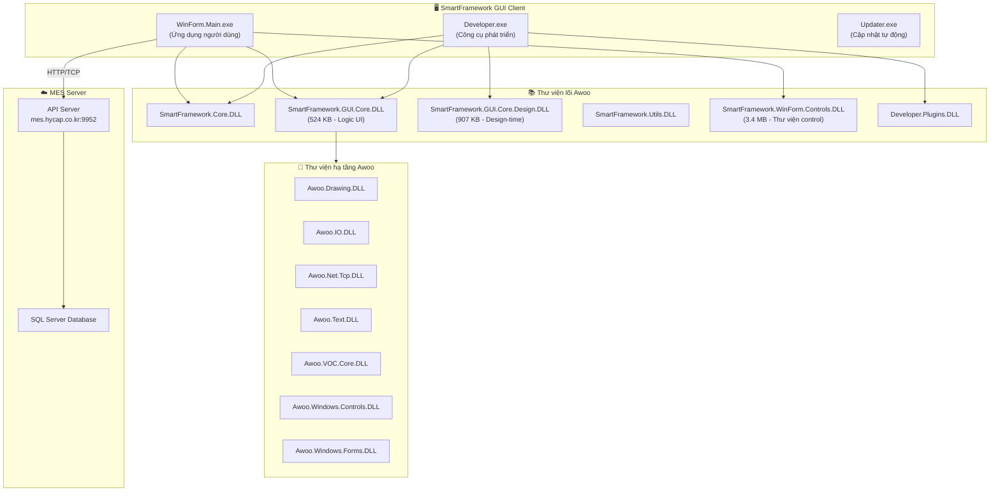
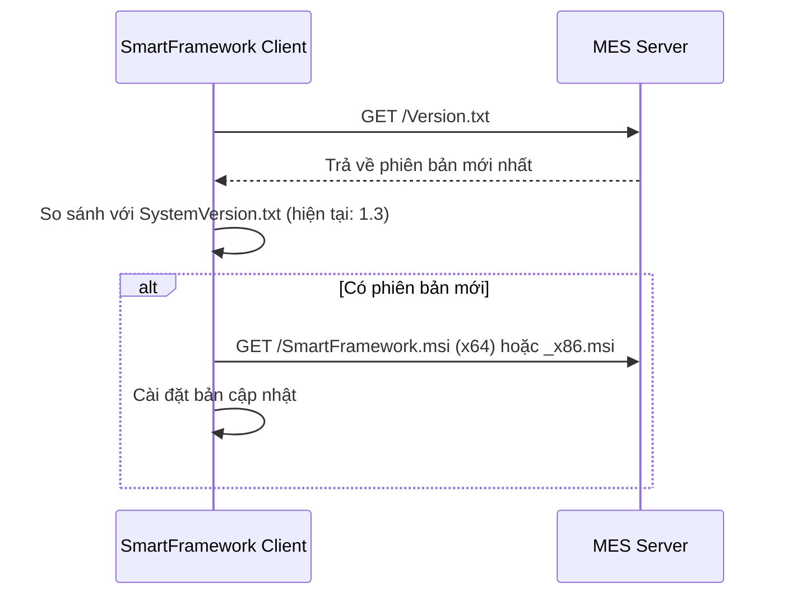
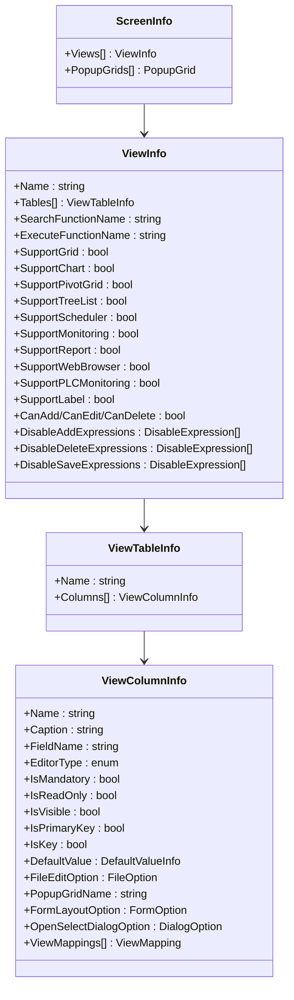

# 📋 BÁO CÁO PHÂN TÍCH CHI TIẾT ỨNG DỤNG
# **SmartFramework GUI 1.3 — NAIS System**

> **Ngày phân tích:** 09/03/2026 (đã cập nhật đính chính)  
> **Đường dẫn:** `c:\AwooSystem\SmartFramework GUI 1.3`  
> **Phiên bản hệ thống:** 1.3 (ProductVersion: 1.3.123, Changelog: v1.0.123)  
> **Bản quyền:** Copyright © 2015-2016  
> **Phương pháp:** Phân tích tĩnh (static analysis) — không decompile, không chạy ứng dụng

---

## 1. Tổng quan ứng dụng


| Thuộc tính | Chi tiết |
|---|---|
| **Tên hệ thống** | **NAIS System** (Vinatech) |
| **Nền tảng framework** | SmartFramework GUI — namespace **Awoo** (suy luận từ `.co.kr` domain + tác giả Hàn Quốc) |
| **Slogan** | *"Vision for Nature"* |
| **Loại ứng dụng** | Ứng dụng Desktop Windows (WinForms) — **Client MES** |
| **Mục đích** | Hệ thống quản lý sản xuất (Manufacturing Execution System - MES) phục vụ quản lý toàn bộ quy trình sản xuất tại nhà máy VINATech |
| **Server MES** | `http://mes.hycap.co.kr:9952` (máy chủ Hycap, Hàn Quốc) |
| **Ngôn ngữ giao diện** | Tiếng Việt (Vietnamese) — có hỗ trợ đa ngôn ngữ (ko-KR, zh-CN, en-US) |
| **User ID mẫu** | `92603003` |


---

## 2. Kiến trúc hệ thống



### Mô hình hoạt động

Ứng dụng hoạt động theo mô hình **Client-Server** kiểu **Data-Driven UI (Giao diện điều khiển bằng dữ liệu)**:

1. **Server** lưu trữ các **định nghĩa màn hình** (Screen Definitions) dưới dạng đối tượng .NET được serialize
2. **Client** tải về và cache các định nghĩa này vào thư mục `mes.hycap.co.kr.9952/Screens/`
3. Tại runtime, SmartFramework **đọc định nghĩa → tự động render giao diện** bằng DevExpress controls
4. Mọi thao tác CRUD được thực hiện qua **Stored Procedures** trên SQL Server

> [!IMPORTANT]
> Đây **không phải** là ứng dụng có mã nguồn (source code) thông thường. Toàn bộ logic giao diện được **cấu hình** (configuration-driven), không cần viết code cho từng màn hình.

---

## 3. Công nghệ sử dụng (Technology Stack)

### 3.1 Framework & Runtime

| Công nghệ | Phiên bản | Mục đích |
|---|---|---|
| **.NET Framework** | 4.6.1 | Runtime nền tảng |
| **Windows Forms** | — | Framework giao diện desktop |
| **DevExpress WinForms** | v19.2 | Bộ UI control cao cấp (40+ DLL) |
| **CefSharp / Chromium** | v63 | Nhúng trình duyệt web (WebBrowser) |

### 3.2 Thư viện quan trọng

| Thư viện | Mục đích |
|---|---|
| `Newtonsoft.Json` v12 | JSON serialization/deserialization |
| `System.Data.SQLite` | Lưu trữ local (Messages.sqlite) |
| `Polenter.SharpSerializer` v3 | Binary serialization cho screen definitions |
| `CSScriptLibrary` | C# scripting engine (CS-Script) |
| `Microsoft.CodeAnalysis` v3.3 (Roslyn) | Biên dịch C# script tại runtime |
| `DynamicExpresso.Core` | Đánh giá biểu thức động (Dynamic Expressions) |
| `ExcelDataReader` v3.6 | Đọc dữ liệu Excel |
| `HtmlAgilityPack` | Phân tích/xử lý HTML |
| `ICSharpCode.AvalonEdit` | Text editor nâng cao (trong Developer tool) |
| `ICSharpCode.SharpZipLib` | Nén/giải nén file |
| `Markdown` & `ReverseMarkdown` | Xử lý Markdown |
| `Unity Container` v5 | Dependency Injection (IoC Container) |
| `System.Net.Http.Formatting` | HTTP communication với server |
| `Mono.CSharp` | Biên dịch C# bổ sung |

### 3.3 DevExpress Controls (v19.2) — Chi tiết

Bộ DevExpress chiếm **~160 MB** với các thành phần:

| Module | Controls chính |
|---|---|
| **XtraGrid** | GridView, BandedGridView (hiển thị dữ liệu dạng bảng) |
| **XtraBars** | Ribbon, Toolbar, Menu |
| **XtraEditors** | TextEdit, ComboBox, DateEdit, SpinEdit, v.v. |
| **XtraCharts** | Biểu đồ (Chart) đa loại |
| **XtraPivotGrid** | Bảng tổng hợp xoay (Pivot Table) |
| **XtraTreeList** | Cây dữ liệu (Tree) |
| **XtraScheduler** | Lịch biểu (Scheduler/Calendar) |
| **XtraLayout** | Auto-layout cho form |
| **XtraReports** | Báo cáo (Reports) |
| **XtraPrinting** | In ấn |
| **XtraRichEdit** | Soạn thảo văn bản rich-text |
| **XtraSpreadsheet** | Bảng tính (Spreadsheet) |
| **XtraPdfViewer** | Xem PDF |
| **XtraDiagram** | Sơ đồ (Diagram) |
| **XtraNavBar** | Thanh điều hướng |
| **XtraVerticalGrid** | Lưới dọc (Property Grid) |
| **XtraGauges** | Đồng hồ đo (Gauges) |
| **XtraSpellChecker** | Kiểm tra chính tả |
| **Snap** | Mail merge & document templates |
| **BonusSkins** | 22 MB skin bổ sung (hiện dùng skin "Lilian") |

---

## 4. Các thành phần thực thi (Executables)

### 4.1 `Awoo.SmartFramework.WinForm.Main.exe` (560 KB)
**Ứng dụng chính cho người dùng cuối.** Đây là client MES mà nhân viên nhà máy sử dụng hàng ngày để:
- Đăng nhập hệ thống (hỗ trợ "Ghi nhớ đăng nhập")
- Xem và thao tác trên các màn hình MES
- Hiển thị Dashboard / Bảng hiện trạng
- Tự động khóa khi không sử dụng

### 4.2 `Awoo.SmartFramework.Developer.exe` (660 KB)
**Công cụ phát triển** dành cho kỹ sư hệ thống/developer. Cho phép:
- Thiết kế màn hình (Screen Designer)
- Cấu hình stored procedures mapping
- Thiết kế PLC Monitoring
- Chạy Update Table mà không cần dialog
- Quản lý biến (Set Variable Actions)
- Hỗ trợ Code Editor (AvalonEdit) và C# Scripting (Roslyn)

### 4.3 `Awoo.SmartFramework.Updater.exe` (46 KB)
**Trình cập nhật tự động.** Kiểm tra phiên bản mới từ server và tải về cài đặt.

---

## 5. Hệ thống cập nhật (Auto-Update)



File `UpgradeSource.json` cấu hình:
- **x64**: `SmartFramework.msi`
- **x86**: `SmartFramework_x86.msi`

File `Version.xml` quản lý cập nhật từng file riêng lẻ (bg.PNG, splash.jpg, SystemVersion.txt, v.v.)

---

## 6. Hệ thống màn hình (Screens) — 27 màn hình

### 6.1 Kiến trúc Data-Driven UI

Mỗi màn hình được định nghĩa bởi một object `ScreenInfo` (serialize nhị phân) bao gồm:



### 6.2 Danh sách màn hình theo nhóm chức năng

#### 📁 Quản lý dữ liệu chính (Master Data)

| Màn hình | Mô tả | Ngày tạo/sửa |
|---|---|---|
| `CompanyInfo` | Quản lý thông tin công ty | 2020-07-27 |
| `CustomerInfo` | Quản lý thông tin khách hàng | 2020-07-27 |
| `MaterialMaster` | Quản lý vật tư (Master) | 2025-09-17 |
| `MaterialTypeInfo` | Quản lý loại vật tư | 2018-08-14 |
| `ModelBasicInfo` | Quản lý thông tin model sản phẩm | 2025-10-24 |
| `ModelLabelInfo` | Quản lý nhãn model | 2025-10-15 |
| `ProductGroupInfo` | Quản lý nhóm sản phẩm | 2018-08-14 |
| `MachineMaster` | Quản lý máy móc thiết bị | 2025-01-14 |

#### 🏭 Quản lý sản xuất (Production)

| Màn hình | Mô tả | Ngày tạo/sửa |
|---|---|---|
| `ProductionOrderInfo` | Quản lý lệnh sản xuất (Production Order) | 2025-12-23 |
| `DayProdPlanForMainLot` | Kế hoạch sản xuất ngày cho Lot chính | 2025-11-07 |
| `CreateManualPODialog` | Tạo PO thủ công (Dialog) | 2025-09-15 |
| `ProdWorkerInfo` | Quản lý thông tin công nhân sản xuất | 2025-11-26 |
| `InputDatastage` | Nhập dữ liệu công đoạn | 2022-09-21 |

#### 🛤️ Quản lý Routing & Line

| Màn hình | Mô tả | Ngày tạo/sửa |
|---|---|---|
| `RouteInfo` | Quản lý thông tin định tuyến | 2026-02-22 |
| `BasicRoutingInfo` | Quản lý routing cơ bản | 2022-04-08 |
| `LineInfo` | Quản lý thông tin dây chuyền sản xuất | 2025-01-10 |
| `LineRouteMapping` | Ánh xạ Line - Route | 2022-08-28 |
| `WorkCenterInfo` | Quản lý trung tâm sản xuất | 2023-06-16 |

#### 🔍 Kiểm tra chất lượng (Quality Control)

| Màn hình | Mô tả | Ngày tạo/sửa |
|---|---|---|
| `QcInspectionGroup` | Quản lý nhóm kiểm tra QC | 2025-01-14 |
| `CommInspTypeItemManagement` | Quản lý hạng mục kiểm tra chung | 2019-11-06 |

#### 👤 Quản lý người dùng & phân quyền

| Màn hình | Mô tả | Ngày tạo/sửa |
|---|---|---|
| `UserInfo` | Quản lý thông tin người dùng | 2025-08-23 |
| `UserTypePermission` | Phân quyền theo loại người dùng | 2025-03-05 |
| `ChangePersonalInfo` | Thay đổi thông tin cá nhân | 2019-09-05 |
| `VendorMenuManagement` | Quản lý menu nhà cung cấp | 2024-12-17 |

#### 🇻🇳 Màn hình tùy chỉnh VNT (Vinatech)

| Màn hình | Mô tả | Ngày tạo/sửa |
|---|---|---|
| `VNT_DoCreateQcDefectReport` | Tạo báo cáo lỗi QC (tùy chỉnh VNT) | 2025-04-16 |
| `VNT_ProductionForMonitoring_Test` | Giám sát sản xuất - Test | 2019-01-21 |
| `VNT_ProductionForMonitoring_Dialog` | Giám sát sản xuất - Dialog chi tiết | 2019-03-04 |

---

## 7. Stored Procedures — Danh mục đầy đủ (130 SP)

### 7.1 Quy ước đặt tên

| Hậu tố | Ý nghĩa | Ví dụ |
|---|---|---|
| `_get` | Truy vấn/đọc dữ liệu | `usp_CompanyInfo_get` |
| `_iud` | Insert/Update/Delete | `usp_CompanyInfo_iud` |
| `_popup` | Lấy dữ liệu cho Popup chọn | `usp_CompanyInfo_popup` |
| `Do*` | Thực thi hành động nghiệp vụ | `usp_DoCreateProductionOrder` |
| `Get*` | Truy vấn chuyên biệt | `usp_GetBaseCode_popup` |
| `VN_` / `VNT_` | Tùy chỉnh cho VINATech | `usp_VN_VendorFOQC` |

### 7.2 Danh sách SP theo module

<details>
<summary><b>📁 Master Data (Dữ liệu chính) — 40 SP</b></summary>

| SP | Bảng/Chức năng |
|---|---|
| `usp_CompanyInfo_get` / `_iud` / `_popup` | Công ty |
| `usp_CustomerInfo_get` / `_iud` | Khách hàng |
| `usp_MaterialMaster_get` / `_iud` / `_popup` | Vật tư |
| `usp_MaterialType_get` / `_iud` | Loại vật tư |
| `usp_BasicMaterialType_popup` | Popup loại vật tư cơ bản |
| `usp_MaterialTypeCode_popup` | Popup mã loại vật tư |
| `usp_MaterialTypeCodeHaNamGoods_popup` | Popup mã vật tư Hà Nam |
| `usp_MaterialPurchaseType_popup` | Popup loại mua vật tư |
| `usp_MaterialWarehouse_popup` | Popup kho vật tư |
| `usp_ModelBasicInfo_get` / `_iud` / `_popup` | Model sản phẩm |
| `usp_ModelBasicInfoTotal_popup` | Popup tổng hợp model |
| `usp_ModelLabelInfo_iud` | Label model |
| `usp_DoMakeModelLabelInfo` | Tạo label model |
| `usp_DoSaveModelLabelInfoSpec` | Lưu spec label |
| `usp_GetLabelInfoByMaterial` | Label theo vật tư |
| `usp_LabelInfo_popup` | Popup label |
| `usp_MachineMaster_get` / `_iud` / `_popup` | Máy móc |
| `usp_MachineType_popup` | Popup loại máy |
| `usp_ProductGroup_get` / `_iud` / `_popup` | Nhóm sản phẩm |
| `usp_MoldBasicInfoByWorkCenter_popup` | Popup khuôn theo Work Center |
| `usp_MoldProductMapping_popup` | Popup mapping khuôn-sản phẩm |
| `usp_SalesArea_popup` | Popup khu vực bán hàng |

</details>

<details>
<summary><b>🏭 Production (Sản xuất) — 25 SP</b></summary>

| SP | Chức năng |
|---|---|
| `usp_ProductionOrderInfo_get` | Truy vấn lệnh sản xuất |
| `usp_ProductionOrderBom_get` | BOM lệnh sản xuất |
| `usp_ProductionOrderRouting_get` / `_iud` | Routing lệnh SX |
| `usp_ProductionMaterialPopup` | Popup vật tư sản xuất |
| `usp_DoCreateProductionOrder` | Tạo lệnh sản xuất |
| `usp_DoCreateProductionOrderBatch` | Tạo lệnh SX hàng loạt |
| `usp_DoFixProductionOrder` | Xác nhận lệnh SX |
| `usp_DoCancelPO` | Hủy lệnh SX |
| `usp_DayProdPlan_get` / `_iud` | Kế hoạch SX ngày |
| `usp_DoFixDayProdPlan` | Xác nhận kế hoạch ngày |
| `usp_DoFinishDayProdPlan` | Hoàn thành kế hoạch ngày |
| `usp_DoCancelDayProdPlan` | Hủy kế hoạch ngày |
| `usp_BomVersion_popup` | Popup phiên bản BOM |
| `usp_ProdWorkerInfo_get` / `_iud` / `_Popup` | Công nhân SX |
| `usp_GetDummyProductionOrderForCreateManual` | Template PO thủ công |
| `usp_DoCreateSetInfoForProdQty_VNT` | Tạo set info SL SX (VNT) |
| `usp_Add_StageProduction` | Thêm công đoạn SX |
| `usp_Month_popup` | Popup tháng |
| `usp_ShiftCode_popup` | Popup ca làm việc |
| `usp_GetMaterialGIForPO` | Xuất kho vật tư cho PO |

</details>

<details>
<summary><b>🛤️ Routing & Line — 16 SP</b></summary>

| SP | Chức năng |
|---|---|
| `usp_RouteInfo_get` / `_iud` | Thông tin route |
| `usp_GetRouteInfo_popup` / `usp_GetRouteInfoAll_popup` | Popup route |
| `usp_GetRouteType_popup` | Popup loại route |
| `usp_FacilityRoute_popup` | Popup route thiết bị |
| `usp_BasicRoutingInfo_get` / `_iud` / `_popup` | Routing cơ bản |
| `usp_BasicRoutingDetail_iud` | Chi tiết routing |
| `usp_GetBasicRouteingDetailForRoute` | Chi tiết routing theo route |
| `usp_LineInfo_get` / `_iud` / `_popup` | Dây chuyền |
| `usp_LineRouteMapping_get` / `_iud` | Mapping line-route |
| `usp_WorkCenterInfo_get` / `_iud` / `_popup` | Trung tâm SX |
| `usp_RouteInfoForLine_popup` | Popup route theo line |

</details>

<details>
<summary><b>🔍 Quality Control — 18 SP</b></summary>

| SP | Chức năng |
|---|---|
| `usp_QcInspectionGroup_get` / `_iud` / `_popup` | Nhóm kiểm tra QC |
| `usp_QcInspectionItem_get` / `_iud` | Hạng mục kiểm tra QC |
| `usp_CommInspTypeInfo_get` | Loại kiểm tra chung |
| `usp_CommInspItem_get` | Hạng mục kiểm tra chung |
| `usp_DoCommInspTypeItem_iud` | CRUD hạng mục kiểm tra |
| `usp_CommInspSelectGroup_popup` | Popup chọn nhóm kiểm tra |
| `usp_GetCommInspInputType_popup` | Popup loại input kiểm tra |
| `usp_IqcInspectionGroup_iud` / `usp_IqcInspectionItem_iud` | Kiểm tra IQC |
| `usp_DefectInfo_popup` | Popup thông tin lỗi |
| `usp_QcDefectReport_iud` / `usp_QcDefectReportDummy_get` | Báo cáo lỗi QC |
| `usp_GetAql_popup` | Popup AQL |
| `usp_GetInspectionLevel_popup` / `usp_GetInspectionType_popup` | Popup cấp/loại kiểm tra |
| `usp_OqcInspectionRuleType_popup` / `usp_OqcLotCreateRule_popup` / `usp_OqcType_popup` | OQC |
| `usp_GetWorkerAndMachineForDefectReport_popup` | Popup CN & máy cho báo cáo lỗi |

</details>

<details>
<summary><b>👤 User & Permission — 14 SP</b></summary>

| SP | Chức năng |
|---|---|
| `usp_UserInfo_get` / `_iud` | Người dùng |
| `usp_UserInfoUserPermissionGroup_iud` | Nhóm quyền người dùng |
| `usp_UserPermissionGroup_get` | Truy vấn nhóm quyền |
| `usp_UserType_get` | Loại người dùng |
| `usp_GetFunctionListForUserType` | DS chức năng theo loại user |
| `usp_GetScreenListForUserType` | DS màn hình theo loại user |
| `usp_GetViewListForUserType` | DS view theo loại user |
| `usp_DoSaveUserTypePermissionAll` | Lưu tất cả quyền |
| `usp_DoGrantAll` | Cấp tất cả quyền |
| `usp_GetUserAllowFlag` | Kiểm tra quyền user |
| `usp_GetScreenAccessType` | Loại truy cập màn hình |
| `usp_VendorScreenInfo_get` / `_iud` | Màn hình nhà cung cấp |
| `usp_ScreenInfo_iud` | Quản lý thông tin màn hình |

</details>

<details>
<summary><b>⚙️ System & Utilities — 8 SP</b></summary>

| SP | Chức năng |
|---|---|
| `usp_GetBaseCode_popup` | Mã cơ bản (lookup) |
| `usp_GetBaseCodeRemarkFilter_popup` | Mã cơ bản có filter |
| `usp_CommonCode_YesNo_popup` | Popup Có/Không |
| `usp_GetSystemPlant` | Thông tin nhà máy |
| `usp_GetPossableScreenInfo_get` | DS màn hình khả dụng |
| `usp_GetScreenLayoutVersionList` | DS version layout |
| `usp_GetVWStartupType` | Loại khởi động |
| `usp_SetInfo_get` / `_iud` | Thông tin Set |
| `usp_GetMaterialLocationForWarehouse_popup` | Vị trí vật tư kho |

</details>

<details>
<summary><b>🇻🇳 VNT Custom (Vinatech tùy chỉnh) — 6 SP</b></summary>

| SP | Chức năng |
|---|---|
| `usp_DoCreateSetInfoForProdQty_VNT` | Tạo Set cho số lượng SX |
| `usp_GetProductionForMonitoring_VNT` | Giám sát sản xuất (dữ liệu) |
| `usp_GetProductionForMonitoringChart_VNT` | Giám sát SX (biểu đồ) |
| `usp_VN_EmpsVendors` | Nhân viên/nhà cung cấp VN |
| `usp_VN_VendorFOQC` | FOQC nhà cung cấp VN |
| `usp_VN_View_Stages` | Xem công đoạn VN |

</details>

---

## 8. Tính năng đáng chú ý

### 8.1 Data-Driven UI
- Toàn bộ giao diện được **cấu hình** từ Server, không cần deploy lại client
- Hỗ trợ **17 loại hiển thị**: Grid, BandedGrid, PivotGrid, Chart, TreeList, FormLayout, VerticalGrid, Scheduler, Monitoring, Report, PDFViewer, DynamicGrid, CustomControl, WebBrowser, PLCMonitoring, Snap, Label, ImageSlider

### 8.2 Biểu thức điều kiện (Conditional Expressions)
- **DisableAddExpressions**: Vô hiệu hóa nút Thêm theo điều kiện
- **DisableDeleteExpressions**: Vô hiệu hóa nút Xóa theo điều kiện
- **DisableSaveExpressions**: Vô hiệu hóa nút Lưu theo điều kiện
- **ReadOnly Expressions**: Biểu thức chỉ đọc động
- **Mandatory Expressions**: Biểu thức bắt buộc nhập động

### 8.3 Tích hợp file & Azure
- Upload/Download file từ Server hoặc **Azure Blob Storage**
- Hỗ trợ Anonymous Access Azure
- Quản lý file bằng File ID/Name/Size/Data fields

### 8.4 C# Scripting Runtime
- Thực thi C# script tại runtime bằng **Roslyn** và **CS-Script**
- Đánh giá biểu thức động bằng **DynamicExpresso**

### 8.5 PLC Monitoring
- Kết nối và giám sát PLC (Programmable Logic Controller)
- Sử dụng `Awoo.Net.Tcp.DLL` cho giao tiếp TCP

### 8.6 Đa ngôn ngữ
- Hỗ trợ: **Vietnamese**, **Korean** (ko-KR), **Chinese** (zh-CN), **English** (en-US)
- Cache màn hình theo ngôn ngữ riêng biệt

### 8.7 Bảo mật
- Phân quyền theo **User Type** → Screen → Function → View
- Tự động **khóa màn hình** khi không hoạt động (Auto-Lock)
- Hỗ trợ cả trên **PC, Tablet, Phone** (cờ IsPhoneVisible/IsTabletVisible)

---

## 9. Lịch sử phiên bản (Changelog)

| Version | Thay đổi chính |
|---|---|
| **v1.0.123** | Sửa bug phân trang dashboard, bug PLC monitoring designer, tăng cường biểu thức chỉ đọc/bắt buộc |
| **v1.0.122** | Sửa bug tăng thread khi chạy SetData Action |
| **v1.0.121** | Sửa bug phân trang dashboard |
| **v1.0.120** | Thu nhỏ cột checkbox multi-select, lưu conditional expression khi save layout |
| **v1.0.119** | Sửa thanh progress không biến mất khi mở dialog chồng dialog |
| **v1.0.118** | Update Table không hiện dialog, sửa bug Set Variable, sửa bug update table kiểu Binary |
| **v1.0.117** | Sửa bug NullReferenceException khi dashboard có nhiều view |
| **v1.0.116** | Sửa bug Unbound Expression trên Chart control |
| **v1.0.115** | Tắt auto-lock khi chạy dashboard mode |
| **v1.0.114** | Thêm MRU Edit, Progress Edit, Lock Button, Auto-Lock |

---

## 10. Cấu trúc thư mục

```
c:\AwooSystem\SmartFramework GUI 1.3\
├── 📄 Awoo.SmartFramework.WinForm.Main.exe       ← Ứng dụng chính
├── 📄 Awoo.SmartFramework.Developer.exe           ← Công cụ phát triển
├── 📄 Awoo.SmartFramework.Updater.exe             ← Trình cập nhật
├── 📄 App.config                                  ← Cấu hình user (URL, ngôn ngữ, skin)
├── 📄 *.exe.config                                ← Cấu hình runtime (.NET binding)
├── 📄 SystemVersion.txt                           ← Phiên bản hệ thống: "1.3"
├── 📄 UpgradeSource.json                          ← Nguồn cập nhật (x64/x86)
├── 📄 ChangeLog.txt                               ← Lịch sử thay đổi
├── 📄 Messages.sqlite                             ← DB tin nhắn local
├── 🖼️ banner.jpg / splash.jpg / bg.PNG            ← Hình ảnh giao diện
├── 📁 Backup/                                     ← Backup files
├── 📁 locales/                                    ← 53 ngôn ngữ Chromium
├── 📁 en-US/ ko-KR/ zh-CN/                        ← Tài nguyên ngôn ngữ
├── 📁 mes.hycap.co.kr.9952/                       ← Cache dữ liệu từ server
│   ├── 📄 Version.xml                             ← Phiên bản file từ server
│   └── 📁 Screens/
│       ├── 📄 ScreensV2.xml                       ← Danh mục & version 27 màn hình
│       └── 📁 Vietnamese/                         ← 27 screen definitions (binary)
│           ├── CompanyInfo, CustomerInfo, ...
│           ├── ProductionOrderInfo, DayProdPlan...
│           ├── QcInspectionGroup, ...
│           └── VNT_DoCreateQcDefectReport, ...
├── 📚 Awoo.*.DLL                                  ← 13 thư viện Awoo (7 SmartFramework + 6 hạ tầng)
├── 📚 DevExpress.*.dll                            ← 47 thư viện DevExpress v19.2 (161 MB)
├── 📚 CefSharp.*.dll + libcef.dll                 ← Chromium Embedded Framework
└── 📚 [Các thư viện phụ trợ khác]                ← Json, SQLite, Roslyn, Unity...
```

---

## 11. Prompt gợi ý để phân tích ứng dụng tốt hơn

Dưới đây là prompt đã được viết lại, hoàn chỉnh và tối ưu hơn để bạn có thể sử dụng lại cho các lần phân tích tương tự:

---

> ### 🎯 PROMPT HOÀN CHỈNH
>
> ```
> Hãy thực hiện phân tích toàn diện ứng dụng tại thư mục [đường dẫn] theo các bước sau:
>
> 1. **Khám phá cấu trúc**: Liệt kê toàn bộ file/thư mục, phân loại theo chức năng
>    (executable, library, config, data, resource).
>
> 2. **Phân tích công nghệ**: Xác định technology stack (framework, runtime, UI library,
>    database, communication protocol, scripting engine, DI container, v.v.)
>    từ các file config, DLL dependencies, và file metadata.
>
> 3. **Phân tích kiến trúc**: Vẽ sơ đồ kiến trúc hệ thống (Client-Server, các tầng/layer,
>    luồng dữ liệu) bằng Mermaid diagram.
>
> 4. **Phân tích chức năng**: Liệt kê và mô tả chi tiết từng module/màn hình,
>    phân nhóm theo nghiệp vụ. Trích xuất tất cả stored procedures/API endpoints.
>
> 5. **Phân tích dữ liệu**: Mô tả cấu trúc dữ liệu (screen definitions, config schema,
>    database schema nếu có). Chỉ ra quy ước đặt tên.
>
> 6. **Phân tích tính năng đặc biệt**: Highlight các tính năng nổi bật
>    (scripting, auto-update, PLC monitoring, conditional expressions, v.v.)
>
> 7. **Lịch sử phiên bản**: Tổng hợp changelog.
>
> 8. **Xuất báo cáo**: Viết bằng tiếng Việt, sử dụng bảng/sơ đồ/mermaid diagram,
>    nhúng hình ảnh minh họa. Lưu vào artifact markdown.
> ```

---

> [!NOTE]
> Báo cáo này được tạo dựa trên phân tích **static** (phân tích tĩnh) các file trong thư mục cài đặt. Do ứng dụng là compiled .NET binary, không có source code, nên phân tích dựa trên: config files, binary metadata, serialized screen definitions, và branding assets. Để phân tích sâu hơn (decompile DLL), cần sử dụng công cụ như ILSpy hoặc dnSpy.
