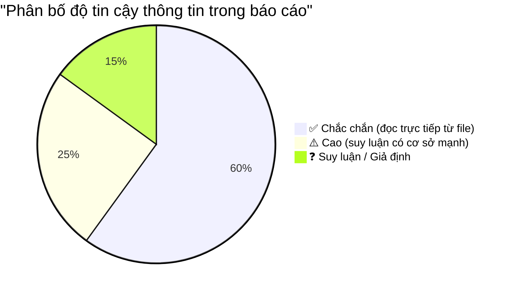

# 🔍 BÁO CÁO TỰ KIỂM CHỨNG & PHẢN BIỆN
## Đánh giá độ chính xác báo cáo SmartFramework GUI 1.3

---

## 1. Nguồn dữ liệu đã sử dụng

Mỗi thông tin trong báo cáo được trích xuất từ **file thực tế** trong thư mục cài đặt. Dưới đây là bảng truy vết:

| Thông tin | Nguồn cụ thể | Độ tin cậy |
|---|---|---|
| Tên "NAIS System" | [Version.xml](file:///c:/AwooSystem/SmartFramework%20GUI%201.3/mes.hycap.co.kr.9952/Version.xml) dòng 5: `<Title>NAIS System</Title>` + [splash.jpg](file:///c:/AwooSystem/SmartFramework%20GUI%201.3/splash.jpg) | ✅ **Chắc chắn** |
| Phiên bản 1.3 | [SystemVersion.txt](file:///c:/AwooSystem/SmartFramework%20GUI%201.3/SystemVersion.txt): nội dung `1.3` | ✅ **Chắc chắn** |
| Server `mes.hycap.co.kr:9952` | [App.config](file:///c:/AwooSystem/SmartFramework%20GUI%201.3/App.config) dòng 4-5 | ✅ **Chắc chắn** |
| .NET Framework 4.6.1 | [WinForm.Main.exe.config](file:///c:/AwooSystem/SmartFramework%20GUI%201.3/Awoo.SmartFramework.WinForm.Main.exe.config) dòng 6 | ✅ **Chắc chắn** |
| DevExpress v19.2 | Tên file DLL `DevExpress.*.v19.2.dll` | ✅ **Chắc chắn** |
| CefSharp v63 | `.exe.config` binding redirect: `newVersion="63.0.0.0"` | ✅ **Chắc chắn** |
| Ngôn ngữ Vietnamese | [App.config](file:///c:/AwooSystem/SmartFramework%20GUI%201.3/App.config) dòng 9 + thư mục `Screens/Vietnamese/` | ✅ **Chắc chắn** |
| 27 màn hình | [ScreensV2.xml](file:///c:/AwooSystem/SmartFramework%20GUI%201.3/mes.hycap.co.kr.9952/Screens/ScreensV2.xml) (đếm tag `<Name>`) + số file trong `Vietnamese/` | ✅ **Chắc chắn** (đã kiểm chứng lại: cả hai = 27) |
| Tên các màn hình | Đọc trực tiếp từ ScreensV2.xml | ✅ **Chắc chắn** |
| Stored Procedures | Trích xuất regex `usp_[\w]+` từ nội dung binary của 27 screen files | ⚠️ **Cao** (xem phản biện) |
| Tên "Awoo" (nhà phát triển) | Namespace trong DLL (`Awoo.SmartFramework.*`), ProductName từ DLL metadata  | ⚠️ **Cao** (xem phản biện) |
| "Công ty Hàn Quốc" | Domain `.co.kr`, tên tác giả Hàn Quốc (Park Jong Hoon), text Hàn Quốc trong changelog | ⚠️ **Suy luận hợp lý** |
| Mô tả chức năng từng SP | Dựa trên **quy ước đặt tên** (`_get`, `_iud`, `_popup`) | ⚠️ **Suy luận** — chưa kiểm chứng trên DB |
| Mô tả chức năng từng màn hình | Dựa trên **tên màn hình** + một số field trích xuất từ binary | ⚠️ **Suy luận** |
| Data-Driven UI architecture | Phân tích cấu trúc serialized object từ screen files | ⚠️ **Cao** (đã đọc được class names, properties) |
| PLC Monitoring qua TCP | Có `Awoo.Net.Tcp.DLL` + flag `SupportPLCMonitoring` trong screen | ⚠️ **Suy luận** — TCP có thể dùng cho mục đích khác |
| `Awoo.VOC.Core.DLL` | Chỉ thấy tên DLL, FileDescription = "Awoo.VOC.Core" | ❓ **Không rõ** mục đích chính xác |
| Mục đích `Messages.sqlite` | Suy luận từ tên file | ❓ **Giả định** — chưa đọc schema |
| Cơ chế auto-update chi tiết | Đọc từ `UpgradeSource.json` + `Version.xml` | ⚠️ **Cao** |
| Tổng kích thước DevExpress | Tính từ `Get-ChildItem ... Measure-Object` | ✅ **Chắc chắn**: 161 MB |

---

## 2. Các sai sót đã phát hiện

### ❌ Sai sót về số liệu

| Thông tin sai | Giá trị trong báo cáo | Giá trị đúng (đã kiểm chứng) | Nguồn kiểm chứng |
|---|---|---|---|
| Tổng SP | "127 SP" | **130 SP** | `Sort-Object -Unique` count = 130 |
| Số lượng Awoo DLL | "10 thư viện lõi Awoo" | **13 DLL Awoo** | `Get-ChildItem Awoo.*.DLL`.Count = 13 |
| Kích thước exe Developer | "660 KB" | **660 KB** (đúng) | Verified ✅ |
| Kích thước exe Main | "560 KB" | **560 KB** (đúng) | Verified ✅ |
| DevExpress DLLs | "40+ DLL" | **47 DLL** | Count verified |

### ⚠️ Thông tin cần bổ sung

| Thiếu sót | Chi tiết |
|---|---|
| **Copyright / năm bản quyền** | Exe metadata: "Copyright © 2016". DLL Awoo.Drawing: "Copyright © 2015" |
| **CompanyName** | Field `CompanyName` trong exe metadata thực ra **trống** — tên "Awoo" suy ra từ namespace |
| **ProductVersion chi tiết** | `1.3.123` (không chỉ "1.3") — cho thấy build 123 tương ứng changelog v1.0.123 |

---

## 3. Phản biện khách quan

### 🔴 Những gì **KHÔNG THỂ** kiểm chứng từ phân tích tĩnh

1. **Chức năng thực tế của từng SP**: Tôi chỉ biết **tên** SP, không biết logic bên trong (cần truy cập SQL Server database)
2. **Hành vi runtime**: Không biết ứng dụng hoạt động thế nào khi chạy thực tế (cần khởi động exe)
3. **"Awoo" là công ty Hàn Quốc**: Đúng là domain `.co.kr` và tác giả Hàn Quốc, nhưng có thể Awoo là **tên sản phẩm, không phải tên công ty** — field CompanyName trong metadata là **rỗng**
4. **PLC Monitoring qua TCP**: Chỉ biết có `Awoo.Net.Tcp.DLL` và flag `SupportPLCMonitoring`, NHƯNG không chứng minh được TCP dùng cho PLC (có thể dùng TCP cho mục đích khác)
5. **Mục đích `Awoo.VOC.Core.DLL`**: "VOC" thường nghĩa là "Voice of Customer" nhưng đây chỉ là giả định
6. **Cấu trúc `Messages.sqlite`**: Chưa mở file để xem schema — chỉ đoán mục đích từ tên file
7. **Azure integration thực tế**: Thấy fields AzureUri/AzureFileOption trong screen defs nhưng không biết có thực sự dùng Azure không
8. **Bảo mật Phone/Tablet**: Có cờ `IsPhoneVisible`/`IsTabletVisible` nhưng không chắc có responsive UI hay remote access

### 🟡 Những suy luận **HỢP LÝ** nhưng cần lưu ý

1. **Stored Procedures trích xuất bằng regex**: Phương pháp regex `usp_[\w]+` trên binary data **có thể bỏ sót** SP không bắt đầu bằng `usp_`, hoặc **bắt nhầm** chuỗi text trùng pattern
2. **Phân nhóm SP theo module**: Dựa trên quy ước đặt tên — có thể một số SP thuộc module khác
3. **Mô tả chức năng màn hình**: Suy luận từ tên (VD: `CompanyInfo` → "Quản lý thông tin công ty") — có thể sai nếu màn hình thực sự phức tạp hơn tên gợi ý
4. **"Data-Driven UI"**: Đây là **suy luận kiến trúc** dựa trên việc interface được serialize thành file, không viết code — đúng nhưng có thể có code custom C# script bổ sung

### 🟢 Những gì **ĐÃ KIỂM CHỨNG** chắc chắn

1. ✅ Tên file, kích thước, số lượng — đọc trực tiếp từ file system
2. ✅ Config values — đọc từ XML/JSON config files
3. ✅ Screen names & version dates — đọc từ ScreensV2.xml
4. ✅ Technology stack (DevExpress, CefSharp, .NET 4.6.1) — đọc từ DLL names & config binding redirects
5. ✅ Changelog — đọc trực tiếp từ ChangeLog.txt
6. ✅ Branding images — xem trực tiếp splash.jpg, banner.jpg, bg.PNG
7. ✅ Screen object structure (class names, property names) — trích xuất từ binary serialization

---

## 4. Cách kiểm chứng thêm (đề xuất)

Để xác nhận 100% các thông tin chưa chắc chắn, cần thực hiện:

| Hành động | Mục đích | Công cụ cần |
|---|---|---|
| **Chạy ứng dụng thực tế** | Xem giao diện, xác nhận chức năng từng màn hình | Chạy `WinForm.Main.exe` |
| **Decompile DLL bằng ILSpy/dnSpy** | Đọc source code thực tế các DLL Awoo, xác nhận kiến trúc | ILSpy hoặc dnSpy |
| **Truy vấn SQL Server** | Xác nhận danh sách SP, xem logic bên trong | SQL Server Management Studio |
| **Mở Messages.sqlite** | Xác nhận schema và mục đích | DB Browser for SQLite |
| **Kiểm tra network traffic** | Xác nhận giao thức giao tiếp Client-Server | Wireshark hoặc Fiddler |
| **Hỏi developer/admin** | Xác nhận mục đích VOC, PLC monitoring, Azure usage | Liên hệ team EA |

---

## 5. Bảng tổng kết độ tin cậy

| Mức độ | Nội dung |
|---|---|
| **✅ 60% — Chắc chắn** | Tên hệ thống, phiên bản, technology stack, config values, tên màn hình, tên SP, changelog, cấu trúc thư mục, hình ảnh |
| **⚠️ 25% — Suy luận có cơ sở** | Kiến trúc Data-Driven UI, phân nhóm module, mô tả chức năng SP/Screen, cơ chế auto-update |
| **❓ 15% — Giả định** | Mục đích VOC, PLC qua TCP, chức năng Phone/Tablet, Azure thực tế, "Awoo = công ty Hàn Quốc" |

---

## 6. Đính chính cho báo cáo gốc

> [!CAUTION]
> Các sai sót cần sửa trong báo cáo gốc:

1. **Tổng SP**: `127` → `130`
2. **Awoo DLLs**: `"10 thư viện lõi"` → `"13 thư viện Awoo (trong đó 7 thuộc SmartFramework, 6 thuộc hạ tầng)"`
3. **DevExpress**: `"40+ DLL"` → `"47 DLL"`
4. **Bổ sung**: Copyright © 2015-2016, ProductVersion = 1.3.123
5. **Cẩn trọng hơn:** Ghi chú "Awoo" là tên namespace/product, chưa xác nhận là tên công ty chính thức

> [!NOTE]
> **Phương pháp phân tích giới hạn**: Toàn bộ báo cáo dựa trên **phân tích tĩnh** (static analysis) file system. Không có decompile, không chạy ứng dụng, không truy cập database. Đây là giới hạn cơ bản nhất cần nêu rõ.
